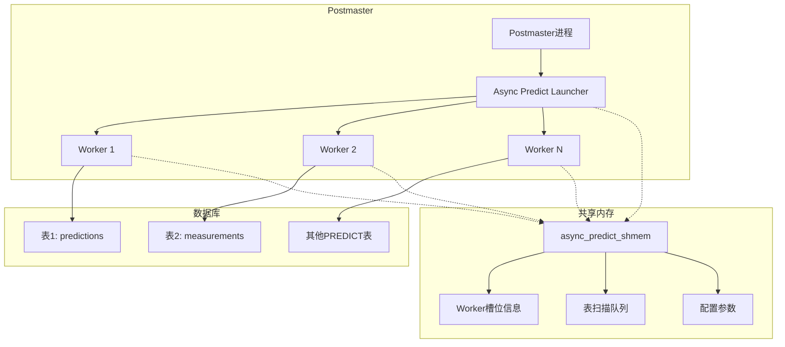

# 异步推理模块设计文档

## 1. 概述

### 1.1 功能目标
异步推理模块（Async Predict Worker）是一个后台工作进程，用于异步处理 PREDICT 列的预测任务：
- 自动扫描包含 PREDICT 列且 `predict_timing = deferred` 的表
- 查找 predict 列和 `_predict` 列同时为 NULL 的数据
- 调用预测函数并存储结果

### 1.2 设计原则
- 基于 PostgreSQL 的 Background Worker 机制实现
- 使用进程池而非线程池（PostgreSQL 标准模式）
- 可配置的参数控制工作进程数量和执行间隔
- 支持多个数据库和表的并行处理
- **仅处理 `predict_timing = deferred` 的表**（immediate 模式由触发器实时处理）

## 2. 架构设计

### 2.1 系统架构图



### 2.2 组件说明

| 组件 | 说明 |
|------|------|
| Async Predict Launcher | 主控进程，负责启动和管理 Worker |
| Worker | 工作进程，执行实际的预测任务 |
| 共享内存 | 存储 Worker 状态、任务队列和配置 |

## 3. 详细设计

### 3.1 配置参数

| 参数名 | 类型 | 默认值 | 说明 |
|--------|------|--------|------|
| `async_predict_workers` | int | 2 | 工作进程数量 |
| `async_predict_naptime` | int | 60 | 扫描间隔时间（秒） |
| `async_predict_batch_size` | int | 100 | 每次处理的最大行数 |
| `async_predict_enabled` | bool | true | 是否启用异步预测 |

### 3.2 共享内存结构

```c
/* 异步预测工作进程共享状态 */
typedef struct AsyncPredictWorker
{
    Oid         dboid;          /* 数据库OID */
    Oid         relid;          /* 表OID */
    AttrNumber  predict_attnum; /* PREDICT列属性号 */
    AttrNumber  result_attnum;  /* _predict列属性号 */
    Oid         predict_func;   /* 预测函数OID */
    TimestampTz last_scan;      /* 上次扫描时间 */
    int64       processed;      /* 已处理行数 */
    pid_t       pid;            /* 工作进程PID */
    bool        in_use;         /* 是否在使用 */
    LWLock      lock;           /* 锁 */
} AsyncPredictWorker;

/* 共享内存主结构 */
typedef struct AsyncPredictShmemStruct
{
    int         num_workers;        /* 工作进程数量 */
    int         naptime;            /* 扫描间隔 */
    int         batch_size;         /* 批处理大小 */
    bool        enabled;            /* 是否启用 */
    AsyncPredictWorker workers[FLEXIBLE_ARRAY_MEMBER];
} AsyncPredictShmemStruct;
```

### 3.3 PREDICT 表注册表

为了跟踪哪些表包含 PREDICT 列，需要一个注册表：

```sql
-- 创建 pg_predict_table 系统表
CREATE TABLE pg_predict_table (
    pt_dboid        Oid NOT NULL,       -- 数据库OID
    pt_reloid       Oid NOT NULL,       -- 表OID
    pt_attnum       int2 NOT NULL,      -- PREDICT列属性号
    pt_result_attnum int2 NOT NULL,     -- _predict列属性号
    pt_funcoid      Oid,                -- 预测函数OID
    pt_timing       char NOT NULL,      -- 'i' = immediate, 'd' = deferred
    pt_enabled      bool DEFAULT true,  -- 是否启用异步预测
    PRIMARY KEY (pt_dboid, pt_reloid, pt_attnum)
);
```

### 3.4 工作进程主函数

```c
void async_predict_worker_main(Datum main_arg)
{
    int         worker_slot = DatumGetInt32(main_arg);
    
    /* 1. 设置信号处理器 */
    pqsignal(SIGHUP, SignalHandlerForConfigReload);
    pqsignal(SIGTERM, die);
    BackgroundWorkerUnblockSignals();
    
    /* 2. 初始化 */
    InitProcess();
    BaseInit();
    
    /* 3. 主循环 */
    while (true)
    {
        /* 等待事件 */
        WaitLatch(MyLatch,
                  WL_LATCH_SET | WL_TIMEOUT | WL_EXIT_ON_PM_DEATH,
                  async_predict_naptime * 1000L,
                  WAIT_EVENT_ASYNC_PREDICT_MAIN);
        ResetLatch(MyLatch);
        
        CHECK_FOR_INTERRUPTS();
        
        /* 处理配置重载 */
        if (ConfigReloadPending)
        {
            ConfigReloadPending = false;
            ProcessConfigFile(PGC_SIGHUP);
        }
        
        /* 执行预测任务 */
        async_predict_process_tables(worker_slot);
    }
}
```

### 3.5 表扫描和处理逻辑

```c
static void
async_predict_process_tables(int worker_slot)
{
    Relation    pg_predict_table;
    HeapTuple   tuple;
    SysScanDesc scan;
    
    /* 连接数据库 */
    BackgroundWorkerInitializeConnection(NULL, NULL, 0);
    
    /* 扫描 pg_predict_table 获取需要处理的表 */
    StartTransactionCommand();
    
    pg_predict_table = table_open(PredictTableRelationId, AccessShareLock);
    scan = systable_beginscan(pg_predict_table, InvalidOid, false, NULL, 0, NULL);
    
    while ((tuple = systable_getnext(scan)) != NULL)
    {
        Form_pg_predict_table pt = (Form_pg_predict_table) GETSTRUCT(tuple);
        
        /* 只处理 predict_timing = deferred 的表 */
        if (pt->pt_timing != 'd')
            continue;
        
        /* 检查是否启用异步预测 */
        if (!pt->pt_enabled)
            continue;
        
        /* 处理该表 */
        async_predict_process_table(pt);
    }
    
    systable_endscan(scan);
    table_close(pg_predict_table, AccessShareLock);
    CommitTransactionCommand();
}

static void
async_predict_process_table(Form_pg_predict_table pt)
{
    Relation    rel;
    TupleDesc   tupdesc;
    ScanKeyData key[2];
    SysScanDesc scan;
    HeapTuple   tuple;
    int         processed = 0;
    
    /* 打开表 */
    rel = table_open(pt->pt_reloid, RowExclusiveLock);
    tupdesc = RelationGetDescr(rel);
    
    /* 扫描 predict 列和 _predict 列都为 NULL 的行 */
    ScanKeyInit(&key[0], pt->pt_attnum, BTEqualStrategyNumber,
                F_INT4EQ, Int32GetDatum(0));  // NULL
    ScanKeyInit(&key[1], pt->pt_result_attnum, BTEqualStrategyNumber,
                F_INT4EQ, Int32GetDatum(0));  // NULL
    
    scan = systable_beginscan(rel, InvalidOid, false, NULL, 2, key);
    
    while ((tuple = systable_getnext(scan)) != NULL &&
           processed < async_predict_batch_size)
    {
        Datum       predict_result;
        bool        isnull;
        HeapTuple   newtuple;
        
        /* 调用预测函数 */
        predict_result = OidFunctionCall1(pt->pt_funcoid,
                                          heap_getattr(tuple, pt->pt_attnum,
                                                       tupdesc, &isnull));
        
        /* 更新 _predict 列 */
        newtuple = heap_modify_tuple_by_cols(tuple, tupdesc, 1,
                                             &pt->pt_result_attnum,
                                             &predict_result, &isnull);
        simple_heap_update(rel, &tuple->t_self, newtuple);
        
        processed++;
    }
    
    systable_endscan(scan);
    table_close(rel, RowExclusiveLock);
    
    /* 更新统计信息 */
    pgstat_report_stat(false);
}
```

## 4. 文件结构

```
src/
├── backend/
│   └── postmaster/
│       └── async_predict.c      # 主实现文件
├── include/
│   └── postmaster/
│       └── async_predict.h      # 头文件
└── test/
    └── modules/
        └── async_predict_test/  # 测试模块
```

## 5. 初始化流程

### 5.1 共享内存初始化

```c
static shmem_request_hook_type prev_shmem_request_hook = NULL;
static shmem_startup_hook_type prev_shmem_startup_hook = NULL;

void
async_predict_shmem_request(void)
{
    if (prev_shmem_request_hook)
        prev_shmem_request_hook();
    
    RequestAddinShmemSpace(AsyncPredictShmemSize());
    RequestNamedLWLockTranche("async_predict", 1);
}

void
async_predict_shmem_startup(void)
{
    bool    found;
    
    AsyncPredictShmem = ShmemInitStruct("async_predict_shmem",
                                        AsyncPredictShmemSize(),
                                        &found);
    if (!found)
    {
        /* 初始化共享内存 */
        AsyncPredictShmem->num_workers = async_predict_workers;
        AsyncPredictShmem->naptime = async_predict_naptime;
        AsyncPredictShmem->batch_size = async_predict_batch_size;
        AsyncPredictShmem->enabled = async_predict_enabled;
        
        for (int i = 0; i < async_predict_workers; i++)
        {
            AsyncPredictWorker *w = &AsyncPredictShmem->workers[i];
            w->in_use = false;
            w->pid = 0;
            LWLockInitialize(&w->lock, LWTRANCHE_ASYNC_PREDICT);
        }
    }
}
```

### 5.2 工作进程注册

```c
void
async_predict_register(void)
{
    BackgroundWorker worker;
    
    if (!async_predict_enabled)
        return;
    
    memset(&worker, 0, sizeof(worker));
    worker.bgw_flags = BGWORKER_SHMEM_ACCESS |
                       BGWORKER_BACKEND_DATABASE_CONNECTION;
    worker.bgw_start_time = BgWorkerStart_RecoveryFinished;
    worker.bgw_restart_time = BGW_NEVER_RESTART;
    strcpy(worker.bgw_library_name, "postgres");
    strcpy(worker.bgw_function_name, "async_predict_launcher_main");
    strcpy(worker.bgw_name, "async predict launcher");
    strcpy(worker.bgw_type, "async_predict");
    worker.bgw_notify_pid = 0;
    
    RegisterBackgroundWorker(&worker);
}
```

## 6. 使用示例

### 6.1 创建带 PREDICT 列的表

```sql
-- 创建预测函数
CREATE OR REPLACE FUNCTION my_predict(rec record) 
RETURNS float AS $$
BEGIN
    RETURN random() * 100;
END;
$$ LANGUAGE plpgsql;

-- 创建表
CREATE TABLE predictions (
    id SERIAL PRIMARY KEY,
    feature1 float,
    feature2 float,
    result float PREDICT
) WITH (
    predict_timing = deferred,
    predict_function = 'my_predict'
);

-- 插入数据（predict 列为 NULL）
INSERT INTO predictions (feature1, feature2) VALUES (1.0, 2.0);
INSERT INTO predictions (feature1, feature2) VALUES (3.0, 4.0);

-- 异步预测工作进程会自动处理这些数据
-- 等待一段时间后查询结果
SELECT id, feature1, feature2, result, result_predict, result_actual
FROM predictions;
```

### 6.2 配置参数

```sql
-- 设置工作进程数量
SET async_predict_workers = 4;

-- 设置扫描间隔
SET async_predict_naptime = 30;

-- 设置批处理大小
SET async_predict_batch_size = 500;

-- 启用/禁用异步预测
SET async_predict_enabled = true;
```

## 7. 监控和诊断

### 7.1 查看工作进程状态

```sql
-- 查看异步预测工作进程
SELECT pid, usename, application_name, state, query
FROM pg_stat_activity
WHERE application_name LIKE 'async predict%';
```

### 7.2 查看 PREDICT 表

```sql
-- 查看所有 PREDICT 表
SELECT * FROM pg_predict_table;
```

## 8. predict_timing 模式说明

### 8.1 两种模式对比

| 模式 | 值 | 触发时机 | 处理方式 |
|------|-----|---------|---------|
| **immediate** | `'i'` | INSERT/UPDATE 时 | 触发器实时调用预测函数 |
| **deferred** | `'d'` | 后台异步处理 | Worker 进程批量处理 |

### 8.2 immediate 模式

```sql
CREATE TABLE predictions (
    id SERIAL PRIMARY KEY,
    feature1 float,
    feature2 float,
    result float PREDICT
) WITH (
    predict_timing = immediate,    -- 实时预测
    predict_function = 'my_predict'
);

-- 当 result 为 NULL 时，触发器立即调用预测函数
INSERT INTO predictions (feature1, feature2) VALUES (1.0, 2.0);
-- result_predict 立即被填充
```

### 8.3 deferred 模式

```sql
CREATE TABLE predictions (
    id SERIAL PRIMARY KEY,
    feature1 float,
    feature2 float,
    result float PREDICT
) WITH (
    predict_timing = deferred,     -- 异步预测
    predict_function = 'my_predict'
);

-- 数据插入后，result_predict 为 NULL
INSERT INTO predictions (feature1, feature2) VALUES (1.0, 2.0);

-- Worker 进程在后台扫描并处理
-- 等待 async_predict_naptime 后，result_predict 被填充
```

### 8.4 模式选择建议

| 场景 | 推荐模式 | 原因 |
|------|---------|------|
| 实时性要求高 | immediate | 用户需要立即看到预测结果 |
| 批量数据处理 | deferred | 避免阻塞主事务，提高吞吐量 |
| 预测函数耗时较长 | deferred | 不影响用户操作体验 |
| 数据频繁更新 | deferred | 减少预测函数调用次数 |

## 9. 注意事项

1. **进程数量限制**：工作进程数量受 `max_worker_processes` 限制
2. **并发控制**：多个工作进程处理同一表时需要适当的锁机制
3. **错误处理**：预测函数失败时需要记录日志并继续处理
4. **资源管理**：需要控制内存使用和数据库连接
5. **模式区分**：只有 `predict_timing = deferred` 的表才会被异步处理

## 10. 内存管理

### 10.1 关键设计原则

异步预测工作进程在处理表扫描时，需要特别注意内存上下文的管理。以下是关键原则：

### 10.2 表扫描内存上下文

**问题**：`table_beginscan` 在调用时的当前内存上下文中分配扫描描述符。如果在循环内部重置该上下文，会导致扫描描述符被销毁，后续的 `heap_getnext` 调用将访问无效内存，导致段错误。

**正确做法**：

```c
static void
async_predict_process_table(Relation rel, AttrNumber predict_attnum,
                            AttrNumber result_attnum, Oid funcoid,
                            int worker_slot)
{
    MemoryContext cbcontext;
    MemoryContext oldcontext;
    TableScanDesc scan;
    
    /* 创建内存上下文，但不要立即切换 */
    cbcontext = AllocSetContextCreate(CurrentMemoryContext,
                                      "async_predict callback",
                                      ALLOCSET_DEFAULT_SIZES);
    
    /* 在父上下文中创建扫描描述符 */
    scan = table_beginscan(rel, GetActiveSnapshot(), 0, NULL);
    
    /* 然后切换到子上下文 */
    oldcontext = MemoryContextSwitchTo(cbcontext);
    
    while (processed < async_predict_batch_size)
    {
        tuple = heap_getnext(scan, ForwardScanDirection);
        if (tuple == NULL)
            break;
        
        /* 处理元组... */
        
        /* 重置子上下文，释放本次处理分配的内存 */
        MemoryContextReset(cbcontext);
    }
    
    table_endscan(scan);
    
    MemoryContextSwitchTo(oldcontext);
    MemoryContextDelete(cbcontext);
}
```

**错误做法**（会导致段错误）：

```c
/* 错误：先切换上下文，再创建扫描 */
oldcontext = MemoryContextSwitchTo(cbcontext);  // 错误！
scan = table_beginscan(...);  // 扫描在 cbcontext 中分配

while (...)
{
    /* ... */
    MemoryContextReset(cbcontext);  // 销毁了扫描描述符！
    tuple = heap_getnext(scan, ...);  // 段错误！
}
```

### 10.3 内存上下文生命周期图

```
父上下文 (CurrentMemoryContext)
├── cbcontext (per-tuple context)
│   ├── tuple data
│   ├── prediction result
│   └── temporary allocations
│
└── TableScanDesc (必须在父上下文中)
    ├── scan state
    └── internal buffers
```

### 10.4 内存管理最佳实践

| 操作 | 内存上下文 | 说明 |
|------|-----------|------|
| `table_beginscan()` | 父上下文 | 扫描描述符需要持续到 `table_endscan()` |
| `heap_getnext()` 返回的元组 | 扫描上下文 | 元组数据在扫描结束前有效 |
| 预测函数调用 | 子上下文 | 每次处理后可重置 |
| `heap_modify_tuple_by_cols()` | 子上下文 | 新元组在重置前使用 |

### 10.5 错误处理与内存清理

使用 `PG_TRY()` / `PG_CATCH()` 确保异常情况下内存正确清理：

```c
PG_TRY();
{
    /* 处理逻辑 */
    Datum predict_datum = OidFunctionCall1(funcoid, row_datum);
    /* ... */
}
PG_CATCH();
{
    EmitErrorReport();
    FlushErrorState();
    elog(LOG, "async_predict: error processing tuple");
}
PG_END_TRY();

/* 无论成功或失败，都重置内存上下文 */
MemoryContextReset(cbcontext);
```

---

**文档版本**: 1.2  
**创建日期**: 2025-03-04  
**最后更新**: 2025-03-12  
**作者**: PostgreSQL开发团队
