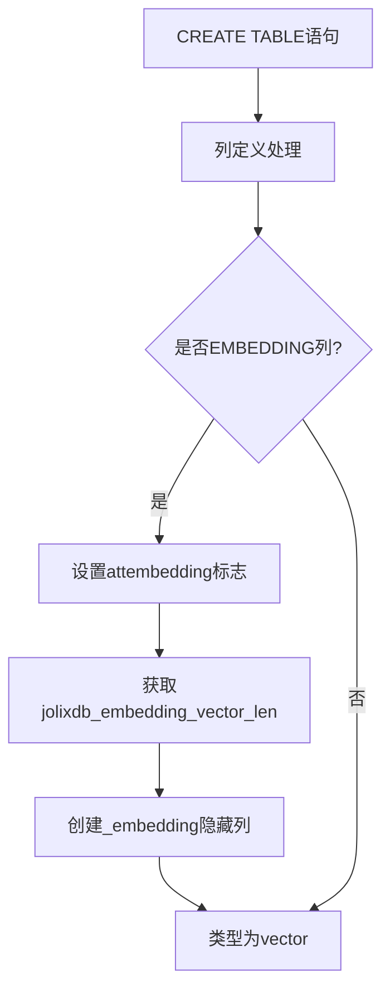

# EMBEDDING列属性详细设计文档

## 1. 概述

### 1.1 功能简介

EMBEDDING列属性用于标记需要存储嵌入向量的列。当定义一个EMBEDDING列时，系统会自动创建一个隐藏的向量列来存储嵌入向量数据。该功能与pgvector扩展配合使用，支持向量相似度搜索等AI应用场景。

### 1.2 设计目标

- 提供简洁的语法标记需要嵌入向量的列
- 自动创建隐藏的向量列存储嵌入数据
- 支持自定义向量维度
- 支持自定义嵌入函数
- 与PREDICT列属性协同工作

### 1.3 当前实现状态

| 功能 | 状态 | 说明 |
|-----|------|------|
| EMBEDDING关键字 | ✅ 已完成 | 在kwlist.h中定义 |
| 语法解析 | ✅ 已完成 | gram.y中添加语法规则 |
| attembedding字段 | ✅ 已完成 | pg_attribute系统表扩展 |
| 自动创建_embedding列 | ✅ 已完成 | parse_utilcmd.c实现 |
| jolixdb_embedding_vector_len选项 | ✅ 已完成 | 表级向量长度选项 |
| embedding_function选项 | ✅ 已完成 | 表级嵌入函数选项 |
| get_embedding_function_oid | ✅ 已完成 | 获取嵌入函数OID |

## 2. 设计原理

### 2.1 工作流程



### 2.2 核心组件

| 组件 | 说明 |
|-----|------|
| EMBEDDING关键字 | SQL语法中的列属性标记 |
| attembedding字段 | pg_attribute系统表中的列属性标志 |
| _embedding隐藏列 | 自动创建的向量存储列 |
| jolixdb_embedding_vector_len | 表级选项，指定向量维度 |
| embedding_function | 表级选项，指定嵌入函数 |

## 3. 数据结构设计

### 3.1 系统表扩展

**文件**: `src/include/catalog/pg_attribute.h`

```c
/* Is EMBEDDING option specified */
bool        attembedding BKI_DEFAULT(f);
```

### 3.2 解析器列定义扩展

**文件**: `src/include/nodes/parsenodes.h`

```c
typedef struct ColumnDef
{
    // ... 现有字段
    bool        is_predict;     /* PREDICT option specified? */
    bool        is_embedding;   /* EMBEDDING option specified? */
    bool        is_hidden;      /* hidden from SELECT * expansion? */
} ColumnDef;
```

### 3.3 紧凑属性扩展

**文件**: `src/include/access/tupdesc.h`

```c
typedef struct CompactAttribute
{
    // ... 现有字段
    bool        attpredict;     /* FormData_pg_attribute.attpredict */
    bool        attembedding;   /* FormData_pg_attribute.attembedding */
} CompactAttribute;
```

## 4. 表级选项设计

### 4.1 jolixdb_embedding_vector_len选项

**功能描述**: 指定嵌入向量的维度长度。

**文件**: `src/backend/access/common/reloptions.c`

```c
static relopt_int intRelOpts[] =
{
    // ... 其他选项
    {
        {
            "jolixdb_embedding_vector_len",
            "Length of embedding vector for prediction columns.",
            RELOPT_KIND_HEAP,
            ShareUpdateExclusiveLock
        },
        10, 0, INT_MAX    /* 默认值=10, 最小值=0, 最大值=INT_MAX */
    },
};
```

**文件**: `src/include/utils/rel.h`

```c
typedef struct StdRdOptions
{
    // ... 现有字段
    int         jolixdb_embedding_vector_len;   /* length of embedding vector for prediction */
} StdRdOptions;

/* 获取jolixdb_embedding_vector_len的宏 */
#define RelationGetEmbeddingVectorLen(relation, defaultlen) \
    ((relation)->rd_options ? \
     ((StdRdOptions *) (relation)->rd_options)->jolixdb_embedding_vector_len : (defaultlen))
```

### 4.2 embedding_function选项

**功能描述**: 设置表的嵌入函数，用于生成嵌入向量。该函数接收整行数据作为参数，返回vector类型的嵌入向量。

**文件**: `src/backend/access/common/reloptions.c`

```c
static relopt_string stringRelOpts[] =
{
    // ... predict_function 选项
    {
        {
            "embedding_function",
            "Sets the embedding function for the table (output type: vector)",
            RELOPT_KIND_HEAP,
            AccessExclusiveLock
        },
        0,      /* 默认偏移量 */
        true,   /* 允许为空 */
        NULL,   /* 默认值 */
        NULL,   /* 验证函数 */
        NULL    /* 填充函数 */
    },
};
```

**文件**: `src/include/utils/rel.h`

```c
typedef struct StdRdOptions
{
    // ... 现有字段
    int     predict_function;    /* offset to predict function name string */
    int     embedding_function;  /* offset to embedding function name string */
} StdRdOptions;
```

**函数签名要求**:
- 输入参数: `record` 类型（整行数据）
- 返回类型: `vector` 类型
- 向量维度: 必须与 `jolixdb_embedding_vector_len` 设置一致

**获取函数OID的接口**:

**文件**: `src/include/utils/predict.h`

```c
extern PGDLLIMPORT Oid get_predict_function_oid(Oid relid);
extern PGDLLIMPORT Oid get_embedding_function_oid(Oid relid);
```

**文件**: `src/backend/utils/adt/predict.c`

```c
/*
 * get_embedding_function - Get the embedding function name from reloptions
 * Returns the function name if set, or NULL if not set.
 */
static char *
get_embedding_function(Oid relid);

/*
 * get_embedding_function_oid - Get the OID of the embedding function
 * Returns the function OID if set, or InvalidOid if not set.
 */
Oid
get_embedding_function_oid(Oid relid);
```

## 5. 语法设计

### 5.1 关键字定义

**文件**: `src/include/parser/kwlist.h`

```c
PG_KEYWORD("embedding", EMBEDDING, UNRESERVED_KEYWORD, BARE_LABEL)
```

### 5.2 语法规则

**文件**: `src/backend/parser/gram.y`

```bison
/* 列定义语法 */
columnDef: ColId Typename opt_column_storage opt_column_compression 
           create_generic_options ColQualList opt_predict opt_embedding
    {
        ColumnDef *n = makeNode(ColumnDef);
        // ...
        n->is_predict = $7;
        n->is_embedding = $8;
        // ...
    }
;

/* EMBEDDING选项规则 */
opt_embedding:
    EMBEDDING     { $$ = true; }
    | /*EMPTY*/   { $$ = false; }
;
```

## 6. 自动创建嵌入向量列

### 6.1 实现位置

**文件**: `src/backend/parser/parse_utilcmd.c`

**函数**: `transformColumnDefinition()`

```c
/*
 * If this is an EMBEDDING column, automatically add a companion hidden
 * column with "_embedding" suffix to store the embedding vector.
 * The column type is vector with length specified by jolixdb_embedding_vector_len.
 */
if (column->is_embedding)
{
    ColumnDef  *embedding_col;
    char       *embedding_colname;
    TypeName   *vector_type;
    int         vector_len;

    /* Get jolixdb_embedding_vector_len from relation options */
    vector_len = cxt->jolixdb_embedding_vector_len;

    /* Create _embedding column name */
    embedding_colname = psprintf("%s_embedding", column->colname);

    /* Create vector type: vector(vector_len) */
    vector_type = makeNode(TypeName);
    vector_type->names = list_make1(makeString("vector"));
    vector_type->typmods = list_make1(makeAConst(vector_len));
    vector_type->typemod = -1;
    vector_type->location = -1;

    /* Create the _embedding column definition */
    embedding_col = makeNode(ColumnDef);
    embedding_col->colname = embedding_colname;
    embedding_col->typeName = vector_type;
    embedding_col->is_predict = false;
    embedding_col->is_embedding = false;
    embedding_col->is_hidden = true;
    // ... 其他字段初始化

    cxt->columns = lappend(cxt->columns, embedding_col);
}
```

## 7. 使用示例

### 7.1 基本使用

```sql
-- 创建带EMBEDDING列的表，使用默认向量长度(10)
CREATE TABLE documents (
    id SERIAL PRIMARY KEY,
    content TEXT EMBEDDING
);

-- 实际表结构：
-- id (serial, PRIMARY KEY)
-- content (text)                        -- EMBEDDING列
-- content_embedding (vector(10), HIDDEN) -- 自动创建的隐藏向量列
```

### 7.2 指定向量长度

```sql
-- 创建带EMBEDDING列的表，指定向量长度
CREATE TABLE documents (
    id SERIAL PRIMARY KEY,
    content TEXT EMBEDDING
) WITH (
    jolixdb_embedding_vector_len = 128
);

-- 实际表结构：
-- id (serial, PRIMARY KEY)
-- content (text)                           -- EMBEDDING列
-- content_embedding (vector(128), HIDDEN)  -- 自动创建的隐藏向量列
```

### 7.3 同时使用PREDICT和EMBEDDING

```sql
CREATE TABLE predictions (
    id SERIAL PRIMARY KEY,
    text_content TEXT EMBEDDING,
    value INTEGER PREDICT
) WITH (
    jolixdb_embedding_vector_len = 256,
    predict_timing = immediate,
    predict_function = 'ml_predict'
);

-- 实际表结构：
-- id (serial, PRIMARY KEY)
-- text_content (text)                        -- EMBEDDING列
-- text_content_embedding (vector(256), HIDDEN) -- 自动创建
-- value (integer)                            -- PREDICT列
-- value_predict (integer, HIDDEN)            -- 自动创建
-- value_actual (integer, HIDDEN)             -- 自动创建
```

### 7.4 查询隐藏列

```sql
-- SELECT * 不返回隐藏列
SELECT * FROM documents;
-- 结果列：id, content

-- 显式指定可以查询隐藏列
SELECT id, content, content_embedding FROM documents;
-- 结果列：id, content, content_embedding

-- 使用向量相似度查询
SELECT id, content 
FROM documents 
ORDER BY content_embedding <=> '[1,2,3,4,5,6,7,8,9,10]'::vector
LIMIT 10;
```

### 7.5 使用embedding_function

```sql
-- 确保已安装 pgvector 扩展
CREATE EXTENSION IF NOT EXISTS vector;

-- 创建嵌入函数
CREATE OR REPLACE FUNCTION simple_embedding_func(row_data record)
RETURNS vector
AS $$
DECLARE
    text_content text;
    result vector;
BEGIN
    -- 从行数据中提取文本内容
    text_content := row_data.content;
    
    -- 返回示例向量（实际应用中应调用真实嵌入模型）
    result := '[0.1, 0.2, 0.3, 0.4, 0.5, 0.6, 0.7, 0.8, 0.9, 1.0]'::vector;
    
    RETURN result;
END;
$$ LANGUAGE plpgsql IMMUTABLE;

-- 创建带嵌入函数的表
CREATE TABLE documents (
    id int PRIMARY KEY,
    title text,
    content text EMBEDDING
) WITH (
    jolixdb_embedding_vector_len = 10,
    embedding_function = 'simple_embedding_func'
);
```

## 8. 代码修改文件清单

| 文件路径 | 功能说明 |
|---------|----------|
| `src/include/parser/kwlist.h` | 添加EMBEDDING关键字定义 |
| `src/backend/parser/gram.y` | 添加EMBEDDING语法规则和关键字声明 |
| `src/include/nodes/parsenodes.h` | ColumnDef结构体添加is_embedding字段 |
| `src/include/catalog/pg_attribute.h` | 添加attembedding字段定义 |
| `src/include/access/tupdesc.h` | CompactAttribute结构体添加attembedding字段 |
| `src/backend/access/common/reloptions.c` | 添加jolixdb_embedding_vector_len和embedding_function表选项定义和解析 |
| `src/backend/access/common/tupdesc.c` | populate_compact_attribute_internal添加attembedding处理 |
| `src/backend/parser/parse_utilcmd.c` | transformColumnDefinition添加EMBEDDING列处理逻辑 |
| `src/backend/commands/tablecmds.c` | BuildDescForRelation添加attembedding属性设置 |
| `src/backend/nodes/makefuncs.c` | makeColumnDef初始化is_embedding字段 |
| `src/include/utils/rel.h` | StdRdOptions结构体添加jolixdb_embedding_vector_len和embedding_function字段，添加RelationGetEmbeddingVectorLen宏 |
| `src/backend/utils/adt/predict.c` | 添加get_embedding_function和get_embedding_function_oid函数 |
| `src/include/utils/predict.h` | 添加get_embedding_function_oid函数声明 |

## 9. 与PREDICT列的对比

| 特性 | PREDICT列 | EMBEDDING列 |
|-----|----------|-------------|
| 标记字段 | attpredict | attembedding |
| 自动创建列 | `_predict`, `_actual` | `_embedding` |
| 自动创建列类型 | 与原列相同 | vector(N) |
| 表级选项 | predict_timing, predict_function | jolixdb_embedding_vector_len, embedding_function |
| 触发器 | 自动创建预测触发器 | 无 |
| 用途 | 存储预测值和实际值 | 存储嵌入向量 |

## 10. 函数签名要求

| 属性 | 要求 |
|-----|------|
| 输入参数类型 | `record`（整行数据） |
| 返回类型 | `vector` |
| 向量维度 | 必须与 `jolixdb_embedding_vector_len` 一致 |
| 推荐属性 | `IMMUTABLE`（如果结果确定） |

## 11. 重新构建和初始化

由于修改了`pg_attribute`系统表结构，需要重新构建项目并初始化数据库：

### 11.1 重新构建

```bash
cd /path/to/postgres/build
make clean
make -j4
make install
```

### 11.2 重新初始化数据库

```bash
# 停止数据库服务
pg_ctl stop -D /path/to/data

# 删除旧数据目录
rm -rf /path/to/data/*

# 重新初始化
initdb -D /path/to/data

# 启动数据库
pg_ctl start -D /path/to/data
```

---

**文档版本**: 1.0  
**最后更新**: 2025-04-03  
**作者**: PostgreSQL开发团队
