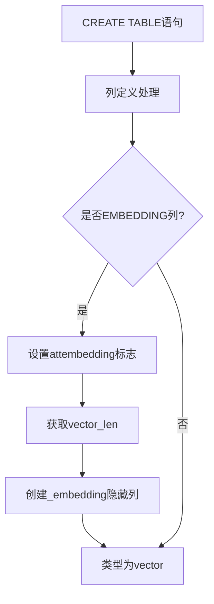
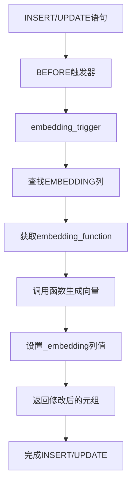
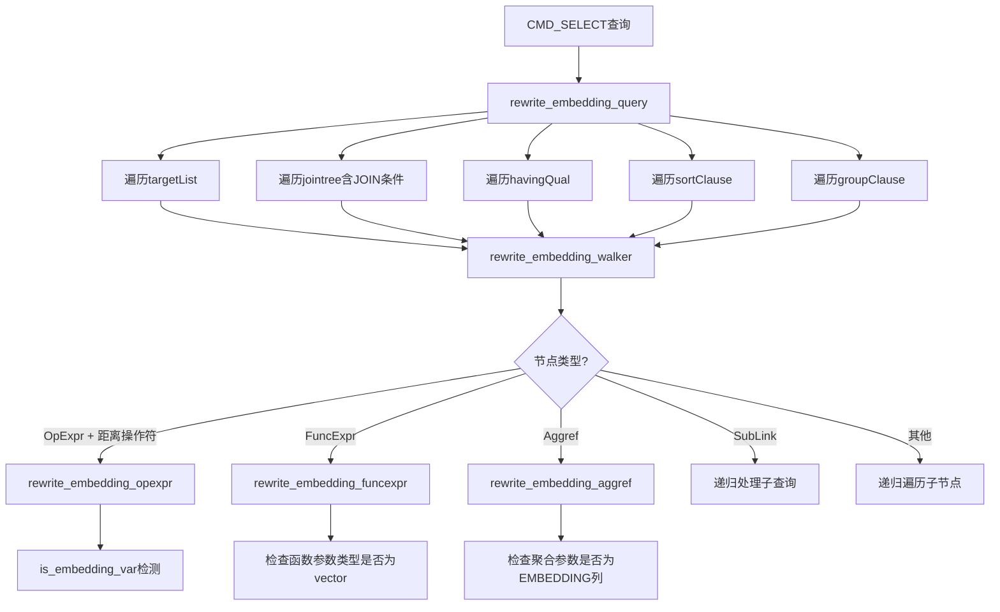

# EMBEDDING列属性详细设计文档

## 1. 概述

### 1.1 功能简介

EMBEDDING列属性用于标记需要存储嵌入向量的列。当定义一个EMBEDDING列时，系统会自动创建一个隐藏的向量列来存储嵌入向量数据。该功能与pgvector扩展配合使用，支持向量相似度搜索等AI应用场景。

### 1.2 设计目标

- 提供简洁的语法标记需要嵌入向量的列
- 自动创建隐藏的向量列存储嵌入数据
- 支持自定义向量维度
- 支持自定义嵌入函数
- 与PREDICT列属性协同工作

### 1.3 当前实现状态

| 功能 | 状态 | 说明 |
|-----|------|------|
| EMBEDDING关键字 | ✅ 已完成 | 在kwlist.h中定义 |
| 语法解析 | ✅ 已完成 | gram.y中添加语法规则 |
| attembedding字段 | ✅ 已完成 | pg_attribute系统表扩展 |
| 自动创建_embedding列 | ✅ 已完成 | parse_utilcmd.c实现 |
| vector_len选项 | ✅ 已完成 | 表级向量长度选项 |
| embedding_function选项 | ✅ 已完成 | 表级嵌入函数选项 |
| get_embedding_function_oid | ✅ 已完成 | 获取嵌入函数OID |
| embedding_trigger触发器 | ✅ 已完成 | 自动调用嵌入函数生成向量 |
| 自动创建触发器 | ✅ 已完成 | 建表时自动创建embedding触发器 |
| 自动创建向量索引 | ✅ 已完成 | 建表时通过vector_index/vector_distance参数自动创建 |
| 索引参数自动传递 | ✅ 已完成 | lists/m/ef_construction参数传递到索引 |
| 通用查询重写Walker | ✅ 已完成 | 全查询树EMBEDDING列自动替换为_embedding列 |
| 向量函数重写 | ✅ 已完成 | l2_distance/cosine_distance等函数参数自动替换 |
| 向量聚合重写 | ✅ 已完成 | avg/sum聚合参数自动替换 |
| L1距离操作符<+> | ✅ 已完成 | 支持pgvector L1距离操作符 |

## 2. 设计原理

### 2.1 工作流程



### 2.2 核心组件

| 组件 | 说明 |
|-----|------|
| EMBEDDING关键字 | SQL语法中的列属性标记 |
| attembedding字段 | pg_attribute系统表中的列属性标志 |
| _embedding隐藏列 | 自动创建的向量存储列 |
| vector_len | 表级选项，指定向量维度 |
| embedding_function | 表级选项，指定嵌入函数 |

## 3. 数据结构设计

### 3.1 系统表扩展

**文件**: `src/include/catalog/pg_attribute.h`

```c
/* Is EMBEDDING option specified */
bool        attembedding BKI_DEFAULT(f);
```

### 3.2 解析器列定义扩展

**文件**: `src/include/nodes/parsenodes.h`

```c
typedef struct ColumnDef
{
    // ... 现有字段
    bool        is_predict;     /* PREDICT option specified? */
    bool        is_embedding;   /* EMBEDDING option specified? */
    bool        is_hidden;      /* hidden from SELECT * expansion? */
} ColumnDef;
```

### 3.3 紧凑属性扩展

**文件**: `src/include/access/tupdesc.h`

```c
typedef struct CompactAttribute
{
    // ... 现有字段
    bool        attpredict;     /* FormData_pg_attribute.attpredict */
    bool        attembedding;   /* FormData_pg_attribute.attembedding */
} CompactAttribute;
```

## 4. 表级选项设计

### 4.1 vector_len选项

**功能描述**: 指定嵌入向量的维度长度。

**文件**: `src/backend/access/common/reloptions.c`

```c
static relopt_int intRelOpts[] =
{
    // ... 其他选项
    {
        {
            "vector_len",
            "Length of embedding vector for prediction columns.",
            RELOPT_KIND_HEAP,
            ShareUpdateExclusiveLock
        },
        10, 0, INT_MAX    /* 默认值=10, 最小值=0, 最大值=INT_MAX */
    },
};
```

**文件**: `src/include/utils/rel.h`

```c
typedef struct StdRdOptions
{
    // ... 现有字段
    int         vector_len;   /* length of embedding vector for prediction */
} StdRdOptions;

/* 获取vector_len的宏 */
#define RelationGetEmbeddingVectorLen(relation, defaultlen) \
    ((relation)->rd_options ? \
     ((StdRdOptions *) (relation)->rd_options)->vector_len : (defaultlen))
```

### 4.2 embedding_function选项

**功能描述**: 设置表的嵌入函数，用于生成嵌入向量。该函数接收整行数据作为参数，返回vector类型的嵌入向量。

支持两种格式：
1. **单个函数名**：`embedding_function = 'func_name'` — 为该表所有EMBEDDING列设置相同的嵌入函数
2. **列特定函数名**：`embedding_function = 'col_a:func_a;col_b:func_b'` — 为不同列设置不同的嵌入函数，格式为`列名:函数名`，多个用分号`;`分隔

**文件**: `src/backend/access/common/reloptions.c`

```c
static relopt_string stringRelOpts[] =
{
    // ... predict_timing 选项
    {
        {
            "embedding_function",
            "Sets the embedding function for the table (output type: vector)",
            RELOPT_KIND_HEAP,
            AccessExclusiveLock
        },
        0,      /* 默认偏移量 */
        true,   /* 允许为空 */
        NULL,   /* 默认值 */
        NULL,   /* 验证函数 */
        NULL    /* 填充函数 */
    },
};
```

**文件**: `src/include/utils/rel.h`

```c
typedef struct StdRdOptions
{
    // ... 现有字段
    StdRdOptPredictTiming predict_timing;    /* controls prediction timing */
    int     embedding_function;  /* offset to embedding function name string */
} StdRdOptions;
```

**函数签名要求**:
- 输入参数: `record` 类型（整行数据）
- 返回类型: `vector` 类型
- 向量维度: 必须与 `vector_len` 设置一致

**获取函数OID的接口**:

**文件**: `src/include/utils/predict.h`

```c
extern PGDLLIMPORT Oid get_embedding_function_oid(Oid relid);
extern PGDLLIMPORT Oid get_embedding_function_oid(Oid relid, const char *colname);
```

**文件**: `src/backend/utils/adt/predict.c`

```c
/*
 * get_embedding_function - Get the embedding function name from reloptions
 * Returns the function name if set, or NULL if not set.
 * Supports two formats:
 *   1. Single function name: "func_name" - applies to all EMBEDDING columns
 *   2. Column-specific: "col_a:func_a;col_b:func_b" - applies func_a to col_a, func_b to col_b
 *
 * If colname is provided (non-NULL), looks up the function for that specific column.
 * If colname is NULL, returns the single function name (format 1) or NULL (format 2).
 */
static char *
get_embedding_function(Oid relid, const char *colname);

/*
 * get_embedding_function_oid - Get the OID of the embedding function
 * Returns the function OID if set, or InvalidOid if not set.
 * colname specifies which EMBEDDING column to look up the function for.
 */
Oid
get_embedding_function_oid(Oid relid, const char *colname);
```

**函数查找逻辑**:

当 `embedding_function` 值不包含冒号`:`时，作为单个函数名处理，适用于所有EMBEDDING列。

当 `embedding_function` 值包含冒号`:`时，按列特定格式解析：
1. 以分号`;`分隔多个`列名:函数名`对
2. 根据当前EMBEDDING列名查找对应的函数名
3. 如果找不到对应列名的函数，则该列不调用嵌入函数

## 5. 语法设计

### 5.1 关键字定义

**文件**: `src/include/parser/kwlist.h`

```c
PG_KEYWORD("embedding", EMBEDDING, UNRESERVED_KEYWORD, BARE_LABEL)
```

### 5.2 语法规则

**文件**: `src/backend/parser/gram.y`

```bison
/* 列定义语法 */
columnDef: ColId Typename opt_column_storage opt_column_compression 
           create_generic_options ColQualList opt_predict opt_embedding
    {
        ColumnDef *n = makeNode(ColumnDef);
        // ...
        n->is_predict = $7;
        n->is_embedding = $8;
        // ...
    }
;

/* EMBEDDING选项规则 */
opt_embedding:
    EMBEDDING     { $$ = true; }
    | /*EMPTY*/   { $$ = false; }
;
```

## 6. 自动创建嵌入向量列

### 6.1 实现位置

**文件**: `src/backend/parser/parse_utilcmd.c`

**函数**: `transformColumnDefinition()`

```c
/*
 * If this is an EMBEDDING column, automatically add a companion hidden
 * column with "_embedding" suffix to store the embedding vector.
 * The column type is vector with length specified by vector_len.
 */
if (column->is_embedding)
{
    ColumnDef  *embedding_col;
    char       *embedding_colname;
    TypeName   *vector_type;
    int         vector_len;

    /* Get vector_len from relation options */
    vector_len = cxt->vector_len;

    /* Create _embedding column name */
    embedding_colname = psprintf("%s_embedding", column->colname);

    /* Create vector type: vector(vector_len) */
    vector_type = makeNode(TypeName);
    vector_type->names = list_make1(makeString("vector"));
    vector_type->typmods = list_make1(makeAConst(vector_len));
    vector_type->typemod = -1;
    vector_type->location = -1;

    /* Create the _embedding column definition */
    embedding_col = makeNode(ColumnDef);
    embedding_col->colname = embedding_colname;
    embedding_col->typeName = vector_type;
    embedding_col->is_predict = false;
    embedding_col->is_embedding = false;
    embedding_col->is_hidden = true;
    // ... 其他字段初始化

    cxt->columns = lappend(cxt->columns, embedding_col);
}
```

## 7. 自动触发器设计

### 7.1 触发器函数

**文件**: `src/backend/utils/adt/predict.c`

**函数**: `embedding_trigger()`

```c
/*
 * embedding_trigger - trigger function for EMBEDDING columns
 *
 * This is a BEFORE INSERT/UPDATE trigger that handles EMBEDDING columns:
 * - Calls embedding_function and saves result to _embedding column
 */
PG_FUNCTION_INFO_V1(embedding_trigger);

Datum
embedding_trigger(PG_FUNCTION_ARGS)
{
    TriggerData *trigdata = (TriggerData *) fcinfo->context;
    TupleDesc    tupdesc;
    HeapTuple    rettuple;
    HeapTuple    newtuple;
    Relation     rel;
    int          attnum;

    // 验证触发器调用环境
    // ...

    rel = trigdata->tg_relation;
    tupdesc = RelationGetDescr(rel);
    newtuple = trigdata->tg_trigtuple;

    for (attnum = 1; attnum <= tupdesc->natts; attnum++)
    {
        Form_pg_attribute attr = TupleDescAttr(tupdesc, attnum - 1);

        if (attr->attisdropped)
            continue;

        if (!attr->attembedding)
            continue;

        /* This is an EMBEDDING column */

        /* Find _embedding column */
        embedding_colname = psprintf("%s_embedding", NameStr(attr->attname));
        embedding_attnum = find_column_by_name(tupdesc, embedding_colname);

        /* Get embedding function OID and call it */
        embedding_func_oid = get_embedding_function_oid(rel->rd_id);
        if (OidIsValid(embedding_func_oid))
        {
            // Call embedding function with row data
            row_datum = heap_copy_tuple_as_datum(newtuple, tupdesc);
            embedding_datum = FunctionCall1(&embedding_func, row_datum);

            // Set _embedding column value
            rettuple = heap_modify_tuple_by_cols(newtuple, tupdesc, ...);
            newtuple = rettuple;
        }
    }

    return PointerGetDatum(newtuple);
}
```

### 7.2 触发器创建

**文件**: `src/backend/commands/tablecmds.c`

**函数**: `createEmbeddingTrigger()`

```c
/*
 * createEmbeddingTrigger
 *      Create an internal trigger for an EMBEDDING column.
 */
static void
createEmbeddingTrigger(Oid relOid, AttrNumber attnum, const char *colname)
{
    CreateTrigStmt *trigger;
    char        trigname[NAMEDATALEN];

    /* Generate a unique trigger name */
    snprintf(trigname, NAMEDATALEN, "pg_embedding_%s_%u", colname, relOid);

    /* Create trigger node */
    trigger = makeNode(CreateTrigStmt);
    trigger->trigname = pstrdup(trigname);
    trigger->funcname = SystemFuncName("embedding_trigger");
    trigger->row = true;
    trigger->timing = TRIGGER_TYPE_BEFORE;
    trigger->events = TRIGGER_TYPE_INSERT | TRIGGER_TYPE_UPDATE;

    /* Create the trigger */
    CreateTrigger(trigger, NULL, relOid, InvalidOid, ...);
}
```

### 7.3 触发器调用流程



## 8. 使用示例

### 8.1 基本使用

```sql
-- 创建带EMBEDDING列的表，使用默认向量长度(10)
CREATE TABLE documents (
    id SERIAL PRIMARY KEY,
    content TEXT EMBEDDING
);

-- 实际表结构：
-- id (serial, PRIMARY KEY)
-- content (text)                        -- EMBEDDING列
-- content_embedding (vector(10), HIDDEN) -- 自动创建的隐藏向量列
```

### 8.2 指定向量长度

```sql
-- 创建带EMBEDDING列的表，指定向量长度
CREATE TABLE documents (
    id SERIAL PRIMARY KEY,
    content TEXT EMBEDDING
) WITH (
    vector_len = 128
);

-- 实际表结构：
-- id (serial, PRIMARY KEY)
-- content (text)                           -- EMBEDDING列
-- content_embedding (vector(128), HIDDEN)  -- 自动创建的隐藏向量列
```

### 8.3 使用embedding_function自动生成向量

```sql
-- 确保已安装 pgvector 扩展
CREATE EXTENSION IF NOT EXISTS vector;

-- 创建嵌入函数
CREATE OR REPLACE FUNCTION simple_embedding_func(row_data record)
RETURNS vector
AS $$
DECLARE
    text_content text;
    result vector;
BEGIN
    -- 从行数据中提取文本内容
    text_content := row_data.content;
    
    -- 返回示例向量（实际应用中应调用真实嵌入模型）
    result := '[0.1, 0.2, 0.3, 0.4, 0.5, 0.6, 0.7, 0.8, 0.9, 1.0]'::vector;
    
    RETURN result;
END;
$$ LANGUAGE plpgsql IMMUTABLE;

-- 创建带嵌入函数的表（单个函数名，适用于所有EMBEDDING列）
CREATE TABLE documents (
    id int PRIMARY KEY,
    content text EMBEDDING
) WITH (
    vector_len = 10,
    embedding_function = 'simple_embedding_func'
);

-- 插入数据时自动调用embedding_function生成向量
INSERT INTO documents (id, content) VALUES (1, 'Hello World');

-- 查询自动生成的向量
SELECT id, content, content_embedding FROM documents;
-- 结果：
-- id | content     | content_embedding
-- ---+-------------+----------------------------------
-- 1  | Hello World | [0.1,0.2,0.3,0.4,0.5,0.6,0.7,0.8,0.9,1.0]
```

### 8.4 为不同EMBEDDING列设置不同的嵌入函数

```sql
-- 创建两个不同的嵌入函数
CREATE OR REPLACE FUNCTION title_embedding_func(row_data record)
RETURNS vector
AS $$
BEGIN
    -- 标题嵌入逻辑
    RETURN '[1,0,0,0,0]'::vector;
END;
$$ LANGUAGE plpgsql IMMUTABLE;

CREATE OR REPLACE FUNCTION body_embedding_func(row_data record)
RETURNS vector
AS $$
BEGIN
    -- 正文嵌入逻辑
    RETURN '[0,0,0,0,1]'::vector;
END;
$$ LANGUAGE plpgsql IMMUTABLE;

-- 使用列特定函数名格式：列名:函数名，多个用分号分隔
CREATE TABLE articles (
    id int PRIMARY KEY,
    title text EMBEDDING,
    body text EMBEDDING
) WITH (
    vector_len = 5,
    embedding_function = 'title:title_embedding_func;body:body_embedding_func'
);

-- 插入数据时，title列使用title_embedding_func，body列使用body_embedding_func
INSERT INTO articles (id, title, body) VALUES (1, 'Hello', 'World');

-- 查询结果
SELECT id, title, title_embedding, body, body_embedding FROM articles;
-- 结果：
-- id | title | title_embedding | body  | body_embedding
-- ---+-------+-----------------+-------+----------------
-- 1  | Hello | [1,0,0,0,0]     | World | [0,0,0,0,1]
```

### 8.5 同时使用PREDICT和EMBEDDING

```sql
CREATE TABLE predictions (
    id SERIAL PRIMARY KEY,
    text_content TEXT EMBEDDING,
    value INTEGER PREDICT AS (ml_predict(text_content)) STORED
) WITH (
    vector_len = 256,
    predict_timing = immediate,
    embedding_function = 'text_embedding_func'
);

-- 实际表结构：
-- id (serial, PRIMARY KEY)
-- text_content (text)                        -- EMBEDDING列
-- text_content_embedding (vector(256), HIDDEN) -- 自动创建
-- value (integer)                            -- PREDICT列
-- value_predict (integer, HIDDEN)            -- 自动创建
-- value_actual (integer, HIDDEN)             -- 自动创建
```

### 8.6 查询隐藏列

```sql
-- SELECT * 不返回隐藏列
SELECT * FROM documents;
-- 结果列：id, content

-- 显式指定可以查询隐藏列
SELECT id, content, content_embedding FROM documents;
-- 结果列：id, content, content_embedding

-- 使用向量相似度查询
SELECT id, content 
FROM documents 
ORDER BY content_embedding <=> '[1,2,3,4,5,6,7,8,9,10]'::vector
LIMIT 10;
```

## 12. 通用查询重写 Walker 设计

### 12.1 设计目标

EMBEDDING 列在 SQL 查询中是 text 类型，但向量操作（距离计算、向量函数等）需要操作 `_embedding` 列（vector 类型）。通用 Var 节点替换 Walker 自动遍历查询树，在需要 vector 类型的上下文中将 EMBEDDING 列替换为 `_embedding` 列。

### 12.2 核心设计原则

**只在期望 vector 类型的上下文中进行替换**。当 EMBEDDING 列用于普通 text 操作时（如 `LIKE`、`=`、`<>` 等），不进行替换，保持原始 text 语义。

### 12.3 架构设计



### 12.4 函数设计

**文件**: `src/backend/rewrite/rewriteHandler.c`

#### 12.4.1 入口函数

```c
static void rewrite_embedding_query(Query *parsetree);
```

遍历查询树的所有关键部分：
- `targetList`：SELECT 目标列表
- `jointree`：FROM/WHERE/JOIN 条件
- `havingQual`：HAVING 子句
- `sortClause`：ORDER BY 子句
- `groupClause`：GROUP BY 子句

#### 12.4.2 核心检测函数

```c
static bool is_embedding_var(Var *var, Query *query,
                             Oid *out_relid, int *out_embedding_attnum,
                             char **out_colname);
```

检测 Var 节点是否引用 EMBEDDING 列：
1. 检查 Var 引用的 RTE 是否为普通关系表
2. 打开关系表，检查列的 `attembedding` 标志
3. 查找对应的 `_embedding` 隐藏列
4. 返回关系 OID、_embedding 列属性号和列名

#### 12.4.3 距离操作符重写

```c
static Node *rewrite_embedding_opexpr(OpExpr *opexpr, Query *query);
```

处理四种距离操作符：`<->`、`<=>`、`<#>`、`<+>`

支持三种模式：
| 模式 | 示例 | 处理方式 |
|------|------|---------|
| Var-Const | `content <-> 'text'` | 替换列 + 替换操作符 + 转换常量 |
| Const-Var | `'text' <-> content` | 替换列 + 替换操作符 + 转换常量 |
| Var-Var | `a.content <-> b.content` | 替换两侧列 + 替换操作符 |

常量转换流程：
1. 检查常量是否为 text 类型
2. 获取 embedding 函数 OID
3. 调用 embedding 函数将 text 转为 vector
4. 创建 vector 类型的 Const 节点替换原常量

#### 12.4.4 向量函数重写

```c
static Node *rewrite_embedding_funcexpr(FuncExpr *funcexpr, Query *query);
```

通过检查函数声明的参数类型，判断哪些参数期望 vector 类型：
1. 查找函数的 `pg_proc` 系统表条目
2. 遍历函数参数，检查 `proargtypes` 中对应位置是否为 vector OID
3. 对期望 vector 类型的参数位置，如果传入的是 EMBEDDING 列（Var），替换为 `_embedding` 列
4. 对期望 vector 类型的参数位置，如果传入的是 text 常量，通过 embedding 函数转换为 vector

支持的函数包括：
- 距离函数：`l2_distance`、`cosine_distance`、`inner_product`、`l1_distance`
- 工具函数：`vector_dims`、`vector_norm`、`l2_normalize`、`subvector`、`binary_quantize`

#### 12.4.5 向量聚合重写

```c
static Node *rewrite_embedding_aggref(Aggref *aggref, Query *query);
```

处理向量聚合函数（`avg`、`sum`）：
1. 检查聚合函数的参数数量
2. 遍历聚合参数（TargetEntry）
3. 如果参数是 EMBEDDING 列的 Var，替换为 `_embedding` 列

#### 12.4.6 通用 Walker

```c
static Node *rewrite_embedding_walker(Node *node, Query *query);
```

递归遍历查询表达式树，处理的节点类型：

| 节点类型 | 处理方式 |
|---------|---------|
| OpExpr | 距离操作符走专门处理，其他递归子节点 |
| FuncExpr | 走向量函数专门处理 |
| Aggref | 走向量聚合专门处理 |
| BoolExpr | 递归遍历参数列表 |
| ScalarArrayOpExpr | 递归遍历参数列表 |
| RelabelType | 递归处理 arg |
| CoerceToDomain | 递归处理 arg |
| CaseExpr/CaseWhen | 递归处理条件、结果 |
| NullTest | 递归处理 arg |
| BooleanTest | 递归处理 arg |
| TargetEntry | 递归处理 expr |
| List | 递归遍历元素 |
| SubLink | 递归处理子查询 + testexpr |

#### 12.4.7 JOIN 树遍历

```c
static void rewrite_embedding_walk_jointree(Node *jtnode, Query *query);
```

递归遍历 JOIN 树，处理：
- `FromExpr`：遍历 fromlist + 重写 quals
- `JoinExpr`：递归处理左右子树 + 重写 quals（JOIN 条件）
- `RangeTblRef`：叶子节点，无需处理

### 12.5 不替换的场景

以下场景中 EMBEDDING 列保持原始 text 类型，不进行替换：

| 场景 | 示例 | 原因 |
|------|------|------|
| 普通比较 | `content = 'hello'` | text 类型的等值比较 |
| LIKE/ILIKE | `content LIKE '%test%'` | text 模式匹配 |
| IS NULL | `content IS NULL` | NULL 检查 |
| 非向量操作符 | `content > 'a'` | text 排序比较 |
| IN 列表 | `content IN ('a', 'b')` | text 集合成员检查 |
| text 函数 | `length(content)` | 期望 text 参数的函数 |
| SELECT 显示 | `SELECT content FROM t` | 仅显示原始文本 |

**判断逻辑**：
- 距离操作符（`<->`/`<=>`/`<#>`/`<+>`）：总是替换，因为它们在 text 类型上的语义就是向量距离
- 函数调用：仅当函数声明的参数类型为 vector 时替换
- 聚合调用：仅当聚合参数为 EMBEDDING 列时替换
- 其他操作符（`=`/`<>`/`LIKE` 等）：不替换

### 12.6 调用时机

在 `RewriteQuery` 函数中，仅对 `CMD_SELECT` 查询触发重写：

```c
if (parsetree->commandType == CMD_SELECT)
{
    rewrite_embedding_query(parsetree);
}
```

### 12.7 向量索引自动创建

**文件**: `src/backend/parser/parse_utilcmd.c`

建表时自动为每个 EMBEDDING 列创建向量索引：

```c
if (cxt->vector_index != NULL && cxt->vector_distance != NULL)
{
    IndexStmt  *index;
    List       *index_options = NIL;

    index = makeNode(IndexStmt);
    index->idxname = psprintf("%s_%s_embedding_idx",
                              cxt->relation->relname, column->colname);
    index->accessMethod = pstrdup(cxt->vector_index);
    
    /* 传递索引参数 */
    if (cxt->vector_index_lists != -1)
        index_options = lappend(index_options,
            makeDefElem("lists", (Node *) makeInteger(cxt->vector_index_lists), -1));
    if (cxt->vector_index_m != -1)
        index_options = lappend(index_options,
            makeDefElem("m", (Node *) makeInteger(cxt->vector_index_m), -1));
    if (cxt->vector_index_ef_construction != -1)
        index_options = lappend(index_options,
            makeDefElem("ef_construction", (Node *) makeInteger(cxt->vector_index_ef_construction), -1));
    
    index->options = index_options;
    /* ... 其他索引属性设置 ... */
}
```

索引参数通过 `CreateStmtContext` 从 WITH 子句解析：

| 参数 | CreateStmtContext 字段 | 默认值 | 说明 |
|------|----------------------|--------|------|
| `lists` | `vector_index_lists` | -1 | ivfflat 倒排列表数量 |
| `m` | `vector_index_m` | -1 | hnsw 每层最大连接数 |
| `ef_construction` | `vector_index_ef_construction` | -1 | hnsw 构建时候选列表大小 |

-1 表示未指定，此时索引不包含 WITH 子句，使用 pgvector 自身默认值。

## 13. 代码修改文件清单

| 文件路径 | 功能说明 |
|---------|----------|
| `src/include/parser/kwlist.h` | 添加EMBEDDING关键字定义 |
| `src/backend/parser/gram.y` | 添加EMBEDDING语法规则和关键字声明 |
| `src/include/nodes/parsenodes.h` | ColumnDef结构体添加is_embedding字段 |
| `src/include/catalog/pg_attribute.h` | 添加attembedding字段定义 |
| `src/include/catalog/pg_proc.dat` | 注册embedding_trigger系统函数 |
| `src/include/access/tupdesc.h` | CompactAttribute结构体添加attembedding字段 |
| `src/backend/access/common/reloptions.c` | 添加vector_len和embedding_function表选项定义和解析 |
| `src/backend/access/common/tupdesc.c` | populate_compact_attribute_internal添加attembedding处理 |
| `src/backend/parser/parse_utilcmd.c` | transformColumnDefinition添加EMBEDDING列处理逻辑 |
| `src/backend/commands/tablecmds.c` | BuildDescForRelation添加attembedding属性设置，添加createEmbeddingTrigger和createEmbeddingTriggersForRelation函数 |
| `src/backend/catalog/heap.c` | AddNewAttributeTuples添加attembedding字段存储 |
| `src/backend/nodes/makefuncs.c` | makeColumnDef初始化is_embedding字段 |
| `src/include/utils/rel.h` | StdRdOptions结构体添加vector_len和embedding_function字段，添加RelationGetEmbeddingVectorLen宏 |
| `src/backend/utils/adt/predict.c` | 添加get_embedding_function、get_embedding_function_oid和embedding_trigger函数 |
| `src/include/utils/predict.h` | 添加get_embedding_function_oid函数声明 |
| `src/backend/rewrite/rewriteHandler.c` | 通用Var节点替换Walker：rewrite_embedding_query/rewrite_embedding_walker/rewrite_embedding_opexpr/rewrite_embedding_funcexpr/rewrite_embedding_aggref等 |
| `src/backend/access/common/reloptions.c` | 添加vector_index/vector_distance/lists/m/ef_construction表选项 |
| `src/include/utils/rel.h` | StdRdOptions添加vector_index/vector_distance/lists/m/ef_construction字段 |

## 10. 与PREDICT列的对比

| 特性 | PREDICT列 | EMBEDDING列 |
|-----|----------|-------------|
| 标记字段 | attpredict | attembedding |
| 自动创建列 | `_predict`, `_actual` | `_embedding` |
| 自动创建列类型 | 与原列相同 | vector(N) |
| 表级选项 | predict_timing | vector_len, embedding_function |
| 触发器 | 自动创建预测触发器 | 自动创建嵌入触发器 |
| 用途 | 存储预测值和实际值 | 存储嵌入向量 |

## 11. 函数签名要求

| 属性 | 要求 |
|-----|------|
| 输入参数类型 | `record`（整行数据） |
| 返回类型 | `vector` |
| 向量维度 | 必须与 `vector_len` 一致 |
| 推荐属性 | `IMMUTABLE`（如果结果确定） |

## 12. 重新构建和初始化

由于修改了`pg_attribute`系统表结构，需要重新构建项目并初始化数据库：

### 12.1 重新构建

```bash
cd /path/to/postgres/build
make clean
make -j4
make install
```

### 12.2 重新初始化数据库

```bash
# 停止数据库服务
pg_ctl stop -D /path/to/data

# 删除旧数据目录
rm -rf /path/to/data/*

# 重新初始化
initdb -D /path/to/data

# 启动数据库
pg_ctl start -D /path/to/data
```

---

**文档版本**: 2.0  
**最后更新**: 2026-04-18  
**作者**: PostgreSQL开发团队
