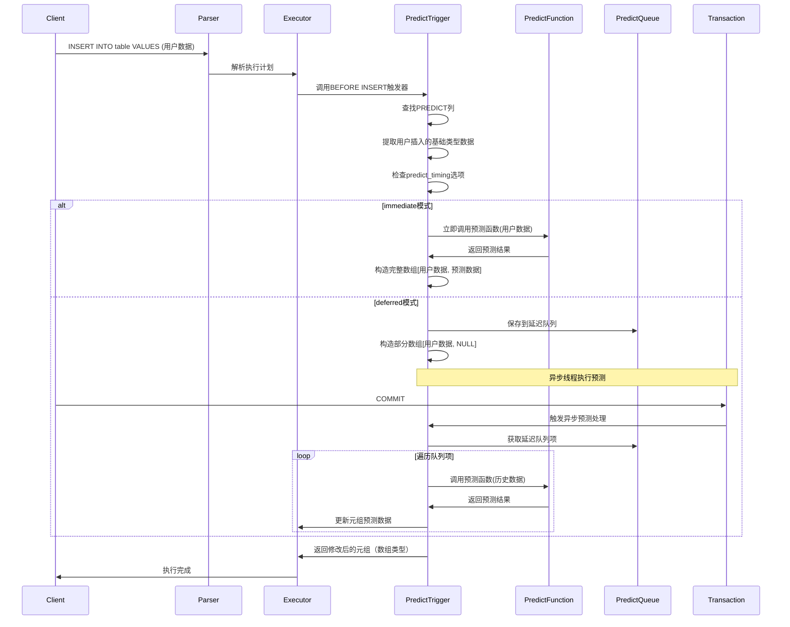
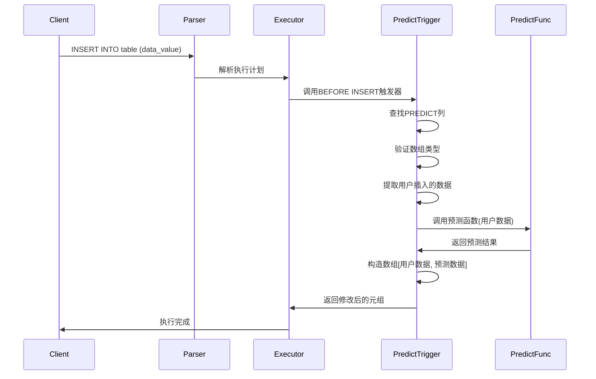
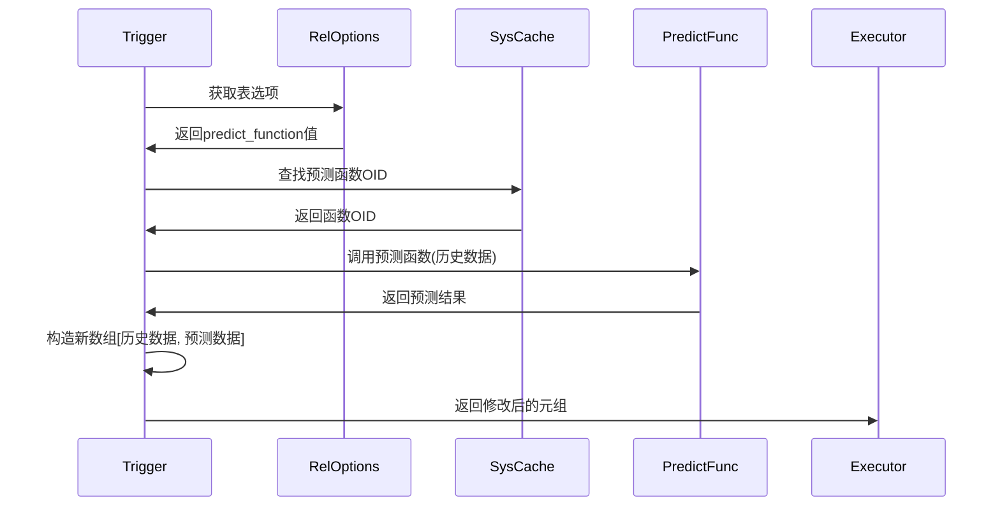
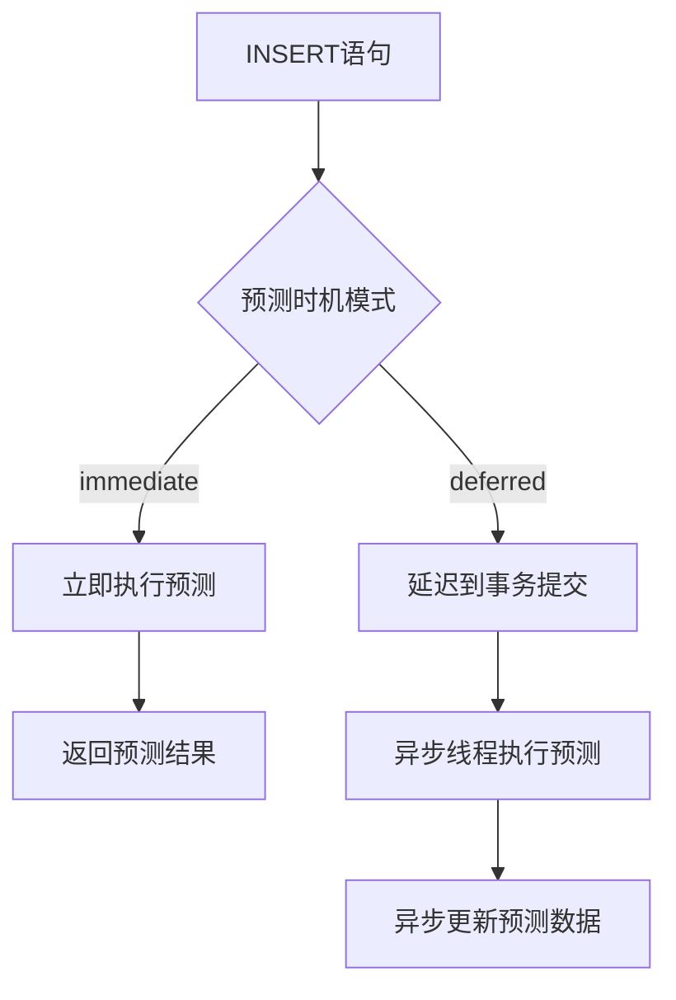
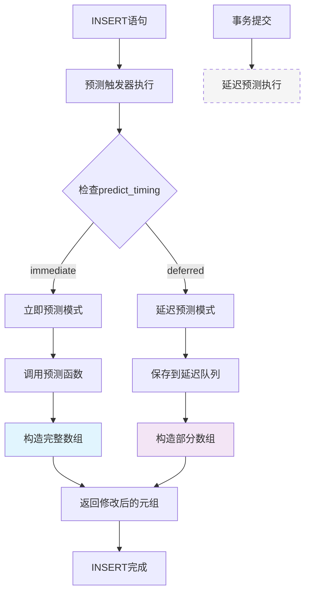
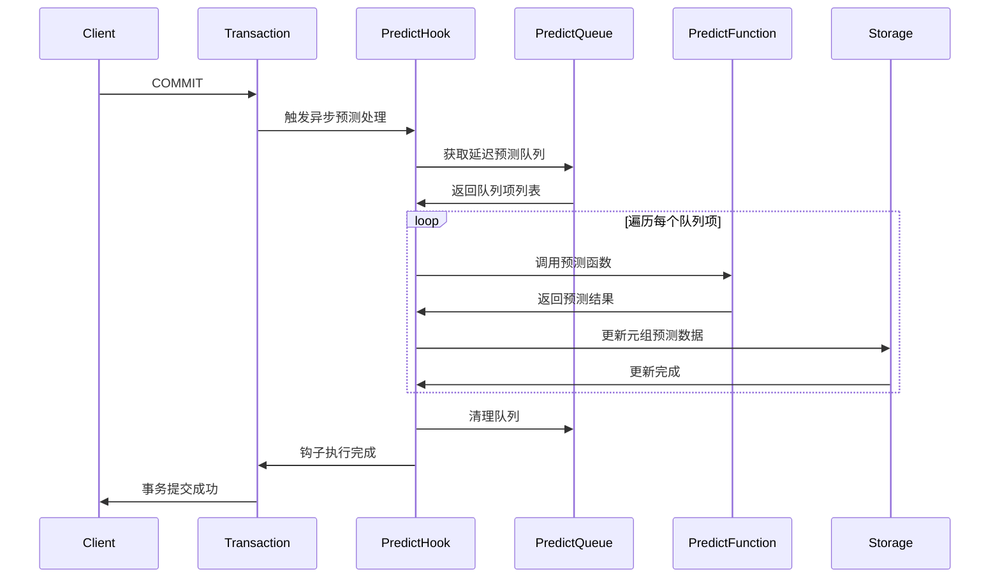

# PREDICT列和PREDICT函数详细设计文档

## 1. 概述

### 1.1 功能简介
PREDICT列和PREDICT函数是PostgreSQL的一个扩展功能，用于在插入数据时自动计算预测值。该功能通过以下组件实现：

- **PREDICT列属性**：标记列为预测列，必须是数组类型
- **PREDICT函数**：用户自定义的预测计算函数
- **预测触发器**：自动处理预测逻辑的触发器函数
- **关系选项**：控制预测行为的表级选项

### 1.3 当前实现状态
PREDICT功能的主要实现包括：
- PREDICT列属性标记（attpredict字段）
- 预测函数查找机制（从reloptions获取）
- 预测触发器函数（predict_trigger）
- PREDICT列验证函数（is_predict_column）
- 预测时机控制选项（predict_timing表选项）

### 1.2 设计目标
- 提供灵活的数据预测机制
- 支持用户自定义预测算法
- 保持与现有PostgreSQL架构的兼容性
- 提供可配置的预测时机控制

## 2. 架构设计

### 2.1 系统架构图


### 2.2 核心组件

#### 2.2.1 PREDICT列属性
- 在`pg_attribute`系统表中添加`attpredict`布尔字段
- 标记该列需要预测处理
- **定义时**：可以是任意基础类型（如integer、float等）
- **存储时**：自动转换为数组类型，存储格式为[历史数据, 预测数据]

#### 2.2.2 预测触发器
- 自动创建的BEFORE INSERT触发器
- 处理所有PREDICT列的预测逻辑
- 调用用户定义的预测函数

#### 2.2.3 预测函数机制
- 通过表选项`predict_function`指定
- 支持自定义预测算法
- 函数签名：`function_name(element_type) returns element_type`

#### 2.2.4 查询处理器
- 解析SELECT语句中的PREDICT列引用
- 验证PREDICT列在查询上下文中的合法性
- 优化包含PREDICT列的查询执行计划
- 格式化查询结果中的PREDICT列数据

#### 2.2.5 查询优化器
- 针对PREDICT列的特殊优化策略
- 查询计划缓存和重用机制
- PREDICT列索引优化考虑

## 3. 详细设计

### 3.1 数据模型设计

#### 3.1.1 系统表扩展
```sql
-- pg_attribute表扩展
ALTER TABLE pg_attribute ADD COLUMN attpredict boolean NOT NULL DEFAULT false;
```

#### 3.1.2 PREDICT列数据结构
```c
// 在FormData_pg_attribute中定义
typedef struct FormData_pg_attribute
{
    // ... 现有字段
    bool        attpredict;     // PREDICT列标记
} FormData_pg_attribute;

// PREDICT列的类型转换和存储格式
// 定义类型：基础类型（如integer、float等）
// 存储类型：数组类型，包含两个元素：[历史数据, 预测数据]
// 用户插入时插入基础类型的值，存储在数组的第一个元素
// 预测函数基于第一个元素计算第二个元素
// 查询时只返回第一个元素（转换为原始基础类型）
```

### 3.2 语法设计

#### 3.2.1 CREATE TABLE语法扩展
```sql
CREATE TABLE example_table (
    id SERIAL PRIMARY KEY,
    data_value integer PREDICT,  -- PREDICT列，定义为基础类型，存储时转换为数组
    -- 可选：指定预测函数
    predict_function = 'my_predict_func'
);
```

#### 3.2.2 语法解析规则
在`gram.y`中添加PREDICT关键字支持：
```bison
column_def:
    colid typename col_qual_list
    {
        // ... 现有处理
        if ($3 != NIL && contains_predict_keyword($3))
        {
            // 设置attpredict标志
        }
    }
;

col_qual_list:
    col_qual_list col_qualifier
    | col_qualifier
;

col_qualifier:
    PREDICT { $$ = makePredictQualifier(); }
    | /* 其他限定符 */
;
```

#### 3.2.3 predict_timing表选项语法
在`reloptions.c`中定义`predict_timing`表选项：

```c
/* predict_timing选项的枚举值定义 */
typedef enum StdRdOptPredictTiming
{
    STDRD_OPTION_PREDICT_TIMING_DEFERRED = 0,
    STDRD_OPTION_PREDICT_TIMING_IMMEDIATE,
} StdRdOptPredictTiming;

/* 在StdRdOptions结构体中添加字段 */
typedef struct StdRdOptions
{
    // ... 现有字段
    StdRdOptPredictTiming predict_timing;    /* 控制预测时机 */
    int predict_function;                    /* 预测函数名称字符串偏移量 */
} StdRdOptions;

/* 在enumRelOpts数组中添加选项定义 */
static relopt_enum_elt_def StdRdOptPredictTimingValues[] =
{
    {"deferred", STDRD_OPTION_PREDICT_TIMING_DEFERRED},
    {"immediate", STDRD_OPTION_PREDICT_TIMING_IMMEDIATE},
    {(const char *) NULL} /* 列表终止符 */
};

static relopt_enum enumRelOpts[] =
{
    {
        {
            "predict_timing",
            "Controls when prediction operations are performed",
            RELOPT_KIND_HEAP,
            AccessExclusiveLock
        },
        StdRdOptPredictTimingValues,
        STDRD_OPTION_PREDICT_TIMING_DEFERRED,
        gettext_noop("Valid values are \"deferred\" and \"immediate\".")
    },
    // ... 其他选项
};
```

### 3.3 预测触发器设计

#### 3.3.1 触发器创建逻辑
```c
// 在表创建时自动创建预测触发器
void CreatePredictTrigger(Relation rel)
{
    CreateTrigStmt *trigstmt = makeNode(CreateTrigStmt);
    trigstmt->trigname = "predict_trigger";
    trigstmt->relation = rel;
    trigstmt->funcname = list_make1(makeString("predict_trigger"));
    trigstmt->args = NIL;
    trigstmt->row = true;
    trigstmt->timing = TRIGGER_TYPE_BEFORE;
    trigstmt->events = TRIGGER_TYPE_INSERT;
    
    CreateTrigger(trigstmt, NULL, rel->rd_id, InvalidOid, InvalidOid, false);
}
```

#### 3.3.2 增强的触发器执行流程



### 3.3.3 预测函数调用控制

#### 3.3.3.1 实现细节

根据`predict_timing`选项的值，预测触发器会决定是否在INSERT时立即调用预测函数：

- **immediate模式**：在BEFORE INSERT触发器中立即调用预测函数，构造完整的数组`[用户数据, 预测数据]`
- **deferred模式**：在BEFORE INSERT触发器中跳过预测函数调用，构造部分数组`[用户数据, NULL]`，预测计算通过异步线程执行

#### 3.3.3.2 代码实现

```c
Datum predict_trigger(PG_FUNCTION_ARGS)
{
    // ... 现有代码 ...
    
    /* 检查predict_timing选项 */
    StdRdOptions *relopts = (StdRdOptions *) rel->rd_options;
    StdRdOptPredictTiming predict_timing = STDRD_OPTION_PREDICT_TIMING_DEFERRED;
    
    if (relopts != NULL)
        predict_timing = relopts->predict_timing;
    
    /* 只有在immediate模式下才调用预测函数 */
    if (predict_timing == STDRD_OPTION_PREDICT_TIMING_IMMEDIATE)
    {
        // 调用预测函数的逻辑
    }
    
    // ... 构造数组和返回结果 ...
}
```

#### 3.3.3.3 行为变化

| 预测时机模式 | 预测函数调用时机 | 数组构造方式 | 性能影响 |
|-------------|-----------------|-------------|----------|
| immediate   | INSERT时立即调用 | [用户数据, 预测数据] | 插入时性能开销较大，但实时获得预测结果 |
| deferred    | 异步线程调用     | [用户数据, NULL] | 插入时性能开销较小，适合批量操作 |

### 3.4 预测函数调用机制

#### 3.4.1 函数查找逻辑
```c
char* get_predict_function(Oid relid)
{
    // 从表选项获取预测函数名
    // 格式: predict_function=function_name
    char *func_name = extract_from_reloptions(relid, "predict_function");
    return func_name;
}

Oid find_predict_function_oid(char *func_name, Oid element_type)
{
    // 查找匹配签名的函数
    // 函数必须接受element_type参数并返回element_type
    List *func_candidates = FuncnameGetCandidates(
        list_make1(makeString(func_name)), 
        1, NIL, false, false, false, true);
    
    // 筛选参数类型匹配的函数
    foreach(lc, func_candidates)
    {
        FuncCandidateList candidate = lfirst(lc);
        if (candidate->nargs == 1 && candidate->args[0] == element_type)
        {
            return candidate->oid;
        }
    }
    return InvalidOid;
}
```

### 3.5 查询处理流程

根据当前代码分析，查询时PREDICT列的处理相对简单：
- PREDICT列在存储时是数组类型
- 查询时直接返回数组值，没有特殊的处理逻辑
- 预测数据存储在数组中，查询时可见

#### 3.4.2 函数调用流程
```c
Datum call_predict_function(Oid func_oid, Datum input, Oid element_type)
{
    FmgrInfo flinfo;
    fmgr_info(func_oid, &flinfo);
    
    // 根据类型处理参数传递
    if (get_typbyval(element_type))
    {
        return FunctionCall1(&flinfo, input);
    }
    else
    {
        // 处理传引用类型
        return FunctionCall1(&flinfo, 
            Int32GetDatum(*((int32 *) DatumGetPointer(input))));
    }
}
```

## 4. 核心算法实现

PREDICT功能的核心算法包括：

### 4.1 预测触发器算法

#### 4.1.1 预测触发器执行流程


#### 4.1.2 增强的预测触发器算法说明
- 在BEFORE INSERT触发器中处理PREDICT列
- 根据`predict_timing`选项决定预测时机
- **immediate模式**：立即执行预测计算
- **deferred模式**：保存到延迟队列，数组第二个元素填NULL
- 从表选项中获取预测函数名称
- 调用预测函数处理数组第一个元素
- 构造包含预测结果的新数组

```c
Datum predict_trigger(PG_FUNCTION_ARGS)
{
    TriggerData *trigdata = (TriggerData *) fcinfo->context;
    HeapTuple newtuple = trigdata->tg_trigtuple;
    TupleDesc tupdesc = RelationGetDescr(trigdata->tg_relation);
    Relation rel = trigdata->tg_relation;
    
    // 获取预测时机设置
    StdRdOptions *relopts = (StdRdOptions *) rel->rd_options;
    StdRdOptPredictTiming predict_timing = STDRD_OPTION_PREDICT_TIMING_DEFERRED;
    
    if (relopts != NULL)
        predict_timing = relopts->predict_timing;
    
    // 遍历所有列查找PREDICT列
    for (int attnum = 1; attnum <= tupdesc->natts; attnum++)
    {
        Form_pg_attribute attr = TupleDescAttr(tupdesc, attnum - 1);
        
        if (attr->attpredict && !attr->attisdropped)
        {
            // 验证是否为数组类型
            Oid array_type = attr->atttypid;
            Oid element_type = get_base_element_type(array_type);
            
            if (!OidIsValid(element_type))
                ereport(ERROR, (...));
            
            // 获取数组值
            Datum array_datum = heap_getattr(newtuple, attnum, tupdesc, &isnull);
            if (isnull) continue;
            
            // 获取第一个元素（历史数据）
            int lower_index[1] = {1};
            Datum historical_data = array_get_element(array_datum, 1, lower_index, ...);
            
            Datum predicted_value;
            bool is_null = false;
            
            if (predict_timing == STDRD_OPTION_PREDICT_TIMING_IMMEDIATE)
            {
                // 立即预测模式：立即执行预测计算
                char *predict_func = get_predict_function(rel->rd_id);
                
                if (predict_func != NULL)
                {
                    Oid func_oid = find_predict_function_oid(predict_func, element_type);
                    if (OidIsValid(func_oid))
                    {
                        predicted_value = call_predict_function(func_oid, historical_data, element_type);
                    }
                    else
                    {
                        predicted_value = (Datum) 0;
                        is_null = true;
                    }
                }
                else
                {
                    predicted_value = (Datum) 0;
                    is_null = true;
                }
            }
            else // deferred模式
            {
                // 延迟预测模式：保存到延迟队列，预测值设为NULL
                predicted_value = (Datum) 0;
                is_null = true;
                
                // 保存到延迟预测队列
                AddToDeferredPredictQueue(rel->rd_id, 
                                         &(newtuple->t_self), 
                                         attnum, 
                                         historical_data, 
                                         element_type, 
                                         false);
            }
            
            // 构造新数组
            Datum new_elements[2] = {historical_data, predicted_value};
            bool new_elements_null[2] = {false, is_null};
            Datum new_array = construct_array(new_elements, 2, element_type, ...);
            
            // 更新元组
            newtuple = heap_modify_tuple_by_cols(newtuple, tupdesc, 1, &attnum, &new_array, &isnull);
        }
    }
    
    PG_RETURN_POINTER(newtuple);
}
```

### 4.3 预测函数调用算法

#### 4.3.1 预测函数调用流程


#### 4.3.2 延迟预测队列管理函数

**队列管理函数设计**：
```c
/* 获取当前事务的延迟预测队列 */
DeferredPredictQueue* GetCurrentDeferredPredictQueue(void)
{
    TransactionState s = CurrentTransactionState;
    
    if (s->predict_queue == NULL)
    {
        /* 创建新的延迟预测队列 */
        MemoryContext oldctx = MemoryContextSwitchTo(s->curTransactionContext);
        
        s->predict_queue = palloc0(sizeof(DeferredPredictQueue));
        s->predict_queue->items = NIL;
        s->predict_queue->mctx = s->curTransactionContext;
        
        MemoryContextSwitchTo(oldctx);
    }
    
    return s->predict_queue;
}

/* 添加预测项到延迟队列 */
void AddToDeferredPredictQueue(Oid relid, ItemPointer ctid, int attnum, 
                              Datum historical_data, Oid element_type, bool isnull)
{
    DeferredPredictQueue *queue = GetCurrentDeferredPredictQueue();
    
    MemoryContext oldctx = MemoryContextSwitchTo(queue->mctx);
    
    DeferredPredictItem *item = palloc0(sizeof(DeferredPredictItem));
    item->relid = relid;
    item->ctid = *ctid;  /* 复制ctid值 */
    item->attnum = attnum;
    item->element_type = element_type;
    item->isnull = isnull;
    
    if (!isnull)
    {
        /* 复制数据值到事务内存上下文 */
        if (get_typbyval(element_type))
        {
            item->historical_data = historical_data;
        }
        else
        {
            Size data_size = datumGetSize(historical_data, false, -1);
            item->historical_data = datumCopy(historical_data, false, data_size);
        }
    }
    else
    {
        item->historical_data = (Datum) 0;
    }
    
    queue->items = lappend(queue->items, item);
    
    MemoryContextSwitchTo(oldctx);
}

/* 清理延迟预测队列 */
void ClearDeferredPredictQueue(void)
{
    TransactionState s = CurrentTransactionState;
    
    if (s->predict_queue != NULL)
    {
        /* 清理队列中的项 */
        ListCell *lc;
        foreach(lc, s->predict_queue->items)
        {
            DeferredPredictItem *item = lfirst(lc);
            pfree(item);
        }
        
        list_free(s->predict_queue->items);
        pfree(s->predict_queue);
        s->predict_queue = NULL;
    }
}

/* 更新预测值到实际元组 */
void UpdatePredictedValue(Oid relid, ItemPointer ctid, int attnum, 
                         Datum historical_data, Datum predicted_value)
{
    Relation rel = relation_open(relid, RowExclusiveLock);
    
    /* 根据ctid查找元组 */
    HeapTuple tuple = heap_get_tuple_by_ctid(rel, ctid);
    
    if (tuple != NULL)
    {
        TupleDesc tupdesc = RelationGetDescr(rel);
        
        /* 构造新数组 */
        Datum new_elements[2] = {historical_data, predicted_value};
        bool new_elements_null[2] = {false, false};
        
        Datum new_array = construct_array(new_elements, 2, 
                                         get_base_element_type(tupdesc->attrs[attnum-1].atttypid), 
                                         -1, false, 'i');
        
        /* 更新元组 */
        HeapTuple newtuple = heap_modify_tuple_by_cols(tuple, tupdesc, 
                                                      1, &attnum, &new_array, &false);
        
        /* 更新到表中 */
        heap_inplace_update(rel, newtuple);
        
        heap_freetuple(newtuple);
    }
    
    relation_close(rel, RowExclusiveLock);
}
```

#### 4.3.3 函数调用流程说明
根据当前代码，预测函数调用流程包括：
- 从表reloptions中提取预测函数名称
- 查找匹配的预测函数OID
- 调用预测函数处理数据
- 构造包含预测结果的新数组

**增强后的函数调用流程**：
- 根据`predict_timing`选项决定是否立即调用预测函数
- `immediate`模式：立即调用预测函数
- `deferred`模式：保存到延迟队列，通过异步线程批量调用

## 5. 接口设计

### 5.1 用户接口

#### 5.1.1 SQL接口
```sql
-- 创建带PREDICT列的表
CREATE TABLE sensor_data (
    id SERIAL PRIMARY KEY,
    timestamp TIMESTAMP,
    temperature FLOAT PREDICT,  -- PREDICT列，定义为基础类型
    predict_function = 'temperature_predict'
);

-- 使用predict_timing选项控制预测时机
CREATE TABLE sensor_data (
    id SERIAL PRIMARY KEY,
    timestamp TIMESTAMP,
    temperature FLOAT PREDICT
) WITH (predict_timing = immediate);  -- 立即执行预测

-- 或者使用默认的延迟预测
CREATE TABLE sensor_data (
    id SERIAL PRIMARY KEY,
    timestamp TIMESTAMP,
    temperature FLOAT PREDICT
) WITH (predict_timing = deferred);  -- 延迟执行预测（默认值）

-- 使用ALTER TABLE修改预测时机
ALTER TABLE sensor_data SET (predict_timing = immediate);
ALTER TABLE sensor_data SET (predict_timing = deferred);

-- 重置为默认值
ALTER TABLE sensor_data RESET (predict_timing);

-- 同时设置多个选项
ALTER TABLE sensor_data SET (predict_timing = immediate, fillfactor = 80);

-- 创建预测函数（接受基础类型参数）
CREATE OR REPLACE FUNCTION temperature_predict(FLOAT) 
RETURNS FLOAT AS $
BEGIN
    -- 自定义预测逻辑
    RETURN $1 * 1.05; -- 示例：基于当前温度预测未来温度
END;
$ LANGUAGE plpgsql;

-- 插入数据（插入基础类型值）
INSERT INTO sensor_data (timestamp, temperature) VALUES 
('2024-01-01 10:00:00', 25.5);

-- 查询数据（显示为基础类型值）
SELECT id, timestamp, temperature FROM sensor_data;

-- 查询PREDICT列状态
SELECT is_predict_column('sensor_data'::regclass, 'temperature');
```

#### 5.1.2 系统函数接口
```c
// 检查列是否为PREDICT列
Datum is_predict_column(PG_FUNCTION_ARGS)
{
    Oid relid = PG_GETARG_OID(0);
    text *colname = PG_GETARG_TEXT_P(1);
    // 实现逻辑...
    PG_RETURN_BOOL(is_predict);
}
```

### 5.2 内部接口

PREDICT功能的内部接口主要包括：
- `is_predict_column()` - 检查列是否为PREDICT列
- `predict_trigger()` - 预测触发器函数
- `get_predict_function()` - 从表选项获取预测函数名称（内部函数）

这些函数在predict.c文件中实现，用于支持PREDICT功能的核心逻辑。

## 6. 配置选项

### 6.1 表级选项
```sql
-- 预测函数指定（已实现）
CREATE TABLE example (
    data INTEGER[] PREDICT
) WITH (
    predict_function = 'custom_predict_func'
);
```

### 6.2 当前配置选项

根据当前代码，PREDICT功能支持的表级选项：

```sql
-- 预测函数指定
CREATE TABLE example (
    data INTEGER[] PREDICT
) WITH (
    predict_function = 'custom_predict_func'
);

-- 预测时机控制（新增）
CREATE TABLE example (
    data INTEGER[] PREDICT
) WITH (
    predict_timing = deferred,      -- 延迟预测（默认）
    predict_function = 'custom_predict_func'
);
```

### 6.3 predict_timing表选项详细设计

#### 6.3.1 功能概述
`predict_timing`表选项用于控制PREDICT列的预测执行时机，提供两种模式：
- **deferred**（默认）：延迟预测模式，通过异步线程执行预测
- **immediate**：立即预测模式，在INSERT语句执行时立即执行预测

#### 6.3.2 设计原理


#### 6.3.3 实现机制

**核心数据结构**：
```c
/* 在src/include/utils/rel.h中定义 */
typedef enum StdRdOptPredictTiming
{
    STDRD_OPTION_PREDICT_TIMING_DEFERRED = 0,    /* 延迟预测 */
    STDRD_OPTION_PREDICT_TIMING_IMMEDIATE,       /* 立即预测 */
} StdRdOptPredictTiming;

/* 在StdRdOptions结构体中添加字段 */
typedef struct StdRdOptions
{
    // ... 现有字段
    StdRdOptPredictTiming predict_timing;        /* 预测时机控制 */
    int predict_function;                        /* 预测函数名称偏移量 */
} StdRdOptions;
```

**选项注册**：
```c
/* 在src/backend/access/common/reloptions.c中注册 */
static relopt_enum_elt_def StdRdOptPredictTimingValues[] =
{
    {"deferred", STDRD_OPTION_PREDICT_TIMING_DEFERRED},
    {"immediate", STDRD_OPTION_PREDICT_TIMING_IMMEDIATE},
    {(const char *) NULL} /* 列表终止符 */
};

static relopt_enum enumRelOpts[] =
{
    {
        {
            "predict_timing",
            "Controls when prediction operations are performed",
            RELOPT_KIND_HEAP,
            AccessExclusiveLock
        },
        StdRdOptPredictTimingValues,
        STDRD_OPTION_PREDICT_TIMING_DEFERRED,
        gettext_noop("Valid values are \"deferred\" and \"immediate\".")
    },
    // ... 其他选项
};
```

#### 6.3.4 预测时机控制实现机制

**立即预测模式（immediate）实现**：
- 在INSERT语句执行时立即调用预测函数
- 构造完整的数组[用户数据, 预测数据]
- 保持现有的预测触发器流程不变

**延迟预测模式（deferred）实现**：
- 在INSERT时仅保存用户数据到队列中
- 将数组第二个元素设置为NULL值
- 通过异步线程执行预测计算
- 更新队列中记录的预测数据

#### 6.3.5 延迟预测队列设计

**按表隔离的队列数据结构（记录完整行数据）**：
```c
typedef struct DeferredPredictItem
{
    ItemPointer ctid;              /* 元组物理位置 */
    int attnum;                    /* PREDICT列编号 */
    Datum historical_data;         /* 历史数据值 */
    Oid element_type;              /* 基础元素类型 */
    bool isnull;                   /* 是否为NULL值 */
    HeapTupleData row_data;        /* 当前行的完整数据（可选） */
    TupleDesc row_desc;            /* 行数据描述符（可选） */
} DeferredPredictItem;

typedef struct DeferredPredictTableQueue
{
    Oid relid;                     /* 表OID */
    List *items;                   /* 该表的延迟预测项列表 */
    TupleDesc table_desc;          /* 表结构描述符 */
} DeferredPredictTableQueue;

typedef struct DeferredPredictQueue
{
    List *table_queues;            /* 按表分组的队列列表 */
    MemoryContext mctx;            /* 内存上下文 */
} DeferredPredictQueue;
```

**队列管理机制**：
- 每个表维护独立的延迟预测队列
- 不同表之间的预测数据完全隔离
- 支持并发插入不同表的PREDICT列
- 按表组织便于后续的批量处理和优化
- **记录完整行数据**：保存当前行的完整信息，便于后续预测函数使用上下文数据

**队列管理函数**：
```c
/* 获取指定表的延迟预测队列 */
DeferredPredictTableQueue* GetTableDeferredPredictQueue(Oid relid);

/* 添加预测项到指定表的队列（包含完整行数据） */
void AddToTableDeferredQueue(Oid relid, ItemPointer ctid, int attnum, 
                            Datum historical_data, Oid element_type, bool isnull,
                            HeapTuple row_tuple, TupleDesc tuple_desc);

/* 获取指定表的所有延迟预测项（包含完整上下文） */
List* GetTableDeferredItems(Oid relid);

/* 清理指定表的延迟预测队列 */
void ClearTableDeferredQueue(Oid relid);

/* 获取预测项的完整行数据 */
HeapTuple GetDeferredItemRowData(DeferredPredictItem *item);
```

**完整行数据记录的优势**：
- **上下文信息**：预测函数可以访问行的其他列数据，提供更丰富的上下文
- **批量处理**：后续可以基于完整行数据进行批量预测优化
- **数据一致性**：确保预测时使用的数据与插入时一致
- **扩展性**：支持更复杂的预测算法需要多列数据

#### 6.3.6 预测触发器修改设计

**修改后的预测触发器算法**：
```c
Datum predict_trigger(PG_FUNCTION_ARGS)
{
    TriggerData *trigdata = (TriggerData *) fcinfo->context;
    HeapTuple newtuple = trigdata->tg_trigtuple;
    TupleDesc tupdesc = RelationGetDescr(trigdata->tg_relation);
    StdRdOptions *relopts = (StdRdOptions *) trigdata->tg_relation->rd_options;
    
    // 获取预测时机设置
    StdRdOptPredictTiming predict_timing = STDRD_OPTION_PREDICT_TIMING_DEFERRED;
    if (relopts && (relopts->predict_timing == STDRD_OPTION_PREDICT_TIMING_IMMEDIATE))
    {
        predict_timing = STDRD_OPTION_PREDICT_TIMING_IMMEDIATE;
    }
    
    // 遍历所有列查找PREDICT列
    for (int attnum = 1; attnum <= tupdesc->natts; attnum++)
    {
        Form_pg_attribute attr = TupleDescAttr(tupdesc, attnum - 1);
        
        if (attr->attpredict && !attr->attisdropped)
        {
            // 验证是否为数组类型
            Oid array_type = attr->atttypid;
            Oid element_type = get_base_element_type(array_type);
            
            if (!OidIsValid(element_type))
                ereport(ERROR, (...));
            
            // 获取用户插入的基础数据
            Datum user_data = heap_getattr(newtuple, attnum, tupdesc, &isnull);
            if (isnull) continue;
            
            if (predict_timing == STDRD_OPTION_PREDICT_TIMING_IMMEDIATE)
            {
                // 立即预测模式：执行现有流程
                Datum predicted_value = user_data;
                char *predict_func = get_predict_function(rel->rd_id);
                
                if (predict_func != NULL)
                {
                    Oid func_oid = find_predict_function_oid(predict_func, element_type);
                    if (OidIsValid(func_oid))
                    {
                        predicted_value = call_predict_function(func_oid, user_data, element_type);
                    }
                }
                
                // 构造完整数组[用户数据, 预测数据]
                Datum new_elements[2] = {user_data, predicted_value};
                Datum new_array = construct_array(new_elements, 2, element_type, ...);
                
                // 更新元组
                newtuple = heap_modify_tuple_by_cols(newtuple, tupdesc, 1, &attnum, &new_array, &isnull);
            }
            else
            {
                // 延迟预测模式：保存到队列，数组第二个元素设为NULL
                Datum new_elements[2] = {user_data, (Datum) 0};  // 第二个元素为NULL
                Datum new_array = construct_array(new_elements, 2, element_type, ...);
                
                // 更新元组
                newtuple = heap_modify_tuple_by_cols(newtuple, tupdesc, 1, &attnum, &new_array, &isnull);
                
                // 保存到延迟预测队列
                add_to_deferred_queue(rel->rd_id, &newtuple->t_self, attnum, 
                                     user_data, element_type);
            }
        }
    }
    
    PG_RETURN_POINTER(newtuple);
}
```


#### 6.3.4 预测时机控制实现机制

**立即预测模式（immediate）实现**：
- 在BEFORE INSERT触发器中立即执行预测计算
- 构造包含[历史数据, 预测数据]的完整数组
- 保持现有流程不变，确保实时性

**延迟预测模式（deferred）实现**：
- 在BEFORE INSERT触发器中仅保存当前行数据到延迟队列
- 存储数组第二个元素填入NULL值：[历史数据, NULL]
- 通过异步线程执行预测计算
- 更新存储数组中的预测数据部分

#### 6.3.5 延迟预测队列设计

**队列数据结构**：
```c
typedef struct DeferredPredictItem
{
    Oid relid;              /* 表OID */
    ItemPointer ctid;       /* 元组物理位置 */
    int attnum;             /* PREDICT列编号 */
    Datum historical_data;  /* 历史数据值 */
    Oid element_type;       /* 基础元素类型 */
    bool isnull;            /* 是否为NULL值 */
} DeferredPredictItem;

typedef struct DeferredPredictQueue
{
    List *items;            /* 延迟预测项列表 */
    MemoryContext mctx;     /* 内存上下文 */
} DeferredPredictQueue;
```

**队列管理机制**：
- 使用事务级内存上下文存储延迟预测队列
- 每个事务维护独立的延迟预测队列
- 通过异步线程统一处理队列中的所有预测项
- 事务回滚时自动清理队列

#### 6.3.6 预测触发器算法增强

**增强后的预测触发器流程**：



#### 6.3.7 使用场景

**立即预测模式（immediate）适用场景**：
- 需要立即获取预测结果的实时应用
- 预测计算开销较小的场景
- 对数据一致性要求不高的应用

**延迟预测模式（deferred）适用场景**：
- 批量插入数据的场景
- 预测计算开销较大的场景
- 对事务性能要求较高的应用
- 需要保证数据一致性的关键业务

#### 6.3.8 兼容性考虑
- `predict_timing`选项与现有的`predict_function`选项完全兼容
- 支持CREATE TABLE和ALTER TABLE语法
- 支持与PostgreSQL其他表选项同时使用
- 默认值为`deferred`，确保向后兼容性

当前版本支持预测函数配置和预测时机控制，其他高级功能可根据需求逐步实现。

## 7. 事务集成与钩子函数

### 7.1 延迟预测队列管理

**当前迭代功能**：
- 在deferred模式下，将当前行数据保存到延迟队列
- 构造部分数组`[历史数据, NULL]`
- 延迟执行的具体机制留待后续迭代设计

**队列管理函数**（仅用于当前迭代的数据记录）：
```c
/* 添加预测项到延迟队列 */
void AddToDeferredPredictQueue(Oid relid, ItemPointer ctid, int attnum, 
                              Datum historical_data, Oid element_type, bool isnull)
{
    // 实现数据记录到队列的逻辑
    // 具体延迟执行机制后续设计
}
```

### 7.2 事务状态扩展

需要在事务状态结构中添加延迟预测队列字段：

```c
/* 在src/include/access/xact.h中扩展TransactionState结构 */
typedef struct TransactionStateData
{
    // ... 现有字段
    
    /* 延迟预测队列 */
    DeferredPredictQueue *predict_queue;
    
    // ... 其他字段
} TransactionStateData;
```

### 7.3 延迟预测执行流程

**异步线程预测执行详细流程**：


## 8. 错误处理

根据当前代码实现，PREDICT功能的错误处理主要依赖于PostgreSQL的标准错误处理机制：

- 使用标准的`ereport`函数报告错误
- 使用PostgreSQL预定义的错误码（如`ERRCODE_DATATYPE_MISMATCH`）
- 在预测触发器中验证PREDICT列是否为数组类型
- 在函数查找过程中处理函数不存在或签名不匹配的情况

**延迟预测的错误处理增强**：
- 延迟预测执行过程中的错误不会导致事务回滚
- 单个预测项的错误不会影响其他项的预测执行
- 预测函数执行错误时，预测值保持为NULL
- 记录预测执行失败的日志信息，便于问题排查

---

**文档版本**: 1.0  
**最后更新**: 2025-01-24  
**作者**: PostgreSQL开发团队