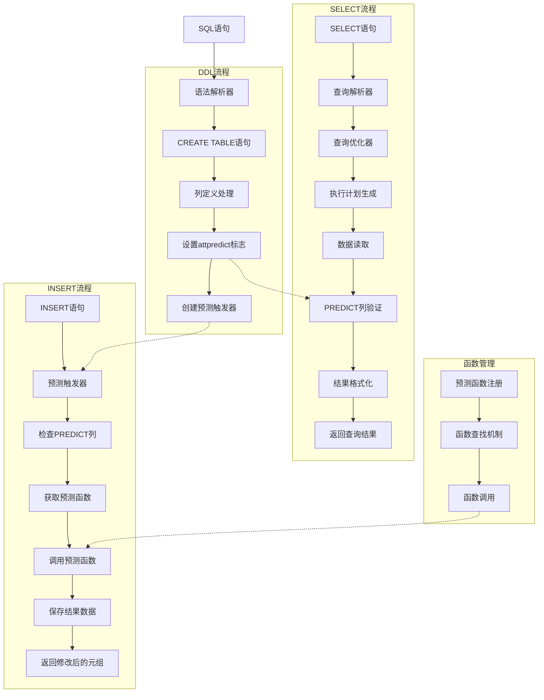
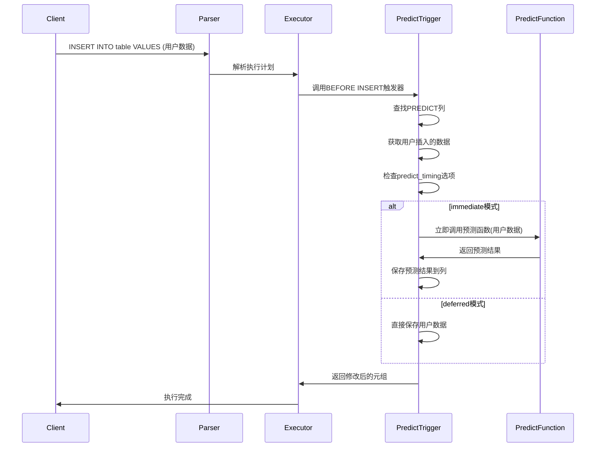
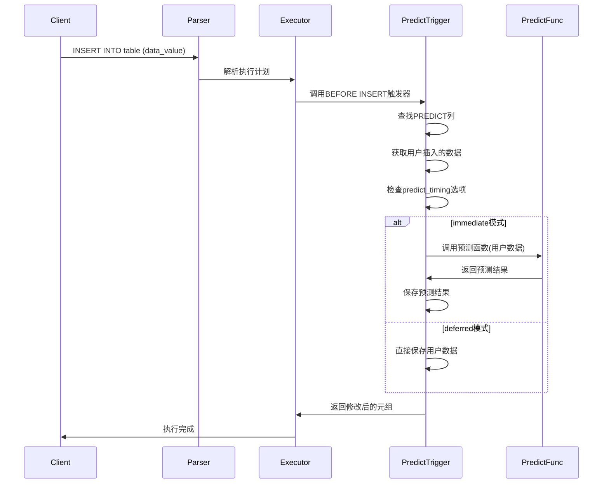
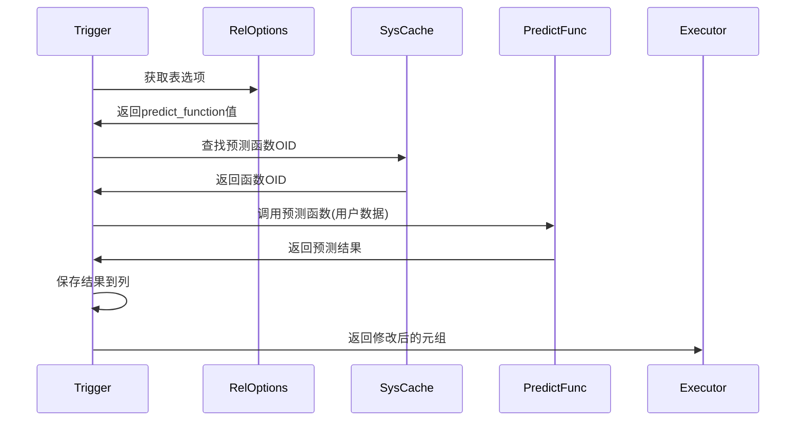
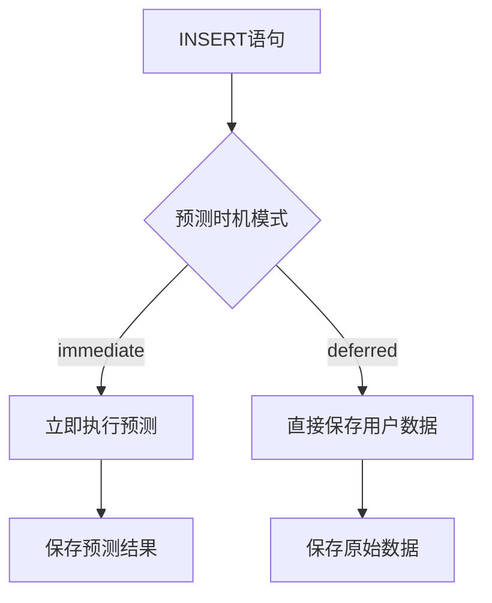
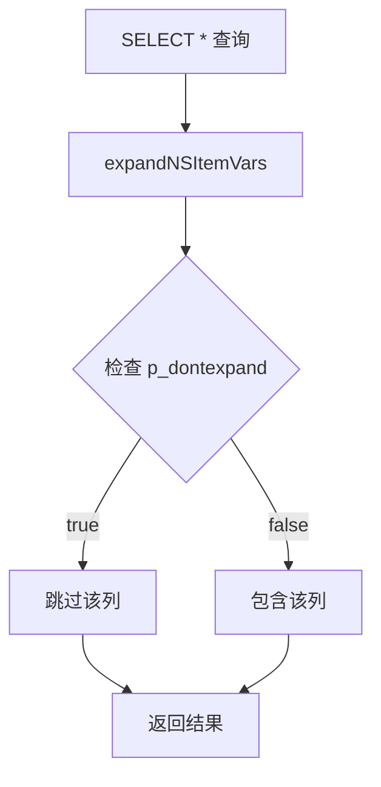

# PREDICT列和PREDICT函数详细设计文档

## 1. 概述

### 1.1 功能简介
PREDICT列和PREDICT函数是PostgreSQL的一个扩展功能，用于在插入数据时自动计算预测值。该功能通过以下组件实现：

- **PREDICT列属性**：标记列为预测列，支持任意基础数据类型
- **PREDICT函数**：用户自定义的预测计算函数
- **预测触发器**：自动处理预测逻辑的触发器函数
- **关系选项**：控制预测行为的表级选项

### 1.3 当前实现状态
PREDICT功能的主要实现包括：
- PREDICT列属性标记（attpredict字段）
- 自动创建预测结果列（`_predict`后缀列）
- 隐藏列机制（atthidden字段，SELECT *时不显示）
- 预测函数查找机制（从reloptions获取）
- 预测触发器函数（predict_trigger）
- PREDICT列验证函数（is_predict_column）
- 预测时机控制选项（predict_timing表选项）

### 1.2 设计目标
- 提供灵活的数据预测机制
- 支持用户自定义预测算法
- 保持与现有PostgreSQL架构的兼容性
- 提供可配置的预测时机控制

## 2. 架构设计

### 2.1 系统架构图



### 2.2 核心组件

#### 2.2.1 PREDICT列属性
- 在`pg_attribute`系统表中添加`attpredict`布尔字段
- 标记该列需要预测处理
- **定义和存储时**：保持原始基础类型（如integer、float等），无需转换为数组
- **写入时**：根据`predict_timing`选项决定是否调用预测函数
- **读取时**：直接返回原始数据，无需特殊处理

#### 2.2.2 自动创建预测结果列
当定义一个PREDICT列时，系统会自动创建一个同类型的预测结果列：
- 列名规则：原列名 + `_predict` 后缀（如 `value` → `value_predict`）
- 数据类型：与原PREDICT列相同
- 隐藏属性：自动设置为隐藏列，在 `SELECT *` 中不显示
- 用途：存储预测函数的计算结果

#### 2.2.3 隐藏列机制
- 在`pg_attribute`系统表中添加`atthidden`布尔字段
- 隐藏列在`SELECT *`展开时被跳过
- 显式指定列名时仍可正常查询隐藏列
- 利用现有的`p_dontexpand`机制实现（与CTE的SEARCH/CYCLE列相同）

#### 2.2.4 预测触发器
- 自动创建的BEFORE INSERT触发器
- 处理所有PREDICT列的预测逻辑
- 调用用户定义的预测函数

#### 2.2.3 预测函数机制
- 通过表选项`predict_function`指定
- 支持自定义预测算法
- 函数签名：`function_name(element_type) returns element_type`

#### 2.2.4 查询处理器
- 解析SELECT语句中的PREDICT列引用
- 验证PREDICT列在查询上下文中的合法性
- 优化包含PREDICT列的查询执行计划
- 格式化查询结果中的PREDICT列数据

#### 2.2.5 查询优化器
- 针对PREDICT列的特殊优化策略
- 查询计划缓存和重用机制
- PREDICT列索引优化考虑

### 2.3 代码实现文件

PREDICT功能涉及以下核心代码文件：

| 文件路径 | 功能说明 |
|---------|----------|
| `src/backend/parser/gram.y` | PREDICT关键字语法解析，设置`is_predict`和`is_hidden`标志 |
| `src/backend/parser/parse_utilcmd.c` | 建表时列定义处理，自动创建`_predict`后缀列 |
| `src/backend/parser/parse_target.c` | INSERT时目标列处理，直接保存原始数据 |
| `src/backend/parser/parse_relation.c` | SELECT时列引用处理，隐藏列的`p_dontexpand`设置 |
| `src/backend/commands/tablecmds.c` | 建表逻辑，创建预测触发器，传递`is_hidden`到`atthidden` |
| `src/backend/catalog/heap.c` | 系统表插入，处理`atthidden`字段 |
| `src/backend/access/common/tupdesc.c` | 元组描述符初始化，初始化`atthidden`字段 |
| `src/backend/nodes/makefuncs.c` | `makeColumnDef()`函数，初始化`is_hidden`字段 |
| `src/backend/nodes/copyfuncs.funcs.c` | 节点复制，处理`is_hidden`字段 |
| `src/backend/nodes/equalfuncs.funcs.c` | 节点比较，处理`is_hidden`字段 |
| `src/backend/nodes/outfuncs.funcs.c` | 节点输出，处理`is_hidden`字段 |
| `src/backend/nodes/readfuncs.funcs.c` | 节点读取，处理`is_hidden`字段 |
| `src/backend/utils/adt/predict.c` | 预测触发器函数实现 |
| `src/include/catalog/pg_attribute.h` | `attpredict`和`atthidden`字段定义 |
| `src/include/nodes/parsenodes.h` | `ColumnDef.is_predict`和`ColumnDef.is_hidden`字段定义 |
| `src/include/parser/parse_node.h` | `ParseNamespaceColumn.p_dontexpand`字段定义 |

## 3. 详细设计

### 3.1 数据模型设计

#### 3.1.1 系统表扩展
```sql
-- pg_attribute表扩展
ALTER TABLE pg_attribute ADD COLUMN attpredict boolean NOT NULL DEFAULT false;
ALTER TABLE pg_attribute ADD COLUMN atthidden boolean NOT NULL DEFAULT false;
```

#### 3.1.2 PREDICT列数据结构
```c
// 在FormData_pg_attribute中定义
typedef struct FormData_pg_attribute
{
    // ... 现有字段
    bool        attpredict;     // PREDICT列标记
    bool        atthidden;      // 隐藏列标记（SELECT *时不显示）
} FormData_pg_attribute;

// 在ColumnDef中定义
typedef struct ColumnDef
{
    // ... 现有字段
    bool        is_predict;     // PREDICT选项指定
    bool        is_hidden;      // 隐藏列标记
} ColumnDef;

// PREDICT列的类型处理
// 定义类型：基础类型（如integer、float等）
// 存储类型：保持原始基础类型，无需转换为数组
// 写入时：
//   - deferred模式：直接保存用户输入的数据
//   - immediate模式：调用预测函数后保存结果
// 查询时：直接返回原始数据，无需特殊处理
```

#### 3.1.3 隐藏列机制数据结构
```c
// 在ParseNamespaceColumn中定义
struct ParseNamespaceColumn
{
    // ... 现有字段
    bool        p_dontexpand;   // 不包含在星号展开中
};

// 隐藏列的处理流程：
// 1. pg_attribute.atthidden 存储列的隐藏属性
// 2. buildNSItemFromTupleDesc() 读取 atthidden 并设置 p_dontexpand
// 3. expandNSItemVars() 检查 p_dontexpand，跳过隐藏列
```

### 3.2 语法设计

#### 3.2.1 CREATE TABLE语法扩展
```sql
-- 创建带PREDICT列的表，自动创建隐藏的预测结果列
CREATE TABLE example_table (
    id SERIAL PRIMARY KEY,
    data_value integer PREDICT,  -- PREDICT列
    -- 系统自动创建：data_value_predict (hidden)
);

-- 查询时，SELECT * 不会返回隐藏列
SELECT * FROM example_table;
-- 结果：id, data_value

-- 显式指定列名时，仍然可以查询隐藏列
SELECT id, data_value, data_value_predict FROM example_table;
-- 结果：id, data_value, data_value_predict
```

#### 3.2.2 语法解析规则
在`gram.y`中添加PREDICT关键字支持：
```bison
column_def:
    colid typename col_qual_list
    {
        // ... 现有处理
        if ($3 != NIL && contains_predict_keyword($3))
        {
            // 设置attpredict标志
        }
    }
;

col_qual_list:
    col_qual_list col_qualifier
    | col_qualifier
;

col_qualifier:
    PREDICT { $$ = makePredictQualifier(); }
    | /* 其他限定符 */
;
```

#### 3.2.3 predict_timing表选项语法
在`reloptions.c`中定义`predict_timing`表选项：

```c
/* predict_timing选项的枚举值定义 */
typedef enum StdRdOptPredictTiming
{
    STDRD_OPTION_PREDICT_TIMING_DEFERRED = 0,
    STDRD_OPTION_PREDICT_TIMING_IMMEDIATE,
} StdRdOptPredictTiming;

/* 在StdRdOptions结构体中添加字段 */
typedef struct StdRdOptions
{
    // ... 现有字段
    StdRdOptPredictTiming predict_timing;    /* 控制预测时机 */
    int predict_function;                    /* 预测函数名称字符串偏移量 */
} StdRdOptions;

/* 在enumRelOpts数组中添加选项定义 */
static relopt_enum_elt_def StdRdOptPredictTimingValues[] =
{
    {"deferred", STDRD_OPTION_PREDICT_TIMING_DEFERRED},
    {"immediate", STDRD_OPTION_PREDICT_TIMING_IMMEDIATE},
    {(const char *) NULL} /* 列表终止符 */
};

static relopt_enum enumRelOpts[] =
{
    {
        {
            "predict_timing",
            "Controls when prediction operations are performed",
            RELOPT_KIND_HEAP,
            AccessExclusiveLock
        },
        StdRdOptPredictTimingValues,
        STDRD_OPTION_PREDICT_TIMING_DEFERRED,
        gettext_noop("Valid values are \"deferred\" and \"immediate\".")
    },
    // ... 其他选项
};
```

### 3.3 预测触发器设计

#### 3.3.1 触发器创建逻辑
```c
// 在表创建时自动创建预测触发器
void CreatePredictTrigger(Relation rel)
{
    CreateTrigStmt *trigstmt = makeNode(CreateTrigStmt);
    trigstmt->trigname = "predict_trigger";
    trigstmt->relation = rel;
    trigstmt->funcname = list_make1(makeString("predict_trigger"));
    trigstmt->args = NIL;
    trigstmt->row = true;
    trigstmt->timing = TRIGGER_TYPE_BEFORE;
    trigstmt->events = TRIGGER_TYPE_INSERT;
    
    CreateTrigger(trigstmt, NULL, rel->rd_id, InvalidOid, InvalidOid, false);
}
```

#### 3.3.2 增强的触发器执行流程



### 3.3.3 预测函数调用控制

#### 3.3.3.1 实现细节

根据`predict_timing`选项的值，预测触发器会决定是否在INSERT时调用预测函数：

- **immediate模式**：在BEFORE INSERT触发器中立即调用预测函数，将预测结果保存到列中
- **deferred模式**：在BEFORE INSERT触发器中跳过预测函数调用，直接保存用户输入的数据

#### 3.3.3.2 代码实现

```c
Datum predict_trigger(PG_FUNCTION_ARGS)
{
    TriggerData *trigdata = (TriggerData *) fcinfo->context;
    HeapTuple newtuple = trigdata->tg_trigtuple;
    TupleDesc tupdesc = RelationGetDescr(trigdata->tg_relation);
    Relation rel = trigdata->tg_relation;
    
    // 遍历所有列查找PREDICT列
    for (int attnum = 1; attnum <= tupdesc->natts; attnum++)
    {
        Form_pg_attribute attr = TupleDescAttr(tupdesc, attnum - 1);
        
        if (attr->attpredict && !attr->attisdropped)
        {
            // 获取用户插入的数据
            Datum coldatum = heap_getattr(newtuple, attnum, tupdesc, &isnull);
            if (isnull) continue;
            
            Datum resultdatum;
            
            // 检查predict_timing选项
            StdRdOptions *relopts = (StdRdOptions *) rel->rd_options;
            StdRdOptPredictTiming predict_timing = STDRD_OPTION_PREDICT_TIMING_DEFERRED;
            
            if (relopts != NULL)
                predict_timing = relopts->predict_timing;
            
            if (predict_timing == STDRD_OPTION_PREDICT_TIMING_IMMEDIATE)
            {
                // 立即预测模式：调用预测函数
                char *predict_func = get_predict_function(rel->rd_id);
                
                if (predict_func != NULL)
                {
                    Oid func_oid = find_predict_function_oid(predict_func, attr->atttypid);
                    if (OidIsValid(func_oid))
                    {
                        resultdatum = call_predict_function(func_oid, coldatum);
                    }
                    else
                    {
                        resultdatum = coldatum;
                    }
                }
                else
                {
                    resultdatum = coldatum;
                }
            }
            else
            {
                // 延迟预测模式：直接保存用户数据
                resultdatum = coldatum;
            }
            
            // 更新元组
            newtuple = heap_modify_tuple_by_cols(newtuple, tupdesc, 1, &attnum, &resultdatum, &false);
        }
    }
    
    PG_RETURN_POINTER(newtuple);
}
```

#### 3.3.3.3 行为变化

| 预测时机模式 | 预测函数调用时机 | 数据保存方式 | 性能影响 |
|-------------|-----------------|-------------|----------|
| immediate   | INSERT时立即调用 | 预测函数结果 | 插入时性能开销较大，但实时获得预测结果 |
| deferred    | 不调用           | 用户原始数据 | 插入时性能开销最小 |

### 3.4 预测函数调用机制

#### 3.4.1 函数查找逻辑
```c
char* get_predict_function(Oid relid)
{
    // 从表选项获取预测函数名
    // 格式: predict_function=function_name
    char *func_name = extract_from_reloptions(relid, "predict_function");
    return func_name;
}

Oid find_predict_function_oid(char *func_name, Oid element_type)
{
    // 查找匹配签名的函数
    // 函数必须接受element_type参数并返回element_type
    List *func_candidates = FuncnameGetCandidates(
        list_make1(makeString(func_name)), 
        1, NIL, false, false, false, true);
    
    // 筛选参数类型匹配的函数
    foreach(lc, func_candidates)
    {
        FuncCandidateList candidate = lfirst(lc);
        if (candidate->nargs == 1 && candidate->args[0] == element_type)
        {
            return candidate->oid;
        }
    }
    return InvalidOid;
}
```

### 3.5 查询处理流程

PREDICT列在查询时直接返回原始数据，无需特殊处理：
- PREDICT列保持原始基础类型
- 查询时直接返回列值，与普通列行为一致
- 无需数组下标访问或类型转换

#### 3.4.2 函数调用流程
```c
Datum call_predict_function(Oid func_oid, Datum input, Oid element_type)
{
    FmgrInfo flinfo;
    fmgr_info(func_oid, &flinfo);
    
    // 根据类型处理参数传递
    if (get_typbyval(element_type))
    {
        return FunctionCall1(&flinfo, input);
    }
    else
    {
        // 处理传引用类型
        return FunctionCall1(&flinfo, 
            Int32GetDatum(*((int32 *) DatumGetPointer(input))));
    }
}
```

## 4. 核心算法实现

PREDICT功能的核心算法包括：

### 4.1 预测触发器算法

#### 4.1.1 预测触发器执行流程


#### 4.1.2 预测触发器算法说明
- 在BEFORE INSERT触发器中处理PREDICT列
- 根据`predict_timing`选项决定预测时机
- **immediate模式**：立即执行预测计算，保存预测结果
- **deferred模式**：直接保存用户输入的数据
- 从表选项中获取预测函数名称
- 调用预测函数处理数据并保存结果

```c
Datum predict_trigger(PG_FUNCTION_ARGS)
{
    TriggerData *trigdata = (TriggerData *) fcinfo->context;
    HeapTuple newtuple = trigdata->tg_trigtuple;
    TupleDesc tupdesc = RelationGetDescr(trigdata->tg_relation);
    Relation rel = trigdata->tg_relation;
    
    // 获取预测时机设置
    StdRdOptions *relopts = (StdRdOptions *) rel->rd_options;
    StdRdOptPredictTiming predict_timing = STDRD_OPTION_PREDICT_TIMING_DEFERRED;
    
    if (relopts != NULL)
        predict_timing = relopts->predict_timing;
    
    // 遍历所有列查找PREDICT列
    for (int attnum = 1; attnum <= tupdesc->natts; attnum++)
    {
        Form_pg_attribute attr = TupleDescAttr(tupdesc, attnum - 1);
        
        if (attr->attpredict && !attr->attisdropped)
        {
            // 获取用户插入的数据
            Datum coldatum = heap_getattr(newtuple, attnum, tupdesc, &isnull);
            if (isnull) continue;
            
            Datum resultdatum = coldatum;
            
            if (predict_timing == STDRD_OPTION_PREDICT_TIMING_IMMEDIATE)
            {
                // 立即预测模式：执行预测计算
                char *predict_func = get_predict_function(rel->rd_id);
                
                if (predict_func != NULL)
                {
                    Oid func_oid = find_predict_function_oid(predict_func, attr->atttypid);
                    if (OidIsValid(func_oid))
                    {
                        resultdatum = call_predict_function(func_oid, coldatum);
                    }
                }
            }
            
            // 更新元组
            bool isnull = false;
            newtuple = heap_modify_tuple_by_cols(newtuple, tupdesc, 1, &attnum, &resultdatum, &isnull);
        }
    }
    
    PG_RETURN_POINTER(newtuple);
}
```

### 4.3 预测函数调用算法

#### 4.3.1 预测函数调用流程


#### 4.3.2 函数调用流程说明
根据当前代码，预测函数调用流程包括：
- 从表reloptions中提取预测函数名称
- 查找匹配的预测函数OID
- 调用预测函数处理数据
- 将结果直接保存到列中

**函数调用模式**：
- `immediate`模式：立即调用预测函数，保存预测结果
- `deferred`模式：不调用预测函数，保存用户原始数据

## 5. 接口设计

### 5.1 用户接口

#### 5.1.1 SQL接口
```sql
-- 创建带PREDICT列的表
CREATE TABLE sensor_data (
    id SERIAL PRIMARY KEY,
    timestamp TIMESTAMP,
    temperature FLOAT PREDICT,  -- PREDICT列，保持原始基础类型
    predict_function = 'temperature_predict'
);

-- 使用predict_timing选项控制预测时机
CREATE TABLE sensor_data (
    id SERIAL PRIMARY KEY,
    timestamp TIMESTAMP,
    temperature FLOAT PREDICT
) WITH (predict_timing = immediate);  -- 立即执行预测

-- 或者使用默认的延迟预测
CREATE TABLE sensor_data (
    id SERIAL PRIMARY KEY,
    timestamp TIMESTAMP,
    temperature FLOAT PREDICT
) WITH (predict_timing = deferred);  -- 延迟执行预测（默认值）

-- 使用ALTER TABLE修改预测时机
ALTER TABLE sensor_data SET (predict_timing = immediate);
ALTER TABLE sensor_data SET (predict_timing = deferred);

-- 重置为默认值
ALTER TABLE sensor_data RESET (predict_timing);

-- 同时设置多个选项
ALTER TABLE sensor_data SET (predict_timing = immediate, fillfactor = 80);

-- 创建预测函数（接受基础类型参数）
CREATE OR REPLACE FUNCTION temperature_predict(FLOAT) 
RETURNS FLOAT AS $
BEGIN
    -- 自定义预测逻辑
    RETURN $1 * 1.05; -- 示例：基于当前温度预测未来温度
END;
$ LANGUAGE plpgsql;

-- 插入数据（插入基础类型值）
INSERT INTO sensor_data (timestamp, temperature) VALUES 
('2024-01-01 10:00:00', 25.5);

-- 查询数据（显示为基础类型值）
SELECT id, timestamp, temperature FROM sensor_data;

-- 查询PREDICT列状态
SELECT is_predict_column('sensor_data'::regclass, 'temperature');
```

#### 5.1.2 系统函数接口
```c
// 检查列是否为PREDICT列
Datum is_predict_column(PG_FUNCTION_ARGS)
{
    Oid relid = PG_GETARG_OID(0);
    text *colname = PG_GETARG_TEXT_P(1);
    // 实现逻辑...
    PG_RETURN_BOOL(is_predict);
}
```

### 5.2 内部接口

PREDICT功能的内部接口主要包括：
- `is_predict_column()` - 检查列是否为PREDICT列
- `predict_trigger()` - 预测触发器函数
- `get_predict_function()` - 从表选项获取预测函数名称（内部函数）

这些函数在predict.c文件中实现，用于支持PREDICT功能的核心逻辑。

## 6. 配置选项

### 6.1 表级选项
```sql
-- 预测函数指定（已实现）
CREATE TABLE example (
    data INTEGER PREDICT
) WITH (
    predict_function = 'custom_predict_func'
);
```

### 6.2 当前配置选项

根据当前代码，PREDICT功能支持的表级选项：

```sql
-- 预测函数指定
CREATE TABLE example (
    data INTEGER PREDICT
) WITH (
    predict_function = 'custom_predict_func'
);

-- 预测时机控制（新增）
CREATE TABLE example (
    data INTEGER PREDICT
) WITH (
    predict_timing = deferred,      -- 延迟预测（默认）
    predict_function = 'custom_predict_func'
);
```

### 6.3 predict_timing表选项详细设计

#### 6.3.1 功能概述
`predict_timing`表选项用于控制PREDICT列的预测执行时机，提供两种模式：
- **deferred**（默认）：延迟预测模式，直接保存用户输入的数据
- **immediate**：立即预测模式，在INSERT语句执行时立即执行预测并保存结果

#### 6.3.2 设计原理


#### 6.3.3 实现机制

**核心数据结构**：
```c
/* 在src/include/utils/rel.h中定义 */
typedef enum StdRdOptPredictTiming
{
    STDRD_OPTION_PREDICT_TIMING_DEFERRED = 0,    /* 延迟预测 */
    STDRD_OPTION_PREDICT_TIMING_IMMEDIATE,       /* 立即预测 */
} StdRdOptPredictTiming;

/* 在StdRdOptions结构体中添加字段 */
typedef struct StdRdOptions
{
    // ... 现有字段
    StdRdOptPredictTiming predict_timing;        /* 预测时机控制 */
    int predict_function;                        /* 预测函数名称偏移量 */
} StdRdOptions;
```

**选项注册**：
```c
/* 在src/backend/access/common/reloptions.c中注册 */
static relopt_enum_elt_def StdRdOptPredictTimingValues[] =
{
    {"deferred", STDRD_OPTION_PREDICT_TIMING_DEFERRED},
    {"immediate", STDRD_OPTION_PREDICT_TIMING_IMMEDIATE},
    {(const char *) NULL} /* 列表终止符 */
};

static relopt_enum enumRelOpts[] =
{
    {
        {
            "predict_timing",
            "Controls when prediction operations are performed",
            RELOPT_KIND_HEAP,
            AccessExclusiveLock
        },
        StdRdOptPredictTimingValues,
        STDRD_OPTION_PREDICT_TIMING_DEFERRED,
        gettext_noop("Valid values are \"deferred\" and \"immediate\".")
    },
    // ... 其他选项
};
```

#### 6.3.4 预测时机控制实现机制

**立即预测模式（immediate）实现**：
- 在INSERT语句执行时立即调用预测函数
- 将预测结果直接保存到列中
- 保持原始数据类型不变

**延迟预测模式（deferred）实现**：
- 在INSERT时直接保存用户输入的数据
- 不调用预测函数
- 保持原始数据类型不变

#### 6.3.5 预测触发器实现

**预测触发器算法**：
```c
Datum predict_trigger(PG_FUNCTION_ARGS)
{
    TriggerData *trigdata = (TriggerData *) fcinfo->context;
    HeapTuple newtuple = trigdata->tg_trigtuple;
    TupleDesc tupdesc = RelationGetDescr(trigdata->tg_relation);
    StdRdOptions *relopts = (StdRdOptions *) trigdata->tg_relation->rd_options;
    
    // 获取预测时机设置
    StdRdOptPredictTiming predict_timing = STDRD_OPTION_PREDICT_TIMING_DEFERRED;
    if (relopts && (relopts->predict_timing == STDRD_OPTION_PREDICT_TIMING_IMMEDIATE))
    {
        predict_timing = STDRD_OPTION_PREDICT_TIMING_IMMEDIATE;
    }
    
    // 遍历所有列查找PREDICT列
    for (int attnum = 1; attnum <= tupdesc->natts; attnum++)
    {
        Form_pg_attribute attr = TupleDescAttr(tupdesc, attnum - 1);
        
        if (attr->attpredict && !attr->attisdropped)
        {
            // 获取用户插入的数据
            Datum coldatum = heap_getattr(newtuple, attnum, tupdesc, &isnull);
            if (isnull) continue;
            
            Datum resultdatum = coldatum;
            
            if (predict_timing == STDRD_OPTION_PREDICT_TIMING_IMMEDIATE)
            {
                // 立即预测模式：执行预测计算
                char *predict_func = get_predict_function(rel->rd_id);
                
                if (predict_func != NULL)
                {
                    Oid func_oid = find_predict_function_oid(predict_func, attr->atttypid);
                    if (OidIsValid(func_oid))
                    {
                        resultdatum = call_predict_function(func_oid, coldatum);
                    }
                }
            }
            
            // 更新元组
            bool isnull = false;
            newtuple = heap_modify_tuple_by_cols(newtuple, tupdesc, 1, &attnum, &resultdatum, &isnull);
        }
    }
    
    PG_RETURN_POINTER(newtuple);
}
```

#### 6.3.6 使用场景

**立即预测模式（immediate）适用场景**：
- 需要立即获取预测结果的实时应用
- 预测计算开销较小的场景

**延迟预测模式（deferred）适用场景**：
- 批量插入数据的场景
- 对事务性能要求较高的应用

#### 6.3.7 兼容性考虑
- `predict_timing`选项与现有的`predict_function`选项完全兼容
- 支持CREATE TABLE和ALTER TABLE语法
- 支持与PostgreSQL其他表选项同时使用
- 默认值为`deferred`，确保向后兼容性

### 6.4 关键代码修改点

PREDICT列保持原始数据类型的设计涉及以下关键代码修改：

#### 6.4.1 建表时类型处理（parse_utilcmd.c）

**移除的代码**：不再自动将基础类型转换为数组类型

```c
/* 已移除：不再自动添加数组边界
if (column->is_predict)
{
    if (column->typeName->arrayBounds == NIL)
    {
        column->typeName->arrayBounds = list_make2(makeInteger(2), makeInteger(-1));
    }
}
*/
```

#### 6.4.2 INSERT时数据处理（parse_target.c）

**移除的代码**：不再自动将标量值包装为数组

```c
/* 已移除：不再自动包装为数组 {expr, 0}
if (attr->attpredict)
{
    ArrayExpr *array_expr;
    // ... 创建两元素数组的逻辑
    array_expr->elements = list_make2(orig_expr, zero_elem);
}
*/
```

#### 6.4.3 SELECT时数据处理（parse_relation.c）

**移除的代码**：不再自动添加数组下标访问

```c
/* 已移除：不再自动添加[1]下标访问
if (attr->attpredict)
{
    A_Indirection *ind;
    A_Indices *indices;
    // ... 创建数组下标访问的逻辑
    ind->indirection = list_make1(indices);
    return transformExpr(pstate, (Node *) ind, ...);
}
*/
```

#### 6.4.4 预测触发器（predict.c）

**简化后的代码**：直接保存原始数据或预测结果

```c
/* 简化后的触发器逻辑 */
if (attr->attpredict)
{
    Datum coldatum = heap_getattr(newtuple, attnum, tupdesc, &isnull);
    Datum resultdatum;
    
    if (predict_timing == STDRD_OPTION_PREDICT_TIMING_DEFERRED)
    {
        resultdatum = coldatum;  // 直接保存用户数据
    }
    else
    {
        // 调用预测函数，保存预测结果
        resultdatum = call_predict_function(func_oid, coldatum);
    }
    
    // 直接更新元组，无需构造数组
    newtuple = heap_modify_tuple_by_cols(newtuple, tupdesc, 1, &attnum, &resultdatum, &isnull);
}
```

## 7. 错误处理

根据当前代码实现，PREDICT功能的错误处理主要依赖于PostgreSQL的标准错误处理机制：

- 使用标准的`ereport`函数报告错误
- 使用PostgreSQL预定义的错误码
- 在函数查找过程中处理函数不存在或签名不匹配的情况

## 8. 自动创建预测结果列

### 8.1 功能概述

当用户定义一个PREDICT列时，系统会自动创建一个同类型的预测结果列，用于存储预测函数的计算结果。

### 8.2 列命名规则

| 原PREDICT列名 | 自动创建的预测结果列名 |
|--------------|---------------------|
| `value` | `value_predict` |
| `temperature` | `temperature_predict` |
| `score` | `score_predict` |

### 8.3 实现位置

**文件**: `src/backend/parser/parse_utilcmd.c`

**函数**: `transformColumnDefinition()`

```c
/*
 * If this is a PREDICT column, automatically add a companion column
 * with "_predict" suffix to store the prediction result.
 */
if (column->is_predict)
{
    ColumnDef  *predict_col;
    char       *predict_colname;

    predict_colname = psprintf("%s_predict", column->colname);

    predict_col = makeNode(ColumnDef);
    predict_col->colname = predict_colname;
    predict_col->typeName = copyObject(column->typeName);
    predict_col->is_hidden = true;  // 设置为隐藏列
    // ... 其他字段初始化

    cxt->columns = lappend(cxt->columns, predict_col);
}
```

### 8.4 列属性继承

预测结果列从原PREDICT列继承以下属性：
- 数据类型（`typeName`）
- 排序规则（`collOid`）

预测结果列的独特属性：
- `is_predict = false`：不是PREDICT列
- `is_hidden = true`：隐藏列，SELECT *时不显示

## 9. 隐藏列机制

### 9.1 功能概述

隐藏列机制允许某些列在`SELECT *`查询时自动被跳过，但仍可通过显式指定列名来查询。

### 9.2 设计原理

隐藏列利用PostgreSQL现有的`p_dontexpand`机制，该机制原本用于CTE的SEARCH和CYCLE子句添加的列。



### 9.3 数据流程

```
pg_attribute.atthidden
        ↓
buildNSItemFromTupleDesc()
        ↓
ParseNamespaceColumn.p_dontexpand
        ↓
expandNSItemVars() 检查并跳过
```

### 9.4 核心代码

#### 9.4.1 pg_attribute扩展

**文件**: `src/include/catalog/pg_attribute.h`

```c
/* Is hidden from SELECT * expansion or not */
bool        atthidden BKI_DEFAULT(f);
```

#### 9.4.2 解析器列定义扩展

**文件**: `src/include/nodes/parsenodes.h`

```c
typedef struct ColumnDef
{
    // ... 现有字段
    bool        is_hidden;      /* hidden from SELECT * expansion? */
} ColumnDef;
```

#### 9.4.3 命名空间列处理

**文件**: `src/backend/parser/parse_relation.c`

```c
static ParseNamespaceItem *
buildNSItemFromTupleDesc(RangeTblEntry *rte, Index rtindex,
                         RTEPermissionInfo *perminfo,
                         TupleDesc tupdesc)
{
    // ...
    for (varattno = 0; varattno < maxattrs; varattno++)
    {
        Form_pg_attribute attr = TupleDescAttr(tupdesc, varattno);
        
        // ...
        
        /* Hidden columns are not included in SELECT * expansion */
        nscolumns[varattno].p_dontexpand = attr->atthidden;
    }
    // ...
}
```

#### 9.4.4 SELECT *展开处理

**文件**: `src/backend/parser/parse_relation.c`

```c
List *
expandNSItemVars(ParseState *pstate, ParseNamespaceItem *nsitem,
                 int sublevels_up, int location,
                 List **colnames)
{
    // ...
    foreach(lc, nsitem->p_names->colnames)
    {
        ParseNamespaceColumn *nscol = nsitem->p_nscolumns + colindex;

        if (nscol->p_dontexpand)
        {
            /* skip */  // 跳过隐藏列
        }
        else if (colname[0])
        {
            // 正常处理列
        }
        // ...
    }
    return result;
}
```

### 9.5 使用示例

```sql
-- 创建带PREDICT列的表
CREATE TABLE predictions (
    id SERIAL PRIMARY KEY,
    value INTEGER PREDICT
);

-- 实际表结构：
-- id (integer, NOT NULL)
-- value (integer)                    -- PREDICT列
-- value_predict (integer, HIDDEN)    -- 自动创建的隐藏列

-- SELECT * 不返回隐藏列
SELECT * FROM predictions;
-- 结果列：id, value

-- 显式指定可以查询隐藏列
SELECT id, value, value_predict FROM predictions;
-- 结果列：id, value, value_predict

-- 隐藏列仍然可以用于WHERE条件
SELECT * FROM predictions WHERE value_predict > 100;
```

### 9.6 与系统列的对比

| 特性 | 隐藏列（atthidden） | 系统列（如ctid） |
|-----|-------------------|-----------------|
| 存储位置 | 正常用户列区域 | 系统列区域（负数attnum） |
| SELECT * | 不显示 | 不显示 |
| 显式查询 | 支持 | 支持 |
| attnum | 正数 | 负数 |
| 用途 | 存储内部数据 | 系统元数据 |

## 10. 重新构建和初始化

由于修改了`pg_attribute`系统表结构，需要重新构建项目并初始化数据库：

### 10.1 重新构建

```bash
cd /path/to/postgres/build
make clean
make -j4
make install
```

### 10.2 重新初始化数据库

```bash
# 停止数据库服务
pg_ctl stop -D /path/to/data

# 删除旧数据目录
rm -rf /path/to/data/*

# 重新初始化
initdb -D /path/to/data

# 启动数据库
pg_ctl start -D /path/to/data
```

---

**文档版本**: 1.2  
**最后更新**: 2025-03-04  
**作者**: PostgreSQL开发团队