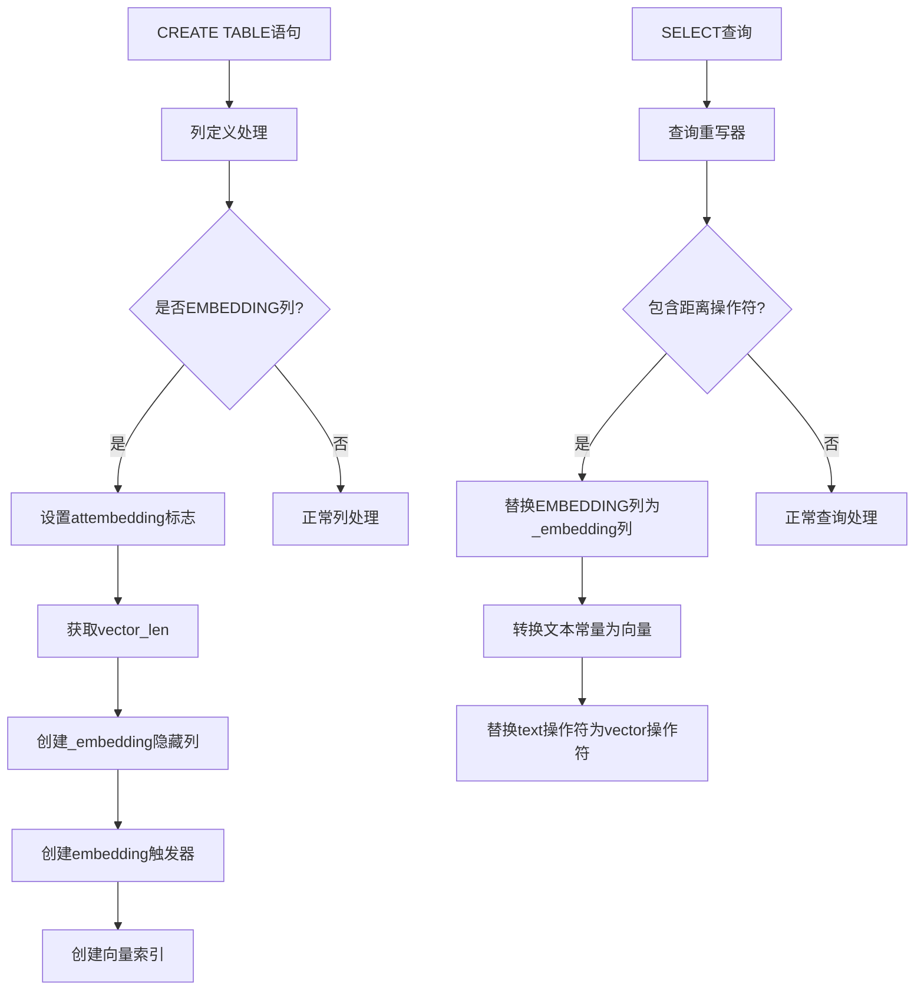

# EMBEDDING 功能设计文档

## 1. 概述

### 1.1 功能简介

EMBEDDING 列属性用于标记需要存储嵌入向量的列。当定义一个 EMBEDDING 列时，系统会自动创建一个隐藏的向量列来存储嵌入向量数据。该功能与 pgvector 扩展配合使用，支持向量相似度搜索等 AI 应用场景。

### 1.2 设计目标

- 提供简洁的语法标记需要嵌入向量的列
- 自动创建隐藏的向量列存储嵌入数据
- 支持自定义向量维度和嵌入函数
- 支持向量距离查询自动重写
- 自动创建向量索引

### 1.3 语法

```sql
column_name data_type EMBEDDING AS (expression) STORED
```

### 1.4 与 PREDICT AS 的关键区别

| 特性 | PREDICT AS STORED | EMBEDDING AS STORED |
|------|-------------------|---------------------|
| attgenerated 值 | 'p' | 'e' |
| attembedding 值 | false | true |
| 表达式返回类型 | 与列类型相同 | vector（与列类型不同） |
| 伴随列 | _predict, _actual | _embedding |
| 查询重写 | 无 | 向量距离操作符重写 |
| 支持延迟计算 | 是（predict_timing=deferred） | 否 |

## 2. 架构设计

### 2.1 系统架构图



### 2.2 核心组件

#### 2.2.1 EMBEDDING 列属性

- 在 `pg_attribute` 系统表中添加 `attembedding` 布尔字段
- `attgenerated = 'e'`（ATTRIBUTE_GENERATED_EMBEDDING）
- EMBEDDING 列本身存储原始文本值（text类型）
- 伴随列 `_embedding` 存储 vector 类型

#### 2.2.2 自动创建伴随列

当定义一个 EMBEDDING 列时，系统自动创建：

| 列名 | 类型 | 用途 |
|------|------|------|
| `{column}_embedding` | vector(vector_len) | 存储嵌入向量值 |

同时自动创建向量索引：`{table}_{column}_embedding_idx`

#### 2.2.3 隐藏列机制

- `_embedding` 伴随列标记为 `atthidden=true`
- `SELECT *` 不显示隐藏列
- 显式指定列名时仍可正常查询

#### 2.2.4 Embedding 触发器

- 自动创建的 BEFORE INSERT OR UPDATE 触发器
- 触发器名称：`jolix_predict_{column}_{oid}`
- 调用嵌入函数，将结果存储到 `_embedding` 伴随列

#### 2.2.5 查询重写器

- 自动将 EMBEDDING 列的向量距离查询重写为 `_embedding` 列的向量操作
- 支持四种距离操作符：`<->`、`<=>`、`<#>`、`<+>`
- 支持向量函数重写：`l2_distance`、`cosine_distance` 等
- 支持向量聚合重写：`avg`、`sum`

## 3. 数据模型设计

### 3.1 系统表扩展

```c
// pg_attribute 表扩展
bool        attembedding BKI_DEFAULT(f);  // EMBEDDING列标记

// attgenerated 新值
#define ATTRIBUTE_GENERATED_EMBEDDING 'e'
```

### 3.2 解析器扩展

```c
typedef struct ColumnDef
{
    bool        is_embedding;   // EMBEDDING选项指定
    bool        is_hidden;      // 隐藏列标记
} ColumnDef;
```

### 3.3 TupleConstr 扩展

```c
typedef struct TupleConstr
{
    bool        has_generated_embedding;  // 包含embedding列
} TupleConstr;
```

## 4. 表级选项设计

### 4.1 vector_len 选项

指定嵌入向量的维度长度，默认值 1536。

```c
static relopt_int intRelOpts[] =
{
    {
        {
            "vector_len",
            "Length of embedding vector for prediction columns.",
            RELOPT_KIND_HEAP,
            ShareUpdateExclusiveLock
        },
        1536, 0, INT_MAX
    },
};
```

### 4.2 向量索引选项

| 参数 | 类型 | 默认值 | 说明 |
|------|------|--------|------|
| `vector_index` | enum | ivfflat | 向量索引类型：ivfflat 或 hnsw |
| `vector_distance` | enum | vector_l2_ops | 向量距离类型 |
| `lists` | int | - | ivfflat 索引的 lists 参数 |
| `m` | int | - | hnsw 索引的 m 参数 |
| `ef_construction` | int | - | hnsw 索引的 ef_construction 参数 |

## 5. 触发器行为设计

### 5.1 embedding_trigger 执行流程

```
INSERT/UPDATE → BEFORE触发器 → embedding_trigger
    │
    ├── 遍历所有 EMBEDDING 列（attembedding=true）
    │
    ├── 检查 attgenerated == ATTRIBUTE_GENERATED_EMBEDDING
    │
    ├── 获取表达式（从 pg_attrdef）
    │   ├── 如果表达式被 CoerceViaIO 包裹，剥离外层强制转换
    │   └── 直接评估内部的函数表达式
    │
    ├── 计算表达式获得 vector 结果
    │
    └── 将 vector 结果存储到 _embedding 伴随列
```

### 5.2 表达式计算方式

EMBEDDING 列的表达式返回 `vector` 类型，但列本身是 `text` 类型。PostgreSQL 在存储时自动添加 `CoerceViaIO` 节点将 vector 转换为 text。在触发器评估表达式时，需要剥离这个 `CoerceViaIO` 节点，直接评估内部的函数表达式，以获得正确的 vector 结果。

## 6. 查询重写设计

### 6.1 设计原则

**只在期望 vector 类型的上下文中进行替换**。当 EMBEDDING 列用于普通 text 操作时（如 `LIKE`、`=`、`<>` 等），不进行替换，保持原始 text 语义。

### 6.2 重写入口

在 `RewriteQuery` 函数中，仅对 `CMD_SELECT` 查询触发重写：

```c
if (parsetree->commandType == CMD_SELECT)
{
    rewrite_embedding_query(parsetree);
}
```

### 6.3 距离操作符重写

处理四种距离操作符：`<->`、`<=>`、`<#>`、`<+>`

| 模式 | 示例 | 处理方式 |
|------|------|---------|
| Var-Const | `content <-> 'text'` | 替换列 + 替换操作符 + 转换常量 |
| Const-Var | `'text' <-> content` | 替换列 + 替换操作符 + 转换常量 |
| Var-Var | `a.content <-> b.content` | 替换两侧列 + 替换操作符 |

常量转换流程：
1. 检查常量是否为 text 类型
2. 获取 embedding 函数 OID
3. 调用 embedding 函数将 text 转为 vector
4. 创建 vector 类型的 Const 节点替换原常量

### 6.4 向量函数重写

通过检查函数声明的参数类型，判断哪些参数期望 vector 类型：
- 距离函数：`l2_distance`、`cosine_distance`、`inner_product`、`l1_distance`
- 工具函数：`vector_dims`、`vector_norm`、`l2_normalize`、`subvector`、`binary_quantize`

### 6.5 向量聚合重写

处理向量聚合函数（`avg`、`sum`）：如果参数是 EMBEDDING 列的 Var，替换为 `_embedding` 列。

### 6.6 不替换的场景

| 场景 | 示例 | 原因 |
|------|------|------|
| 普通比较 | `content = 'hello'` | text 类型的等值比较 |
| LIKE/ILIKE | `content LIKE '%test%'` | text 模式匹配 |
| IS NULL | `content IS NULL` | NULL 检查 |
| 非向量操作符 | `content > 'a'` | text 排序比较 |
| text 函数 | `length(content)` | 期望 text 参数的函数 |
| SELECT 显示 | `SELECT content FROM t` | 仅显示原始文本 |

## 7. jolix_embedding 扩展

### 7.1 功能

jolix_embedding 扩展提供内置的 Sentence Transformers embedding 函数，用户无需手动创建 PL/Python 函数。

### 7.2 核心函数

| 函数 | 说明 |
|------|------|
| `st_embedding(input_text text)` | 使用默认模型生成嵌入向量 |
| `st_embedding(input_text text, model_name text)` | 使用指定模型生成嵌入向量 |

### 7.3 GUC 参数

| 参数 | 默认值 | 说明 |
|------|--------|------|
| `jolix_embedding.model_name` | sentence-transformers/all-MiniLM-L6-v2 | 默认模型名称 |
| `jolix_embedding.model_path` | 空 | 本地模型文件路径 |

### 7.4 特性

- 内置函数：无需手动创建 PL/Python 函数
- 直接返回 vector 类型：可以直接用作 EMBEDDING AS 表达式
- 自动下载模型：如果本地不存在模型文件，自动从 HuggingFace 镜像下载
- 会话级缓存：模型在会话中缓存，避免重复加载
- 国内镜像支持：默认使用 hf-mirror.com 加速下载

## 8. 代码修改文件清单

| 文件路径 | 功能说明 |
|---------|----------|
| `src/include/parser/kwlist.h` | 添加EMBEDDING关键字定义 |
| `src/backend/parser/gram.y` | 添加EMBEDDING语法规则 |
| `src/include/nodes/parsenodes.h` | ColumnDef结构体添加is_embedding字段 |
| `src/include/catalog/pg_attribute.h` | 添加attembedding字段定义 |
| `src/include/access/tupdesc.h` | CompactAttribute结构体添加attembedding字段 |
| `src/backend/access/common/reloptions.c` | 添加vector_len等表选项定义 |
| `src/backend/parser/parse_utilcmd.c` | transformColumnDefinition添加EMBEDDING列处理逻辑 |
| `src/backend/commands/tablecmds.c` | 创建embedding触发器和向量索引 |
| `src/backend/catalog/heap.c` | 跳过EMBEDDING列的IMMUTABLE检查 |
| `src/backend/executor/nodeModifyTable.c` | 跳过embedding列的ExecComputeStoredGenerated |
| `src/backend/rewrite/rewriteHandler.c` | 查询重写：embedding列替换和距离操作符重写 |
| `src/backend/utils/adt/predict.c` | embedding_trigger触发器函数实现 |
| `src/include/utils/rel.h` | StdRdOptions添加vector_len等字段 |
| `src/bin/initdb/initdb.c` | 自动创建vector、jolix_predict、jolix_embedding扩展 |
| `contrib/jolix_embedding/` | jolix_embedding扩展（Sentence Transformers函数） |

---
**文档版本**: 1.0  
**最后更新**: 2026-05-13
