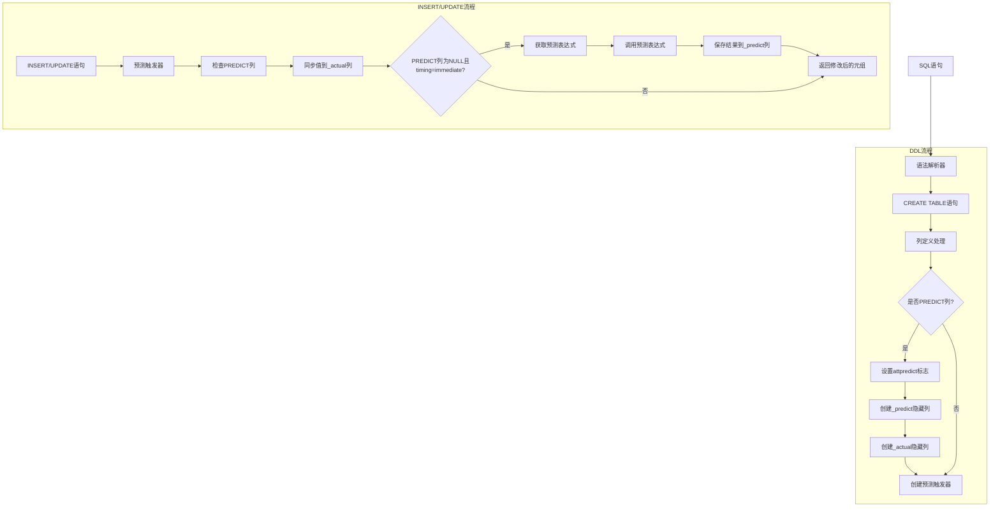

# PREDICT 功能设计文档

## 1. 概述

### 1.1 功能简介

PREDICT 列属性用于标记需要自动预测的列。当定义一个 PREDICT 列时，系统会自动创建隐藏的伴随列来存储预测值和实际值，并通过触发器自动调用预测表达式。

### 1.2 设计目标

- 提供灵活的数据预测机制，支持用户自定义预测算法
- 支持即时预测（immediate）和延迟预测（deferred）两种模式
- 允许用户直接写入 PREDICT 列值（与 GENERATED 列不同）
- 支持 VOLATILE 函数（如 LLM 推理）
- 保持与现有 PostgreSQL 架构的兼容性

### 1.3 语法

```sql
column_name data_type PREDICT AS (expression) STORED
```

### 1.4 与 GENERATED ALWAYS AS 的关键区别

| 特性 | GENERATED ALWAYS AS STORED | PREDICT AS STORED |
|------|---------------------------|-------------------|
| attgenerated 值 | 's' | 'p' |
| 允许直接写入 | 否 | 是 |
| 表达式必须 IMMUTABLE | 是 | 否（允许VOLATILE） |
| 伴随列 | 无 | _predict, _actual |
| 计算方式 | ExecComputeStoredGenerated | predict_trigger |
| 支持延迟计算 | 否 | 是（predict_timing=deferred） |
| 支持异步后台计算 | 否 | 是（async_predict worker） |

## 2. 架构设计

### 2.1 系统架构图



### 2.2 核心组件

#### 2.2.1 PREDICT 列属性

- 在 `pg_attribute` 系统表中添加 `attpredict` 布尔字段
- 标记该列需要预测处理
- `attgenerated = 'p'`（ATTRIBUTE_GENERATED_PREDICT）

#### 2.2.2 自动创建伴随列

当定义一个 PREDICT 列时，系统自动创建两个隐藏列：

| 列名 | 类型 | 用途 |
|------|------|------|
| `{column}_predict` | 与原列相同 | 存储预测表达式的计算结果 |
| `{column}_actual` | 与原列相同 | 存储用户输入的实际值 |

同时自动创建复合 B-tree 索引：`{table}_{column}_predict_idx`

#### 2.2.3 隐藏列机制

- 在 `pg_attribute` 系统表中添加 `atthidden` 布尔字段
- 隐藏列在 `SELECT *` 展开时被跳过
- 显式指定列名时仍可正常查询
- 利用现有的 `p_dontexpand` 机制实现（与 CTE 的 SEARCH/CYCLE 列相同）

#### 2.2.4 预测触发器

- 自动创建的 BEFORE INSERT OR UPDATE 触发器
- 处理所有 PREDICT 列的预测逻辑
- 触发器名称：`jolix_predict_{column}_{oid}`

#### 2.2.5 预测表达式机制

- 通过 `PREDICT AS (expr) STORED` 语法在列定义中内联指定
- 表达式存储在 `pg_attrdef` 系统目录中
- 支持自定义预测算法，可引用同表其他列
- 支持 VOLATILE 函数（如 LLM 推理）

## 3. 数据模型设计

### 3.1 系统表扩展

```c
// pg_attribute 表扩展
bool        attpredict BKI_DEFAULT(f);  // PREDICT列标记
bool        atthidden BKI_DEFAULT(f);   // 隐藏列标记

// attgenerated 新值
#define ATTRIBUTE_GENERATED_PREDICT 'p'
```

### 3.2 解析器扩展

```c
// ColumnDef 结构体扩展
typedef struct ColumnDef
{
    bool        is_predict;     // PREDICT选项指定
    bool        is_hidden;      // 隐藏列标记
} ColumnDef;
```

### 3.3 TupleConstr 扩展

```c
typedef struct TupleConstr
{
    bool        has_generated_predict;  // 包含predict列
} TupleConstr;
```

## 4. 触发器行为设计

### 4.1 predict_trigger 执行流程

```
INSERT/UPDATE → BEFORE触发器 → predict_trigger
    │
    ├── 遍历所有 PREDICT 列
    │
    ├── INSERT 时：
    │   ├── PREDICT列为NULL + immediate → 计算表达式 → 保存到predict列和_predict列
    │   ├── PREDICT列非NULL → 保留用户值 → 保存到_actual列
    │   └── PREDICT列为NULL + deferred → 不计算，等待SELECT时按需推理或async worker
    │
    └── UPDATE 时：
        ├── PREDICT列被修改 → 保存新值到_actual列
        └── PREDICT列未被修改 + immediate → 重新计算表达式
```

### 4.2 deferred 模式下的 SELECT 按需推理流程

```
SELECT → ExecScanExtended → ExecPredictOnDemand
    │
    ├── 检查关系是否有 deferred predict 列
    │
    ├── 检查当前元组的 predict 列是否为 NULL
    │
    ├── 如果 predict 列为 NULL：
    │   ├── 获取 PREDICT AS 表达式
    │   ├── 执行表达式计算推理值
    │   ├── 修改 slot 中的 predict 列和 _predict 列值
    │   └── 通过 SPI 执行 UPDATE 持久化推理结果
    │
    └── 如果 predict 列非 NULL：
        └── 直接返回（无需推理）
```

### 4.3 表达式计算方式

在触发器中使用 `build_column_default` + `ExecPrepareExpr` + `ExecEvalExpr` 的方式计算内联表达式，而不是通过 SPI 执行 SQL 查询。这避免了 BEFORE INSERT 触发器中 ctid 无效的问题。

## 5. predict_timing 表选项

### 5.1 两种模式

| 模式 | 值 | 触发时机 | 处理方式 |
|------|-----|---------|---------|
| **immediate** | 立即预测 | INSERT/UPDATE 时 | 触发器实时调用预测表达式 |
| **deferred** | 延迟预测（默认） | SELECT 时按需推理 + 后台异步处理 | SELECT 时自动推理并持久化，同时后台 Worker 批量处理 |

### 5.2 deferred 模式的按需推理机制

当 `predict_timing = deferred` 时，系统采用双重推理策略：

1. **按需推理（On-Demand）**：当 SELECT 查询访问到 predict 列为 NULL 的行时，立即执行推理表达式，将结果返回给查询并持久化到表中
2. **后台推理（Background Worker）**：异步预测 Worker 定期扫描表，处理 predict 列为 NULL 的行

按需推理的优势：
- 用户无需等待后台 Worker 处理，SELECT 时即可获得推理结果
- 推理结果自动持久化，后续查询无需重复推理
- 与后台 Worker 互补，确保所有行最终都被处理

### 5.3 数据结构

```c
typedef enum StdRdOptPredictTiming
{
    STDRD_OPTION_PREDICT_TIMING_DEFERRED = 0,
    STDRD_OPTION_PREDICT_TIMING_IMMEDIATE,
} StdRdOptPredictTiming;

typedef struct StdRdOptions
{
    StdRdOptPredictTiming predict_timing;
} StdRdOptions;
```

## 6. 异步预测模块

### 6.1 概述

异步预测模块（Async Predict Worker）是一个后台工作进程，用于异步处理 `predict_timing = deferred` 的 PREDICT 列预测任务。与按需推理机制互补，确保所有 predict 列为 NULL 的行最终都被处理。

### 6.2 配置参数

| 参数名 | 类型 | 默认值 | 说明 |
|--------|------|--------|------|
| `async_predict_workers` | int | 2 | 工作进程数量 |
| `async_predict_naptime` | int | 60 | 扫描间隔时间（秒） |
| `async_predict_batch_size` | int | 100 | 每次处理的最大行数 |
| `async_predict_enabled` | bool | true | 是否启用异步预测 |

### 6.3 工作流程

1. 后台工作进程定期扫描表
2. 查找 PREDICT 列为 NULL 的行
3. 通过 SPI 执行预测表达式
4. 通过 SPI 执行 UPDATE 更新 PREDICT 列和 `_predict` 列

### 6.4 注意事项

- Worker 是独立后台进程，GUC 参数必须使用 `ALTER SYSTEM SET` 设置为全局级别
- Worker 执行 UPDATE 时会触发 `predict_trigger`，触发器通过比较新旧值来检测 worker 操作
- Worker 使用 PG_TRY/PG_CATCH 捕获错误，防止 LLM 调用失败导致 worker 崩溃

## 7. 代码修改文件清单

| 文件路径 | 功能说明 |
|---------|----------|
| `src/backend/parser/gram.y` | PREDICT关键字语法解析 |
| `src/backend/parser/parse_utilcmd.c` | 建表时列定义处理，自动创建伴随列 |
| `src/backend/parser/parse_target.c` | INSERT时目标列处理 |
| `src/backend/parser/parse_relation.c` | SELECT时隐藏列的p_dontexpand设置 |
| `src/backend/commands/tablecmds.c` | 建表逻辑，创建预测触发器 |
| `src/backend/catalog/heap.c` | 系统表插入，跳过IMMUTABLE检查 |
| `src/backend/executor/nodeModifyTable.c` | 跳过predict列的ExecComputeStoredGenerated |
| `src/backend/rewrite/rewriteHandler.c` | 允许predict列接受INSERT/UPDATE的用户值 |
| `src/backend/utils/adt/predict.c` | 预测触发器函数实现，ExecPredictOnDemand按需推理 |
| `src/backend/postmaster/async_predict.c` | 异步预测后台工作进程 |
| `src/backend/access/common/reloptions.c` | predict_timing表选项定义（async/immediate） |
| `src/include/catalog/pg_attribute.h` | attpredict和atthidden字段定义 |
| `src/include/nodes/parsenodes.h` | ColumnDef.is_predict和is_hidden字段定义 |
| `src/include/utils/rel.h` | StdRdOptions.predict_timing字段定义 |
| `src/include/utils/predict.h` | ExecPredictOnDemand函数声明 |
| `src/include/executor/execScan.h` | ExecScanExtended中调用ExecPredictOnDemand |
| `contrib/jolix_predict/` | jolix_predict扩展（LLM推理函数） |

## 8. jolix_predict 扩展

### 8.1 功能

jolix_predict 扩展提供大语言模型（LLM）推理功能，允许用户在 SQL 中直接调用 LLM API。

### 8.2 核心函数

| 函数 | 说明 |
|------|------|
| `llm_infer(prompt, question)` | LLM推理函数 |
| `llm_predict(prompt, question)` | LLM预测函数（带历史对话） |
| `llm_rag_infer(prompt, question, table, column)` | RAG推理函数 |
| `llm_rag_predict(prompt, question, table, column)` | RAG预测函数 |

### 8.3 GUC 参数

| 参数 | 默认值 | 说明 |
|------|--------|------|
| `jolix_predict.llm_api_url` | 空 | LLM API 地址 |
| `jolix_predict.llm_api_key` | 空 | LLM API 密钥 |
| `jolix_predict.llm_model` | gpt-3.5-turbo | LLM 模型名称 |
| `jolix_predict.llm_history_table` | default | 默认历史记录表名，空字符串禁用自动记录 |

### 8.4 参数默认值回退机制

当 `llm_infer` 和 `llm_rag_infer` 的 `system_prompt` 或 `user_input` 参数为 NULL 或空字符串时，自动使用 `set_llm_config()` 配置的默认值：

| 参数 | 回退配置 | 说明 |
|------|----------|------|
| `system_prompt` | `set_llm_config(p_system_prompt := '...')` | 系统提示词默认值 |
| `user_input` | `set_llm_config(p_prompt_template := '...')` | 用户输入默认值 |

---
**文档版本**: 1.1  
**最后更新**: 2026-05-23
