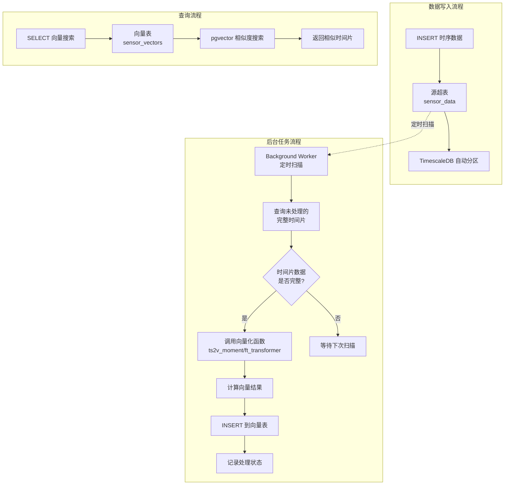

# 时序向量表（Timeseries Vector Table）设计文档

## 1. 概述

### 1.1 功能简介

时序向量表功能用于在 TimescaleDB 超表（hypertable）基础上，自动按固定时间间隔（时间片）对时序数据进行向量化计算，并将向量结果连同时间片信息和相关属性存储到新的向量表中。

该功能结合了 TimescaleDB 的时序数据管理能力和 pgvector 的向量相似度搜索能力，适用于时序数据的异常检测、模式识别、相似度搜索等 AI 应用场景。

### 1.2 设计目标

- 基于现有超表自动创建向量表，无需手动维护
- 支持按固定时间间隔（time bucket）自动切分时序数据
- 当时间片数据完整后，自动调用向量化函数计算该时间片的向量
- 向量表记录时间片元数据（开始时间、结束时间）和源表属性列
- 利用 TimescaleDB 的后台任务调度机制实现定时扫描和计算
- 支持向量相似度查询，快速检索相似的时间片段

### 1.3 典型应用场景

- **工业 IoT 异常检测**：将传感器时序数据按分钟/小时分片向量化，通过向量相似度搜索找到异常时间段
- **金融行情模式识别**：将股票行情按时间窗口向量化，识别相似走势模式
- **系统监控告警**：将服务器指标按时间片向量化，通过相似度匹配历史故障模式
- **能耗分析**：将能耗数据按小时向量化，比较不同时间段的用能模式

### 1.4 术语定义

| 术语 | 说明 |
|------|------|
| 源表（Source Table） | 原始的 TimescaleDB 超表，存储时序数据 |
| 向量表（Vector Table） | 新创建的表，存储时间片的向量数据和元信息 |
| 时间片（Time Slice） | 固定时间间隔的数据窗口，如 1 小时、1 天 |
| 向量化函数 | 将时序数据转换为向量的函数，如 `ts2v_moment`、`ft_transformer_embedding` |

## 2. 语法设计

### 2.1 创建时序向量表

```sql
CREATE TIMESERIES VECTOR TABLE vector_table_name
FROM source_hypertable
TIME_BUCKET bucket_interval
VECTORIZE (vector_column_name)
USING vectorize_function
[ CARRY (column1, column2, ...) ]
[ WITH (option = value, ...) ];
```

#### 参数说明

| 参数 | 说明 | 示例 |
|------|------|------|
| `vector_table_name` | 新创建的向量表名称 | `sensor_vectors` |
| `source_hypertable` | 源超表名称 | `sensor_data` |
| `bucket_interval` | 时间片间隔 | `'1 hour'`、`'30 minutes'` |
| `vector_column_name` | 向量表中存储向量的列名 | `embedding` |
| `vectorize_function` | 向量化函数名 | `ts2v_moment`、`ft_transformer_embedding` |
| `CARRY (columns)` | 从源表携带的属性列（用于 GROUP BY） | `CARRY (sensor_id, location)` |
| `WITH (options)` | 表级选项 | `vector_len = 384, scan_interval = '5 min'` |

### 2.2 语法示例

```sql
-- 基本示例：按 1 小时分片，使用 ts2v_moment 函数向量化
CREATE TIMESERIES VECTOR TABLE sensor_vectors
FROM sensor_data
TIME_BUCKET '1 hour'
VECTORIZE (embedding)
USING ts2v_moment
CARRY (sensor_id, location)
WITH (vector_len = 384, scan_interval = '5 min');
```

### 2.3 删除时序向量表

```sql
DROP TIMESERIES VECTOR TABLE vector_table_name;
-- 或直接使用
DROP TABLE vector_table_name CASCADE;
```

删除向量表时自动删除关联的后台任务。

### 2.4 管理后台任务

后台任务的可调参数（`scan_interval`、`completion_delay`、`enabled` 等）通过向量表的表属性（reloptions）保存，因此直接使用 PostgreSQL 标准的 `ALTER TABLE ... SET/RESET` 语法即可管理，无需额外的管理函数。

```sql
-- 查看所有时序向量表配置
SELECT * FROM timeseries_vector_info;

-- 手动触发一次向量计算
SELECT timeseries_vector_run(vector_table_name);

-- 修改扫描间隔（后台任务下次扫描时读取，立即生效）
ALTER TABLE vector_table_name SET (scan_interval = '10 min');

-- 修改时间片完成延迟
ALTER TABLE vector_table_name SET (completion_delay = '5 min');

-- 恢复为默认值
ALTER TABLE vector_table_name RESET (scan_interval);

-- 停用 / 启用后台任务
ALTER TABLE vector_table_name SET (enabled = false);
ALTER TABLE vector_table_name SET (enabled = true);
```

说明：

- 表属性（reloptions）是 PostgreSQL 表自带的存储机制，`ALTER TABLE ... SET/RESET` 由内核自动处理，无需自定义语法解析。
- 后台任务每次扫描时动态读取表属性，因此修改后无需重建任务。
- 结构性的配置（`vectorize_function`、`bucket_interval`、`carry_columns`、`vector_len` 等）在创建后不可通过 `ALTER TABLE` 修改，仍保留在元数据表中。

## 3. 架构设计

### 3.1 系统架构图



### 3.2 核心组件

#### 3.2.1 向量表结构

向量表自动创建，包含以下列：

| 列名 | 类型 | 说明 |
|------|------|------|
| `slice_start` | TIMESTAMPTZ | 时间片开始时间（主键之一） |
| `slice_end` | TIMESTAMPTZ | 时间片结束时间 |
| `{carry_columns}` | 源表对应类型 | 从源表携带的属性列（主键之一） |
| `{vector_column}` | vector(vector_len) | 向量数据列 |
| `_processed` | BOOLEAN | 是否已处理（默认 true） |
| `_data_watermark` | TIMESTAMPTZ | 本时间片包含的源数据最高时间（用于迟到数据检测） |
| `_coverage` | FLOAT | 覆盖率 = 实际采样点 / 期望采样点（0~1） |
| `_row_count` | INT | 本时间片实际采样点数 |
| `_gap_count` | INT | 检测到的数据间隙数量 |
| `_created_at` | TIMESTAMPTZ | 记录创建时间 |

#### 3.2.2 时间片完整性判断与数据质量处理

时序数据的采集存在两类典型问题：**数据延迟**（数据未及时写入）和**数据缺失**（采集失败导致时间片内出现空洞）。后台任务不能简单地把"时间已过 `slice_end`"等同于"数据完整"，需要分别处理。

##### 1. 数据延迟（迟到数据）

数据延迟指某段数据在其所属时间片结束后才写入源表。处理策略：

1. **延迟缓冲（`completion_delay`）**：时间片结束后额外等待一段时间再计算，缓解正常传输延迟导致的数据不完整。
2. **水位线追踪（watermark）**：为每个向量表记录已处理到的源数据最高时间 `_data_watermark`，后台任务从水位线之后扫描，避免重复读取。
3. **迟到数据重算（`recompute_on_late_data`）**：当检测到水位线之前出现新增数据（迟到数据），将受影响的时间片标记为"待重算"，下次扫描时重新计算向量。默认关闭，按需通过表属性开启。
   - 检测方式：源表新增数据行时（可借助源表触发器记录 `_updated_at`，或通过 INSERT 语义识别），若其 `time` 早于当前水位线，判定为迟到数据。

##### 2. 数据缺失（采集失败）

数据缺失指某个时间片内预期的采样点没有全部到达（如传感器离线、丢包）。处理策略：

1. **覆盖率阈值（`min_coverage`）**：`实际采样点数 / 期望采样点数`，低于阈值的时间片不计算向量，避免产生误导性向量。
2. **最大间隙检测（`max_gap`）**：时间片内相邻采样点的时间间隔若超过阈值，判定中间存在缺失段。
3. **等待补齐超时（`completion_timeout`）**：覆盖率不足的时间片继续等待回补数据，超时后按模式处理：
   - `strict` 模式：跳过该时间片，不写入向量（等待后续重算）；
   - 非 `strict` 模式：仍计算向量，但记录低覆盖率标记，供查询时过滤。
4. **质量元数据**：在向量表中记录质量元数据列，供查询时过滤低质量向量（见 3.2.1）。

期望采样点数由 `sample_interval` 表属性推断（= 时间片长度 / 采样间隔）；未指定时仅依据 `_row_count` 与 `_gap_count` 判断。

##### 3. 综合判定流程

```
1. 找出候选时间片（slice_end + completion_delay < NOW()，且在水位线之后）
2. 对每个候选时间片：
   a. 统计覆盖率、最大间隙、行数
   b. 若 coverage >= min_coverage 且 max_gap 在阈值内 → 计算向量，标记 complete
   c. 若 coverage < min_coverage 或存在超限间隙：
      - 未到 completion_timeout → 跳过，继续等待回补数据
      - 已超时 → 按 strict 模式决定「跳过」或「带质量标记计算」
3. 检测迟到数据（time < watermark 的新增行）→ 标记受影响时间片为待重算
4. 重算受影响的时间片
```

```sql
-- 候选时间片 + 数据质量统计（示意）
WITH candidates AS (
    SELECT
        time_bucket('1 hour', time) AS slice_start,
        time_bucket('1 hour', time) + interval '1 hour' AS slice_end,
        sensor_id, location,
        count(*) AS row_count,
        count(*)::float / (3600.0 / 60.0) AS coverage,  -- 期望采样点 = 片长 / 采样间隔(60s)
        MAX(time) AS max_time_in_slice
    FROM sensor_data
    WHERE time < NOW() - interval '5 min'               -- completion_delay
      AND time > ${watermark}                            -- 水位线之后
    GROUP BY 1, 2, 3, 4
)
SELECT c.*
FROM candidates c
LEFT JOIN sensor_vectors sv
    ON sv.slice_start = c.slice_start AND sv.sensor_id = c.sensor_id
WHERE sv.slice_start IS NULL
  AND c.coverage >= 0.5;                                 -- min_coverage
```

#### 3.2.3 向量化函数接口

向量化函数接收一个时间片内的所有时序数据，返回一个向量。函数签名约定：

```sql
-- 向量化函数模板
CREATE FUNCTION ts2v_moment(
    data_rows REFCURSOR,  -- 或使用 SET RETURNING 函数
    vector_len INT DEFAULT 384
) RETURNS vector;
```

实际实现中，向量化函数在后台任务内部通过 SPI 执行，接收时间片内的聚合数据作为输入。

#### 3.2.4 后台任务机制

利用 TimescaleDB 的 `add_job` API 注册定时任务：

```sql
-- 注册后台任务（DDL 执行时自动创建）
SELECT timescaledb_internal.add_job(
    proc => 'timeseries_vector_scan'::regproc,
    schedule_interval => '5 min'::interval,  -- scan_interval
    config => jsonb_build_object(
        'source_table', 'sensor_data',
        'vector_table', 'sensor_vectors',
        'bucket_interval', '1 hour',
        'carry_columns', ARRAY['sensor_id', 'location'],
        'vector_column', 'embedding',
        'vectorize_function', 'ts2v_moment',
        'completion_delay', '5 min'
    ),
    job_name => 'tsv_sensor_vectors'
);
```

后台任务的执行逻辑：

```
1. 读取 job config 获取源表、向量表、时间片配置
2. 查询源表，找出未处理且已完整的时间片
3. 对每个完整时间片：
   a. 查询该时间片内的时序数据
   b. 调用向量化函数计算向量
   c. INSERT 到向量表（slice_start, slice_end, carry_columns, vector_column）
4. 记录处理日志
```

### 3.3 元数据管理

#### 3.3.1 元数据表

创建一个系统级元数据表记录所有时序向量表的配置：

```sql
CREATE TABLE _timescaledb_internal.timeseries_vector_tables (
    id              SERIAL PRIMARY KEY,
    vector_table    REGCLASS NOT NULL UNIQUE,
    source_table    REGCLASS NOT NULL,
    bucket_interval INTERVAL NOT NULL,
    vector_column   TEXT NOT NULL,
    vectorize_function REGPROC NOT NULL,
    carry_columns   TEXT[] NOT NULL DEFAULT '{}',
    vector_len      INT NOT NULL DEFAULT 384,
    job_id          INTEGER,  -- TimescaleDB job ID
    created_at      TIMESTAMPTZ NOT NULL DEFAULT NOW()
);
```

> 注：`scan_interval`、`completion_delay`、`enabled` 等可调参数不存储在元数据表中，而是作为向量表的表属性（reloptions）保存，通过 `ALTER TABLE ... SET/RESET` 修改。元数据表只记录创建时确定的结构性配置及后台任务句柄（`job_id`）。
```

#### 3.3.2 信息视图

```sql
CREATE VIEW timeseries_vector_info AS
SELECT
    t.vector_table::regclass::text AS vector_table_name,
    t.source_table::regclass::text AS source_table_name,
    t.bucket_interval,
    t.vector_column,
    t.vectorize_function::regproc::text AS vectorize_function,
    t.carry_columns,
    t.vector_len,
    c.reloptions,                    -- 可调参数（scan_interval/completion_delay/enabled）
    t.job_id,
    t.created_at,
    j.job_status,
    j.last_run_status,
    j.last_run_started_at,
    j.next_start
FROM _timescaledb_internal.timeseries_vector_tables t
JOIN pg_class c ON c.oid = t.vector_table
LEFT JOIN timescaledb_information.jobs j ON t.job_id = j.job_id;
```

## 4. 数据模型设计

### 4.1 源表示例

```sql
-- 源表：传感器时序数据
CREATE TABLE sensor_data (
    time        TIMESTAMPTZ NOT NULL,
    sensor_id   TEXT NOT NULL,
    location    TEXT NOT NULL,
    temperature DOUBLE PRECISION,
    humidity    DOUBLE PRECISION,
    pressure    DOUBLE PRECISION
);

SELECT create_hypertable('sensor_data', 'time');
```

### 4.2 向量表结构

执行 `CREATE TIMESERIES VECTOR TABLE` 后自动创建：

```sql
-- 自动生成的向量表
CREATE TABLE sensor_vectors (
    slice_start   TIMESTAMPTZ NOT NULL,
    slice_end     TIMESTAMPTZ NOT NULL,
    sensor_id     TEXT NOT NULL,       -- CARRY 列
    location      TEXT NOT NULL,       -- CARRY 列
    embedding     vector(384),         -- VECTORIZE 列
    _processed    BOOLEAN DEFAULT true,
    _created_at   TIMESTAMPTZ DEFAULT now(),
    PRIMARY KEY (slice_start, sensor_id, location)
);

-- 自动创建向量索引
CREATE INDEX sensor_vectors_embedding_idx
ON sensor_vectors USING hnsw (embedding vector_cosine_ops);

-- 自动注册 TimescaleDB 后台任务
```

### 4.3 WITH 选项

| 选项 | 类型 | 默认值 | 说明 |
|------|------|--------|------|
| `vector_len` | int | 384 | 向量维度 |
| `scan_interval` | interval | '5 min' | 后台任务扫描间隔 |
| `completion_delay` | interval | '0 min' | 时间片完成后的延迟等待（缓解迟到数据） |
| `sample_interval` | interval | NULL | 期望采样间隔，用于推断期望采样点数（NULL 则自动推断） |
| `min_coverage` | float | 0.5 | 覆盖率阈值，低于此值不计算向量 |
| `max_gap` | interval | NULL | 最大数据间隙，超过则判定数据不连续（NULL 表示不检测） |
| `completion_timeout` | interval | NULL | 等待补齐缺失数据的超时时间（NULL 表示一直等待） |
| `strict` | bool | false | 超时后是否跳过不完整时间片（true 跳过 / false 带质量标记计算） |
| `recompute_on_late_data` | bool | false | 检测到迟到数据时是否重算受影响的时间片 |
| `vector_index` | enum | hnsw | 向量索引类型（hnsw/ivfflat） |
| `vector_distance` | enum | cosine | 向量距离类型 |
| `m` | int | 16 | HNSW 索引参数 |
| `ef_construction` | int | 64 | HNSW 索引参数 |

## 5. 后台任务设计

### 5.1 任务执行流程

```
┌─────────────────────────────────────────────────────┐
│              timeseries_vector_scan()                │
├─────────────────────────────────────────────────────┤
│                                                      │
│  1. 读取 job config                                   │
│     ├── source_table, vector_table                   │
│     ├── bucket_interval, carry_columns               │
│     └── completion_delay, vectorize_function         │
│                                                      │
│  2. 查询未处理的完整时间片                              │
│     ├── 使用 time_bucket 计算时间片                    │
│     ├── WHERE slice_end < NOW() - completion_delay   │
│     └── LEFT JOIN 向量表排除已处理的时间片              │
│                                                      │
│  3. 遍历每个时间片                                     │
│     ├── 查询该时间片内的时序数据                        │
│     ├── 调用向量化函数                                 │
│     │   ├── ts2v_moment: 时序特征提取                        │
│     │   └── ft_transformer_embedding: 多列向量化      │
│     └── INSERT 结果到向量表                           │
│                                                      │
│  4. 异常处理                                          │
│     ├── 单个时间片失败不影响其他时间片                  │
│     └── 记录错误日志                                   │
│                                                      │
└─────────────────────────────────────────────────────┘
```

### 5.2 完整性判断逻辑

```sql
-- 找出所有未处理的完整时间片
WITH complete_slices AS (
    SELECT
        time_bucket($1, time) AS slice_start,
        time_bucket($1, time) + $1 AS slice_end,
        sensor_id, location,  -- CARRY 列
        count(*) AS row_count,
        avg(temperature) AS avg_temp,
        avg(humidity) AS avg_humidity,
        avg(pressure) AS avg_pressure,
        min(temperature) AS min_temp,
        max(temperature) AS max_temp,
        stddev(temperature) AS std_temp
    FROM sensor_data
    WHERE time < NOW() - $2  -- completion_delay
    GROUP BY slice_start, sensor_id, location
)
SELECT c.* FROM complete_slices c
LEFT JOIN sensor_vectors v
    ON c.slice_start = v.slice_start
    AND c.sensor_id = v.sensor_id
    AND c.location = v.location
WHERE v.slice_start IS NULL;  -- 未处理的时间片
```

### 5.3 向量化计算

向量化函数接收时间片内的数据，返回向量。两种支持模式：

#### 模式一：聚合特征向量化（ts2v_moment）

```sql
-- ts2v_moment 函数：将时间片的统计特征转为向量
-- 输入：时间片内的聚合数据（均值、标准差、最小值、最大值等）
-- 输出：固定维度的向量
SELECT ts2v_moment(
    avg_temp, avg_humidity, avg_pressure,
    min_temp, max_temp, std_temp,
    row_count
);
```

#### 模式二：多列直接向量化（ft_transformer_embedding）

```sql
-- ft_transformer_embedding 函数：将多列数值转为向量
SELECT ft_transformer_embedding(
    avg_temp, avg_humidity, avg_pressure
);
```

### 5.4 并发控制

- 后台任务使用 TimescaleDB 的 job 机制，同一 job 不会并发执行
- 向量表的 INSERT 使用 `ON CONFLICT DO NOTHING` 防止重复插入
- 支持多任务并行处理不同的源表

## 6. 使用示例

### 6.1 完整示例

```sql
-- 1. 创建源超表
CREATE TABLE sensor_data (
    time        TIMESTAMPTZ NOT NULL,
    sensor_id   TEXT NOT NULL,
    location    TEXT NOT NULL,
    temperature DOUBLE PRECISION,
    humidity    DOUBLE PRECISION,
    pressure    DOUBLE PRECISION
);

SELECT create_hypertable('sensor_data', 'time');

-- 2. 插入测试数据
INSERT INTO sensor_data VALUES
    ('2026-01-01 00:00:00+00', 'S001', 'Room-A', 22.5, 45.0, 1013.0),
    ('2026-01-01 00:30:00+00', 'S001', 'Room-A', 22.8, 45.5, 1013.2),
    ('2026-01-01 01:00:00+00', 'S001', 'Room-A', 23.0, 46.0, 1013.1),
    ('2026-01-01 01:30:00+00', 'S001', 'Room-A', 23.2, 46.2, 1013.0);

-- 3. 创建时序向量表
CREATE TIMESERIES VECTOR TABLE sensor_vectors
FROM sensor_data
TIME_BUCKET '1 hour'
VECTORIZE (embedding)
USING ts2v_moment
CARRY (sensor_id, location)
WITH (vector_len = 384, scan_interval = '1 min', completion_delay = '5 min');

-- 4. 手动触发一次计算（不等后台任务）
SELECT timeseries_vector_run('sensor_vectors');

-- 5. 查看结果
SELECT slice_start, slice_end, sensor_id, location,
       embedding::text
FROM sensor_vectors
ORDER BY slice_start;

-- 6. 向量相似度搜索：找最相似的时间片
SELECT slice_start, slice_end, sensor_id, location,
       embedding <=> target_embedding AS distance
FROM sensor_vectors
ORDER BY embedding <=> target_embedding
LIMIT 5;

-- 7. 查看任务状态
SELECT * FROM timeseries_vector_info;
```

### 6.2 删除示例

```sql
-- 删除时序向量表（自动删除后台任务）
DROP TIMESERIES VECTOR TABLE sensor_vectors;

-- 或使用普通 DROP TABLE
DROP TABLE sensor_vectors CASCADE;
```

## 7. 实现方案

### 7.1 实现层次

```
contrib/jolix_predict/
├── jolix_predict.c              # 现有主文件
├── timeseries_vector.c          # 新增：时序向量表 DDL 处理
├── timeseries_vector_scan.c     # 新增：后台任务执行逻辑
├── timeseries_vector.sql        # 新增：SQL 函数定义
├── timeseries_vector--1.0.sql   # 新增：扩展安装脚本
└── CMakeLists.txt               # 更新：编译配置
```

### 7.2 DDL 处理流程

```
CREATE TIMESERIES VECTOR TABLE 语句
    │
    ├── 1. 解析语法，提取参数
    │      ├── 源表名、向量表名
    │      ├── TIME_BUCKET 间隔
    │      ├── VECTORIZE 列名
    │      ├── USING 向量化函数
    │      ├── CARRY 列列表
    │      └── WITH 选项
    │
    ├── 2. 验证
    │      ├── 源表是否为超表
    │      ├── 向量化函数是否存在
    │      ├── CARRY 列是否在源表中存在
    │      └── WITH 选项是否合法
    │
    ├── 3. 创建向量表
    │      ├── CREATE TABLE（包含 slice_start, slice_end, carry, vector 列）
    │      ├── 创建向量索引
    │      └── 设置表级选项
    │
    ├── 4. 注册元数据
    │      └── INSERT 到 timeseries_vector_tables
    │
    └── 5. 注册后台任务
           └── 调用 timescaledb.add_job()
```

### 7.3 后台任务实现

```c
/*
 * timeseries_vector_scan - 后台任务主函数
 * 由 TimescaleDB job scheduler 调用
 */
Datum
timeseries_vector_scan(PG_FUNCTION_ARGS)
{
    Jsonb       *config;
    Oid          source_table;
    Oid          vector_table;
    Interval    *bucket_interval;
    char       **carry_columns;
    int          num_carry;
    char        *vector_column;
    Oid          vectorize_func;
    Interval    *completion_delay;

    /* 1. 从 job config 读取参数 */
    config = PG_GETARG_JSONB_P(0);
    parse_vector_scan_config(config, &source_table, &vector_table,
                             &bucket_interval, &carry_columns, &num_carry,
                             &vector_column, &vectorize_func,
                             &completion_delay);

    /* 2. 查询未处理的完整时间片 */
    find_complete_unprocessed_slices(source_table, vector_table,
                                     bucket_interval, carry_columns, num_carry,
                                     completion_delay);

    /* 3. 对每个时间片计算向量并插入 */
    while (has_next_slice())
    {
        SliceInfo  *slice = get_next_slice();

        /* 查询时间片内的数据 */
        char *query = build_slice_query(source_table, bucket_interval,
                                        carry_columns, num_carry, slice);

        /* 执行查询获取聚合数据 */
        SPI_execute(query, true, 0);

        /* 调用向量化函数 */
        Datum vector_result = call_vectorize_function(vectorize_func,
                                                       SPI_tuptable);

        /* INSERT 到向量表 */
        insert_vector_row(vector_table, slice, carry_columns,
                          num_carry, vector_column, vector_result);
    }

    SPI_finish();
    PG_RETURN_VOID();
}
```

### 7.4 向量化函数 ts2v_moment 设计

`ts2v_moment` 是一个内置的时序数据向量化函数，将时间片内的时序数据转换为固定维度的向量。当前实现采用 **moment 算法**（统计矩特征提取）：计算均值、标准差、偏度、峰度及 5~8 阶标准化矩，经 soft-sign 有界归一化后循环填充到目标维度（详见 13.5 节）。

```c
/*
 * ts2v_moment - 将时序数据转为向量
 *
 * 接收时间片内的数据行，提取统计特征，
 * 通过线性映射或学习模型转换为固定维度向量。
 *
 * 参数：
 *   - 多个数值参数（来自聚合查询的统计值）
 * 返回：
 *   - vector(vector_len)
 */
Datum
ts2v_moment(PG_FUNCTION_ARGS)
{
    int         nargs = PG_NARGS();
    int         vector_len = 384;  /* 默认维度 */
    Vector     *result;
    float      *features;
    int         nfeatures = 0;

    /* 收集所有数值参数作为特征 */
    features = (float *) palloc(nargs * sizeof(float));
    for (int i = 0; i < nargs; i++)
    {
        Oid argtype = get_fn_expr_argtype(fcinfo->flinfo, i);
        features[i] = extract_float_value(fcinfo, i, argtype);
        nfeatures++;
    }

    /* 特征扩展：将 nfeatures 个特征扩展到 vector_len 维度 */
    result = expand_features_to_vector(features, nfeatures, vector_len);

    pfree(features);
    PG_RETURN_POINTER(result);
}
```

特征扩展策略（当前实现采用 moment 算法，即第 1、4 条的组合）：
1. **直接填充**：将特征值重复填充到目标维度 — 当前实现将 8 个 moment 特征循环填充
2. **统计变换**：对每个特征计算多种统计量（平方、对数、平方根等）扩展维度
3. **位置编码**：添加时间位置信息
4. **归一化**：确保向量各维度在合理范围内 — 当前实现使用 soft-sign 有界归一化到 (-1, 1)

## 8. 异常处理与可靠性

### 8.1 错误处理

| 场景 | 处理方式 |
|------|---------|
| 向量化函数执行失败 | 跳过该时间片，记录日志，下次扫描重试 |
| 源表被删除 | 后台任务自动停止，发送通知 |
| 向量表插入冲突 | `ON CONFLICT DO NOTHING`，视为已处理 |
| 后台任务超时 | TimescaleDB job 机制自动重试 |
| 数据库重启 | job 机制自动恢复任务 |

### 8.2 数据一致性

- 使用事务确保每个时间片的处理是原子的
- 通过主键 `(slice_start, carry_columns)` 保证幂等性
- 支持手动重新计算指定时间片：
  ```sql
  SELECT timeseries_vector_recompute('sensor_vectors',
    '2026-01-01 00:00:00+00', '2026-01-01 02:00:00+00');
  ```

## 9. 性能设计

### 9.1 索引策略

- 向量表主键：`(slice_start, carry_columns)` — 用于快速查找已处理时间片
- 向量索引：HNSW 或 IVFFlat — 用于向量相似度搜索
- 源表时间索引：TimescaleDB 自动分区索引

### 9.2 批处理优化

- 每次扫描批量处理多个时间片，减少查询次数
- 支持配置单次扫描的最大时间片数量
- 向量化计算使用批量数据获取，减少 SPI 调用开销

### 9.3 内存控制

- 向量化函数在内存中处理数据，限制单个时间片的最大数据量
- 对于大数据量时间片，支持采样或分批处理

## 10. 兼容性设计

### 10.1 依赖关系

| 依赖 | 说明 |
|------|------|
| TimescaleDB | 提供超表、time_bucket、后台任务调度 |
| pgvector | 提供向量类型和相似度搜索 |
| jolix_embedding | 提供 st_embedding、ft_transformer_embedding 函数 |

### 10.2 版本兼容

- 向量表本身也可以是普通表（非超表），但在数据量大时可选择转换为超表
- 支持通过 `WITH (hypertable = true)` 选项自动将向量表转为超表

## 11. 后续扩展方向

1. **连续聚合集成**：与 TimescaleDB 连续聚合（Continuous Aggregates）集成，先聚合再向量化
2. **增量更新**：当源表时间片内有新数据写入时，自动重新计算该时间片的向量
3. **多向量列支持**：一个向量表支持多个向量列，使用不同的向量化函数
4. **向量过期策略**：自动删除过期的向量数据，类似 TimescaleDB 的 retention policy
5. **自定义完整性判断**：允许用户提供自定义函数判断时间片是否完整
6. **向量质量评估**：记录每个向量的计算质量指标（如数据覆盖率、置信度）

## 12. 测试计划

### 12.1 功能测试

| 测试项 | 说明 |
|--------|------|
| 创建向量表 | 验证 DDL 正确创建表、索引、元数据、后台任务 |
| 手动触发计算 | 验证 `timeseries_vector_run` 正确计算向量 |
| 自动后台计算 | 验证后台任务自动发现并处理完整时间片 |
| 向量相似度搜索 | 验证向量索引和相似度查询正常工作 |
| 删除向量表 | 验证删除时自动清理后台任务和元数据 |
| CARRY 列处理 | 验证多列 GROUP BY 和主键正确 |
| 时间片完整性判断 | 验证 completion_delay 机制 |

### 12.2 边界测试

| 测试项 | 说明 |
|--------|------|
| 空时间片 | 源表无数据时，后台任务不报错 |
| 单行时间片 | 时间片内只有一行数据时正确计算 |
| 源表删除 | 源表删除后后台任务优雅停止 |
| 大数据量 | 单时间片大量数据时内存控制 |
| 并发写入 | 源表并发写入时后台任务正常执行 |

## 13. 实现状态

### 13.1 已实现功能（2026-09-10）

| 功能 | 状态 | 说明 |
|------|------|------|
| DDL 语法解析 | ✅ 已完成 | `CREATE TIMESERIES VECTOR TABLE` 语法支持，含 `IF NOT EXISTS` |
| 向量表创建 | ✅ 已完成 | 通过 SPI 自动创建物理表，含 slice_start/slice_end/carry列/vector列/元数据列 |
| HNSW 向量索引 | ✅ 已完成 | 自动在向量列上创建 HNSW 索引（vector_cosine_ops） |
| 主键约束 | ✅ 已完成 | (slice_start, carry_columns...) 组合主键 |
| 元数据表 | ✅ 已完成 | `_timescaledb_internal.timeseries_vector_tables` 自动创建和管理 |
| WITH 选项解析 | ✅ 已完成 | vector_len, scan_interval, completion_delay |
| CARRY 列类型推断 | ✅ 已完成 | 自动从源表读取列类型 |
| IF NOT EXISTS | ✅ 已完成 | 支持幂等创建 |
| 重复创建检测 | ✅ 已完成 | 不使用 IF NOT EXISTS 时重复创建报错 |
| Schema 自动创建 | ✅ 已完成 | 自动创建 `_timescaledb_internal` schema（若不存在） |
| ts2v_moment 向量化函数 | ✅ 已完成 | `contrib/tsvector_funcs` 共享库，moment 统计矩特征提取 + soft-sign 归一化 + 循环填充 |
| 手动触发函数 | ✅ 已完成 | `timeseries_vector_run(text)` 函数，手动触发向量计算 |

### 13.2 待实现功能

| 功能 | 状态 | 说明 |
|------|------|------|
| 后台扫描任务 | 🔲 待实现 | `timeseries_vector_scan` 函数，定时扫描并计算向量 |
| 时间片完整性判断 | 🔲 待实现 | 基于 completion_delay 判断时间片是否完整 |
| DROP TIMESERIES VECTOR TABLE | 🔲 待实现 | 专用 DROP 语法，自动清理元数据和后台任务 |
| TimescaleDB 后台任务集成 | 🔲 待实现 | 需 TimescaleDB 扩展可用时通过 add_job 注册定时任务 |

### 13.3 修改的源码文件

| 文件 | 修改内容 |
|------|----------|
| `src/include/parser/kwlist.h` | 新增关键字: TIMESERIES, TIME_BUCKET, VECTOR, VECTORIZE, CARRY |
| `src/backend/parser/gram.y` | 新增 TsVectorStmt 语法规则和关键字声明 |
| `src/include/nodes/parsenodes.h` | 新增 TsVectorStmt 节点结构 |
| `src/include/tcop/cmdtaglist.h` | 新增 CMDTAG_CREATE_TIMESERIES_VECTOR_TABLE 命令标签 |
| `src/backend/tcop/utility.c` | 新增 T_TsVectorStmt 处理分支 |
| `src/backend/commands/tsvectorcmds.c` | 核心实现: 建表、建索引、元数据注册 |
| `src/include/commands/tsvectorcmds.h` | 头文件声明 |
| `src/backend/commands/Makefile` | 添加 tsvectorcmds.o 编译目标 |
| `src/backend/nodes/gen_node_support.pl` | 更新 ABI 稳定性检查计数 (481→482) |

### 13.4 测试验证结果

在编译的 PostgreSQL 18.3 (端口 5433) 上验证通过：

1. **DDL 解析**: `CREATE TIMESERIES VECTOR TABLE` 语法正确解析
2. **表创建**: 向量表包含 6 列 (slice_start, slice_end, carry列, vector列, _processed, _created_at)
3. **索引创建**: 主键索引 + HNSW 向量索引均成功创建
4. **元数据注册**: 元数据表正确记录配置信息
5. **IF NOT EXISTS**: 幂等创建正常工作
6. **多 CARRY 列**: 支持多个携带列
7. **pgvector 兼容**: 需使用对应 PG18 编译的 pgvector 扩展
8. **ts2v_moment 函数**: moment 特征提取(均值/标准差/偏度/峰度/高阶矩 + soft-sign 归一化)、循环填充、默认维度384、空数组/NULL错误处理均通过
9. **timeseries_vector_run**: 正确计算3个时间片的向量，幂等执行(ON CONFLICT DO NOTHING)，不存在的表返回错误
10. **向量内容验证**: moment 特征经 soft-sign 归一化后落在 [-1,1]，如 `[0.6666667, 0.44948974, 0, 0.6]`

### 13.5 ts2v_moment 函数技术细节

- **实现位置**: `contrib/tsvector_funcs/tsvector_funcs.c`（共享库，非内置函数）
- **原因**: `vector` 返回类型来自 pgvector 扩展，bootstrap 时不可用，无法通过 `pg_proc.dat` 注册为 `LANGUAGE internal`
- **算法**（moment 特征提取）:
  1. 计算 1 阶原点矩（均值 mean）与 2 阶中心矩（方差 variance，标准差 stddev）
  2. 计算 3~8 阶标准化矩（偏度 skewness、峰度 kurtosis 及更高阶矩），标准化矩具有平移/尺度不变性
  3. 对每个特征应用 soft-sign 有界归一化 `f(v) = v / (1 + |v|)`，映射到 (-1, 1)
  4. 将 8 个有界特征（mean, stddev, 3~8 阶标准化矩）循环填充到目标维度
  - 常量序列（std=0）时，高阶矩全部置 0，仅保留均值特征
- **签名**: `ts2v_moment(float8[], int DEFAULT 384) RETURNS vector`
- **属性**: IMMUTABLE, PARALLEL SAFE

### 13.6 timeseries_vector_run 函数技术细节

- **实现位置**: `contrib/tsvector_funcs/tsvector_funcs.c`
- **签名**: `timeseries_vector_run(text) RETURNS text`（参数为向量表名）
- **属性**: VOLATILE
- **执行流程**:
  1. 读取 `_timescaledb_internal.timeseries_vector_tables` 元数据
  2. 构建源表和向量表的限定标识符
  3. 查找源表的时间列（第一个 TIMESTAMPTZ 列）
  4. 查找数值列（排除时间列和 carry 列）
  5. 构建 INSERT...SELECT，使用 epoch 时间分桶和 GROUP BY
  6. 通过 SPI 执行，ON CONFLICT DO NOTHING 保证幂等
  7. 返回处理的时间片数量
- **内存管理**: 在 `SPI_connect()` 前保存 `CurrentMemoryContext`，在 `SPI_finish()` 前切换回原上下文分配结果文本
