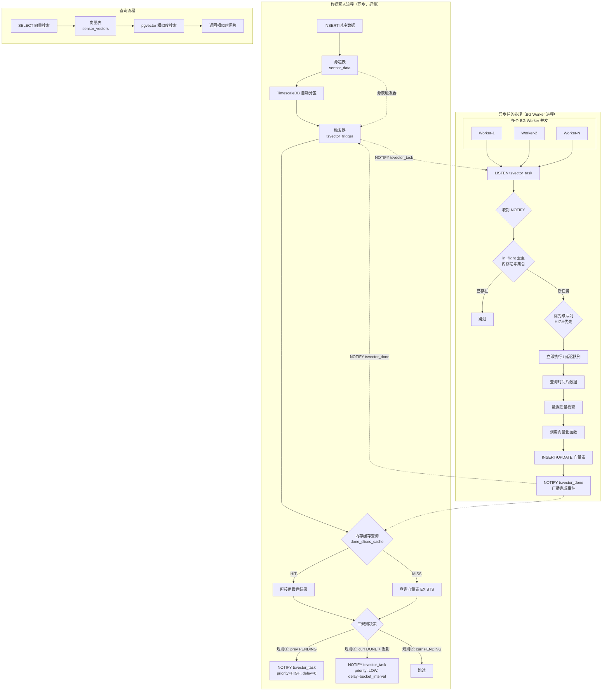
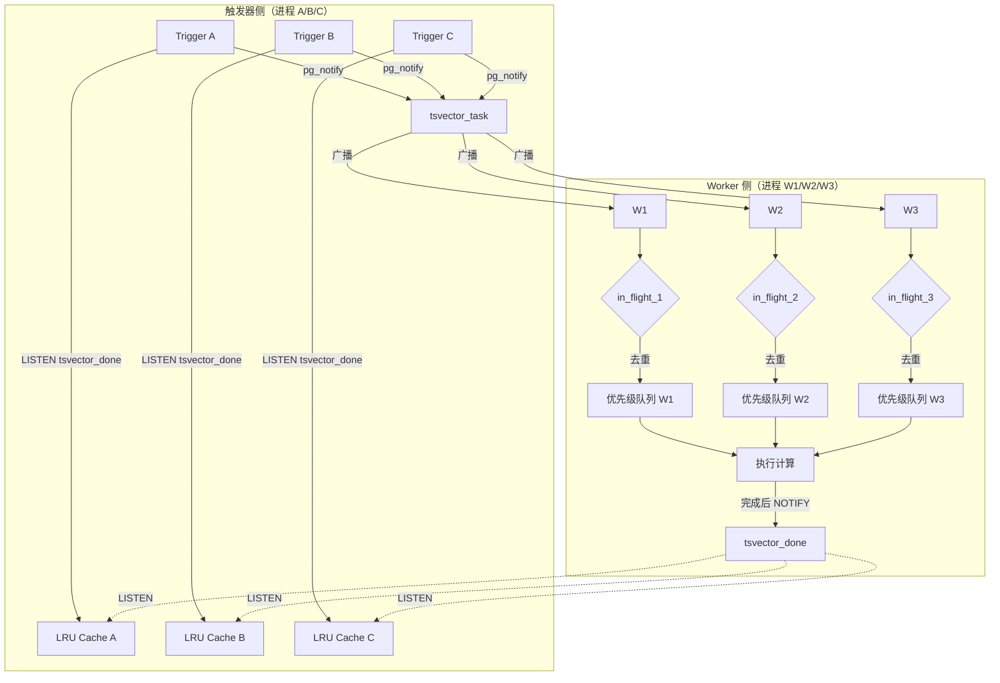
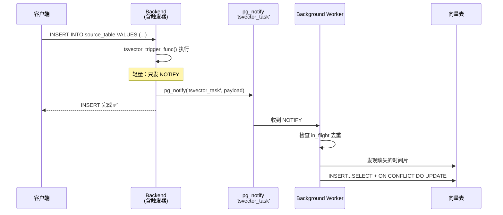
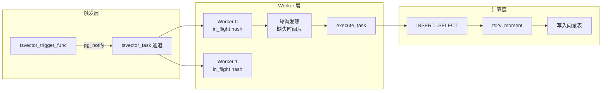
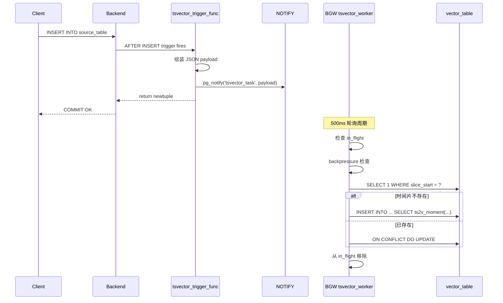

# 时序向量表（Timeseries Vector Table）设计文档

## 1. 概述

### 1.1 功能简介

时序向量表功能用于在 TimescaleDB 超表（hypertable）基础上，自动按固定时间间隔（时间片）对时序数据进行向量化计算，并将向量结果连同时间片信息和相关属性存储到新的向量表中。

该功能结合了 TimescaleDB 的时序数据管理能力和 pgvector 的向量相似度搜索能力，适用于时序数据的异常检测、模式识别、相似度搜索等 AI 应用场景。

### 1.2 设计目标

- 基于现有超表自动创建向量表，无需手动维护
- 支持按固定时间间隔（time bucket）自动切分时序数据
- **数据驱动触发**：新数据 INSERT 时异步触发向量计算任务，不再依赖定时扫描
- 向量表记录时间片元数据（开始时间、结束时间）和源表属性列
- 计算任务与时序数据插入**完全异步解耦**，不影响写入性能
- 支持向量相似度查询，快速检索相似的时间片段

### 1.3 典型应用场景

- **工业 IoT 异常检测**：将传感器时序数据按分钟/小时分片向量化，通过向量相似度搜索找到异常时间段
- **金融行情模式识别**：将股票行情按时间窗口向量化，识别相似走势模式
- **系统监控告警**：将服务器指标按时间片向量化，通过相似度匹配历史故障模式
- **能耗分析**：将能耗数据按小时向量化，比较不同时间段的用能模式

### 1.4 术语定义

| 术语 | 说明 |
|------|------|
| 源表（Source Table） | 原始的 TimescaleDB 超表，存储时序数据 |
| 向量表（Vector Table） | 新创建的表，存储时间片的向量数据和元信息 |
| 时间片（Time Slice） | 固定时间间隔的数据窗口，如 1 小时、1 天 |
| 向量化函数 | 将时序数据转换为向量的函数，如 `ts2v_moment`、`ft_transformer_embedding` |

## 2. 语法设计

### 2.1 创建时序向量表

创建向量表**不再引入自定义 DDL 语法**，而是复用 PostgreSQL 标准的 `CREATE TABLE ... WITH (...)` 语法。当 `WITH` 子句中指定了 `timeseries.source` 时，内核在建表前**自动注入**所有系统必需列（`slice_start`、`slice_end`、携带列、向量列、质量元数据列等），用户**只需声明额外的自定义列**（也可以不声明任何列）。

```sql
CREATE TABLE vector_table_name (
    <自定义列...>                             -- 可选：用户自定义列，可省略
) WITH (
    timeseries.source = 'source_table_name',  -- 必需：关联原始时序表（触发自动注入）
    timeseries.bucket_interval = 3600,      -- 必需：时间片间隔（秒）
    timeseries.vector_len = 384,             -- 向量维度（默认 384）
    timeseries.vectorize_function = 'fn',     -- 向量化函数（默认 ts2v_moment）
    timeseries.vector_column = 'col',         -- 向量列名（默认 embedding）
    timeseries.carry_columns = 'c1,c2,...',   -- 携带列名（逗号分隔，类型从源表自动推断）
    timeseries.enabled = true,                -- 是否启用触发器与异步计算
    timeseries.recompute_on_late_data = true  -- 迟到数据是否触发重算（默认 true）
    /* 其余数据质量参数见 4.3 节 */
);
```

#### 自动注入的列

当 `timeseries.source` 存在于 `WITH` 子句时，内核在 `DefineRelation()` 执行前自动向 `tableElts` 注入以下列（若用户已手动声明同名列则跳以免重复）：

| 列名 | 类型 | 来源 | 说明 |
|------|------|------|------|
| `slice_start` | TIMESTAMPTZ NOT NULL | 固定 | 时间片开始时间（主键之一） |
| `slice_end` | TIMESTAMPTZ NOT NULL | 固定 | 时间片结束时间 |
| `{carry_columns}` | 源表对应类型 NOT NULL | 从源表 `pg_attribute` 推断 | 携带列，用于 GROUP BY 与主键 |
| `{vector_column}` | vector(vector_len) | 由 `timeseries.vector_len` 决定维度 | 向量数据列（列名默认 `embedding`） |
| `_processed` | BOOLEAN DEFAULT true | 固定 | 处理状态 |
| `_data_watermark` | TIMESTAMPTZ | 固定 | 迟到数据水位线 |
| `_coverage` | FLOAT | 固定 | 覆盖率 |
| `_row_count` | INT | 固定 | 采样点数 |
| `_gap_count` | INT | 固定 | 间隙数 |
| `_created_at` | TIMESTAMPTZ DEFAULT now() | 固定 | 记录创建时间 |
| PRIMARY KEY | — | `(slice_start, {carry_columns})` 自动生成 | 保证幂等性 |

注入完成后，内核还自动创建 HNSW 向量索引：`CREATE INDEX ... USING hnsw ({vector_column} vector_cosine_ops)`。

#### 用户只需关注的列

| 列类型 | 说明 |
|------|------|
| 自定义列 | 用户在 `CREATE TABLE` 中显式声明的额外列，后台任务不写入，其值由用户自行维护 |

> 即使用户不声明任何列（`CREATE TABLE foo () WITH (...)`），系统也会自动注入上述全部必需列，建出一张完整的向量表。

#### 表选项（reloptions）说明

下表列出与源表关联和向量化相关的表选项，全部保存在表的 reloptions 中。

| 选项 | 类型 | 必需 | 默认值 | 说明 |
|------|------|------|--------|------|
| `timeseries.source` | text | ✅ | — | 关联的原始时序表（源表）名称。存在即触发系统列自动注入 |
| `timeseries.bucket_interval` | int | ✅ | — | 时间片间隔（秒），如 `3600`（1 小时） |
| `timeseries.vector_len` | int | — | `384` | 向量维度，决定向量列 `vector(N)` 的 N |
| `timeseries.vectorize_function` | text | — | `ts2v_moment` | 向量化函数名 |
| `timeseries.vector_column` | text | — | `embedding` | 向量列名 |
| `timeseries.carry_columns` | text | — | 空 | 携带列名（逗号分隔），类型从源表自动推断 |
| `timeseries.enabled` | bool | — | `true` | 是否启用源表触发器与异步计算 |
| `timeseries.recompute_on_late_data` | bool | — | `true` | 迟到数据写入已计算的时间片时，是否触发延迟重算（规则③） |
| `timeseries.min_coverage` | float | — | `0.5` | 覆盖率阈值 |
| `timeseries.max_gap` | int | — | NULL | 最大数据间隙（秒） |

> `timeseries.source` 与 `timeseries.bucket_interval` 为必需项，其余选项均带默认值。结构性与可调参数统一保存在 reloptions 中，均可通过 `ALTER TABLE ... SET/RESET` 维护（见 2.4 节）。

### 2.2 语法示例

```sql
-- 基本示例：只写 WITH 子句，系统列全部自动注入
CREATE TABLE sensor_vectors () WITH (
    timeseries.source = 'sensor_data',
    timeseries.bucket_interval = 3600,
    timeseries.carry_columns = 'sensor_id,location',
    timeseries.vector_len = 384
);
-- 系统自动注入：slice_start, slice_end, sensor_id(TEXT), location(TEXT),
--               embedding vector(384), _processed, _data_watermark, _coverage,
--               _row_count, _gap_count, _created_at, PRIMARY KEY(slice_start, sensor_id, location)
-- 系统自动创建：HNSW 索引 on embedding
-- 系统自动为源表注册触发器：tsvector_trigger

-- 携带自定义列：用户只声明额外需要的列
CREATE TABLE sensor_vectors_ext (
    anomaly_score FLOAT,          -- 自定义列（后台任务不写入）
    notes         TEXT            -- 自定义列
) WITH (
    timeseries.source = 'sensor_data',
    timeseries.bucket_interval = 1800,
    timeseries.carry_columns = 'sensor_id',
    timeseries.vector_len = 128
);
-- 系统自动注入：slice_start, slice_end, sensor_id(TEXT), embedding vector(128),
--               _processed, _data_watermark, _coverage, _row_count, _gap_count,
--               _created_at, PRIMARY KEY(slice_start, sensor_id)
-- 系统自动创建：HNSW 索引 on embedding
-- 用户自定义列 anomaly_score、notes 保留在表中，由用户自行维护
```

### 2.3 删除时序向量表

向量表就是普通表，直接使用标准 `DROP TABLE` 即可，无需专用语法：

```sql
DROP TABLE vector_table_name;
```

删除时系统自动执行以下清理：
1. 从源表上移除 `tsvector_trigger` 触发器（若无其他向量表关联该源表）
2. 触发器函数保留（因其他向量表可能仍在使用）

### 2.4 管理触发与计算

向量表的所有配置（含可调参数与结构性配置）都保存在表的 reloptions 中，因此直接使用 PostgreSQL 标准的 `ALTER TABLE ... SET/RESET` 语法即可管理，无需额外的管理函数。

```sql
-- 查看所有时序向量表配置
SELECT * FROM timeseries_vector_info;

-- 手动触发一次向量计算（处理所有未计算的时间片）
SELECT timeseries_vector_run('vector_table_name');

-- 停用 / 启用触发器与异步计算
ALTER TABLE vector_table_name SET (timeseries.enabled = false);
ALTER TABLE vector_table_name SET (timeseries.enabled = true);

-- 关闭迟到数据重算（规则③）
ALTER TABLE vector_table_name SET (timeseries.recompute_on_late_data = false);

-- 恢复为默认值
ALTER TABLE vector_table_name RESET (timeseries.recompute_on_late_data);

-- 关联到新的源表 / 调整时间片间隔（结构性配置同样通过 reloptions 修改）
ALTER TABLE vector_table_name SET (timeseries.source = 'new_source_table');
ALTER TABLE vector_table_name SET (timeseries.bucket_interval = 1800);
```

说明：

- 表选项（reloptions）是 PostgreSQL 表自带的存储机制，`ALTER TABLE ... SET/RESET` 由内核自动处理，无需自定义语法解析。
- 触发器函数每次触发时动态读取 reloptions，因此修改后无需重建触发器。
- 所有配置统一保存在 reloptions 中，不再维护独立的元数据表（见 3.3 节）。

## 3. 架构设计

### 3.1 系统架构图



#### 核心状态与去重机制

```
时间片三态模型：
┌─────────────────────────────────────────────────────────────┐
│  PENDING     │  向量表不存在 + Worker in_flight 不存在       │
│  IN_FLIGHT   │  Worker in_flight 存在（已下发，计算中/等待） │
│  DONE        │  向量表存在（已计算完成）                     │
└─────────────────────────────────────────────────────────────┘

去重三层防线：
  Layer 1: 触发器内存缓存（LRU）→ 避免不必要的 DB 查询
  Layer 2: Worker in_flight 集合 → 避免重复下发的 NOTIFY 被执行
  Layer 3: 向量表主键 + ON CONFLICT → 最终兜底
```

#### 触发时机决策流程

```
新数据 INSERT (time = T_new)
    │
    ├─ 计算时间片
    │   curr_slice = time_bucket(bucket_interval, T_new)
    │   prev_slice  = curr_slice - bucket_interval
    │
    ├─ ① 判断 prev_slice 状态（规则①）
    │   ├── cache_hit? → prev_done = cache[prev_slice]
    │   └── cache_miss → prev_done = EXISTS(向量表查 prev_slice)
    │                     结果写入 cache
    │
    │   IF NOT prev_done THEN
    │       pg_notify('tsvector_task', {..., priority: HIGH, delay: 0})
    │       → Worker in_flight 去重：若已在集合则跳过
    │
    ├─ ② 判断 curr_slice 状态（规则②③）
    │   ├── cache_hit? → curr_done = cache[curr_slice]
    │   └── cache_miss → curr_done = EXISTS(向量表查 curr_slice)
    │                     结果写入 cache
    │
    │   IF curr_done AND recompute_on_late_data THEN
    │       pg_notify('tsvector_task', {..., priority: LOW, delay: bucket_interval})
    │       → Worker in_flight 去重：若已在集合则跳过
    │
    │   IF NOT curr_done THEN
    │       跳过（规则②，等后续数据触发 ①）
    │
    └─ 返回，不阻塞 INSERT 事务
```

### 3.2 核心组件

#### 3.2.1 向量表结构

向量表由用户通过标准 `CREATE TABLE ... WITH (timeseries.source = ...)` 创建。当 `timeseries.source` 存在时，内核自动注入以下列（用户无需手动声明），用户声明的自定义列会追加在系统列之后：

| 列名 | 类型 | 注入方式 | 说明 |
|------|------|---------|------|
| `slice_start` | TIMESTAMPTZ NOT NULL | 自动注入 | 时间片开始时间（主键之一） |
| `slice_end` | TIMESTAMPTZ NOT NULL | 自动注入 | 时间片结束时间 |
| `{carry_columns}` | 源表对应类型 NOT NULL | 自动注入（类型从源表推断） | 携带列，用于 GROUP BY 与主键 |
| `{vector_column}` | vector(vector_len) | 自动注入 | 向量数据列（列名默认 `embedding`，维度由 `timeseries.vector_len` 决定） |
| `_processed` | BOOLEAN DEFAULT true | 自动注入 | 处理状态 |
| `_data_watermark` | TIMESTAMPTZ | 自动注入 | 迟到数据水位线 |
| `_coverage` | FLOAT | 自动注入 | 覆盖率 = 实际采样点 / 期望采样点（0~1） |
| `_row_count` | INT | 自动注入 | 本时间片实际采样点数 |
| `_gap_count` | INT | 自动注入 | 检测到的数据间隙数量 |
| `_created_at` | TIMESTAMPTZ DEFAULT now() | 自动注入 | 记录创建时间 |
| PRIMARY KEY | — | 自动注入 | `(slice_start, {carry_columns})` |
| HNSW 索引 | — | 自动创建 | `ON {vector_column} USING hnsw (... vector_cosine_ops)` |
| `{用户自定义列}` | 任意 | 用户声明 | 用户在 `CREATE TABLE` 中显式声明的列，后台任务不写入 |

> 系统列若与用户声明的列同名则跳过注入（以免重复），用户可在 `CREATE TABLE` 中覆盖系统列定义（如改默认值或加约束）。

#### 3.2.2 时间片数据质量处理

触发机制本身已经保证了时间片的"数据完整性"语义：规则①只在上一时间片之后有新数据到来时才触发计算，这意味着上一时间片的数据已经完整结束。但仍需处理以下数据质量问题：

##### 1. 迟到数据与重算

迟到数据指某段数据在其所属时间片结束后才写入源表。处理策略：

1. **重算触发（规则③）**：当新数据写入一个已计算过的时间片时，触发器会下发一个延迟 `bucket_interval` 时间的重算任务，等待更多迟到数据到达后再统一重算。
2. **重算开关（`recompute_on_late_data`）**：默认开启。关闭后，迟到数据不会触发重算，向量数据以首算时为准。
3. **原子重算**：重算使用 `INSERT ON CONFLICT UPDATE` 或 `DELETE + INSERT`，保证向量表中的数据与源表一致。

##### 2. 数据缺失（采集失败）

数据缺失指某个时间片内预期的采样点没有全部到达（如传感器离线、丢包）。处理策略：

1. **覆盖率阈值（`min_coverage`）**：`实际采样点数 / 期望采样点数`，低于阈值的时间片不计算向量，避免产生误导性向量。
2. **最大间隙检测（`max_gap`）**：时间片内相邻采样点的时间间隔若超过阈值，判定中间存在缺失段。
3. **质量元数据**：在向量表中记录质量元数据列，供查询时过滤低质量向量（见 3.2.1）。

期望采样点数由 `bucket_interval` 和源表的实际采样频率推断（可通过源表同 carry_columns 组合的平均采样间隔估算）。

##### 3. 计算时的数据完整性判定

BG Worker 执行计算时，对每个被触发的时间片执行以下检查：

```
1. 统计该时间片内的行数、覆盖率、间隙数
2. 若 coverage < min_coverage 或存在超限间隙 → 跳过计算，记录日志
   （下一条新数据到来时会再次触发规则①，重新尝试计算）
3. 若数据质量合格 → 调用向量化函数，写入向量表
```

#### 3.2.3 向量化函数接口

向量化函数接收一个时间片内的所有时序数据，返回一个向量。函数签名约定：

```sql
-- 向量化函数模板
CREATE FUNCTION ts2v_moment(
    data_rows REFCURSOR,  -- 或使用 SET RETURNING 函数
    vector_len INT DEFAULT 384
) RETURNS vector;
```

实际实现中，向量化函数在后台任务内部通过 SPI 执行，接收时间片内的聚合数据作为输入。

#### 3.2.4 触发机制与异步任务队列

本设计**不再使用定时扫描**，而是采用**数据驱动的触发机制**，在源表 INSERT 时通过触发器下发异步计算任务。

##### 触发入口：源表触发器（含内存缓存）

在创建时序向量表时，系统自动为源表注册一个 AFTER INSERT 触发器 `tsvector_trigger`。触发器维护一个进程内的 **LRU 缓存** `done_slices_cache`，记录已计算完成的时间片，避免每次 INSERT 都查询向量表。

```c
/*
 * tsvector_trigger_func - 源表 AFTER INSERT 触发器函数
 *
 * 关键特性：
 * 1. 内存缓存优先（LRU 512条目），cache miss 才查 DB
 * 2. LISTEN tsvector_done 通道，Worker 完成任务后广播更新缓存
 * 3. 三规则决策 + pg_notify 异步下发
 */
Datum
tsvector_trigger_func(PG_FUNCTION_ARGS)
{
    /* 初始化：首次调用时 LISTEN tsvector_done + 分配 LRU 缓存 */
    if (tvec_trigger_cache == NULL)
    {
        tvec_trigger_cache = lru_create(512);  /* 每个后端进程 512 条 */
        SPI_connect();
        SPI_execute("LISTEN tsvector_done", false, 0);
        SPI_finish();
    }
    
    /* 处理 Worker 广播的完成事件，更新本地缓存 */
    PopActiveNotifications();
    
    /* ... 获取触发器上下文、计算时间片 ... */
    
    /* 规则①：上一时间片状态判断 —— 内存缓存优先 */
    prev_done = lru_get(tvec_trigger_cache, prev_slice_key);
    if (prev_done == -1)  /* cache miss */
    {
        prev_done = check_slice_done_from_db(...);  /* EXISTS 查询 */
        lru_put(tvec_trigger_cache, prev_slice_key, prev_done);
    }
    if (!prev_done)
    {
        pg_notify('tsvector_task', build_task_payload(HIGH, 0, ...));
        /* 注：不写入 prev_slice → in_flight 状态由 Worker 维护 */
    }
    
    /* 规则②③：当前时间片状态判断 —— 同理 */
    curr_done = lru_get(tvec_trigger_cache, curr_slice_key);
    if (curr_done == -1)
    {
        curr_done = check_slice_done_from_db(...);
        lru_put(tvec_trigger_cache, curr_slice_key, curr_done);
    }
    if (curr_done && recompute_on_late_data)
    {
        pg_notify('tsvector_task', build_task_payload(LOW, bucket_interval, ...));
    }
    
    PG_RETURN_POINTER(NULL);
}
```

> **触发器性能分析**：热路径（缓存命中）仅需 LRU 查找（O(1) 哈希），零 DB 查询；冷路径（缓存未命中）执行 1~2 次 EXISTS 查询 + 最多 2 次 pg_notify。Worker 完成广播后，所有触发器的缓存自动更新，后续 INSERT 直接命中缓存。

##### 异步任务执行：多 BG Worker 并发 + 去重 + 优先级

多个 Background Worker 进程（数量由 `timeseries.workers` 配置）独立运行，各自 LISTEN 同一个 `tsvector_task` 通道。



###### Worker 内部数据结构

```c
/* 任务唯一标识：用于 in_flight 去重 */
typedef struct TaskKey {
    Oid         vector_table_oid;
    TimestampTz slice_start;
    uint32      carry_columns_hash;  /* carry_columns 值的哈希 */
} TaskKey;

/* Worker 内存结构 */
typedef struct WorkerState {
    HTAB       *in_flight;           /* 哈希表：TaskKey → 任务信息，用于去重 */
    List       *priority_queue_high; /* HIGH 优先级立即执行队列 */
    List       *priority_queue_low;  /* LOW 优先级立即执行队列 */
    HeapTuple   delay_heap;          /* 延迟执行最小堆（按执行时间排序） */
    int         max_in_flight;       /* 最大并发 in_flight 数（背压阈值） */
    bool        backpressure_active; /* 当前是否处于背压状态 */
} WorkerState;
```

###### Worker 主循环

```c
Datum
tsvector_worker_main(void)
{
    WorkerState state = {0};
    
    BackgroundWorkerInitializeConnection("postgres", NULL);
    SPI_connect();
    SPI_execute("LISTEN tsvector_task", false, 0);
    SPI_execute("LISTEN tsvector_backpressure", false, 0);
    SPI_finish();
    
    while (true)
    {
        /* 等待 NOTIFY 或延迟队列到期 */
        WaitForLatch(worker_latch, GetNextWakeupTime(&state));
        
        /* 处理 tsvector_task 消息 */
        PopActiveNotifications();
        foreach (n, Notifications())
        {
            if (strcmp(n->channel, "tsvector_task") == 0)
                handle_task_notify(&state, n->extra);
            else if (strcmp(n->channel, "tsvector_backpressure") == 0)
                handle_backpressure_notify(&state, n->extra);
        }
        
        /* 背压：暂停接收新任务 */
        if (state.backpressure_active)
            continue;
        
        /* 1. 优先级队列：先处理 HIGH，再处理 LOW */
        while (state.priority_queue_high != NIL)
        {
            execute_next(&state, state.priority_queue_high);
            state.priority_queue_high = list_delete_first(state.priority_queue_high);
        }
        while (state.priority_queue_low != NIL)
        {
            execute_next(&state, state.priority_queue_low);
            state.priority_queue_low = list_delete_first(state.priority_queue_low);
        }
        
        /* 2. 延迟队列：到期任务移入优先级队列 */
        while (delay_heap_top_due(&state.delay_heap))
        {
            TaskSpec *task = delay_heap_pop(&state.delay_heap);
            enqueue_by_priority(&state, task);
        }
    }
}
```

###### 去重逻辑

```c
void
handle_task_notify(WorkerState *state, const char *payload)
{
    TaskSpec *task = parse_notify_payload(payload);
    TaskKey   key  = task_to_key(task);
    
    /* Layer 2 去重：检查 in_flight 集合 */
    if (hash_search(state->in_flight, &key, HASH_FIND, NULL) != NULL)
    {
        elog(DEBUG1, "tsvector: task (%s, %s) already in-flight, skipping",
             task->vector_table, timestamptz_to_string(task->slice_start));
        pfree(task);
        return;
    }
    
    /* 背压检查：in_flight 达到上限时暂不接收新任务 */
    if (hash_get_num_entries(state->in_flight) >= state->max_in_flight)
    {
        elog(LOG, "tsvector: worker backpressure active, dropping task");
        pfree(task);
        return;
    }
    
    /* 加入 in_flight + 对应队列 */
    hash_insert(state->in_flight, &key);
    enqueue_by_priority(state, task);
}

/* 任务完成后从 in_flight 移除 + 广播完成事件 */
void
on_task_done(WorkerState *state, TaskSpec *task, bool success)
{
    TaskKey key = task_to_key(task);
    hash_search(state->in_flight, &key, HASH_REMOVE, NULL);
    
    if (success)
    {
        /* 广播完成事件：触发器 LISTEN 后更新自己的 LRU 缓存 */
        SPI_connect();
        SPI_execute_with_args(
            "SELECT pg_notify('tsvector_done', $1)",
            1, (Oid[]){TEXTOID},
            PointerGetDatum(cstring_to_stringify_done(task)),
            false, 0);
        SPI_finish();
    }
    
    pfree(task);
}
```

##### 延迟队列实现

Worker 内部维护一个基于执行时间排序的最小堆（min-heap），存储在内存中：

```
延迟队列结构（最小堆）：
┌───────────────────────────────────────────────────────────────┐
│  执行时间          │  任务类型 │  任务信息                      │
├───────────────────────────────────────────────────────────────┤
│  2026-09-11 10:30  │  LOW     │  sensor_vectors + 08:00 + S001  │
│  2026-09-11 11:00  │  LOW     │  sensor_vectors + 09:00 + S001  │
│  ...              │  ...     │  ...                          │
└───────────────────────────────────────────────────────────────┘

堆操作：
- 插入：O(log n)
- 查看堆顶：O(1)
- 弹出到期任务：O(log n)
```

##### 优先级与背压

```
优先级规则：
┌──────────────────────────────────────────────────┐
│  HIGH  队列  ← 规则①（立即计算，上一时间片）    │
│  LOW   队列  ← 规则③（延迟重算，迟到数据）       │
└──────────────────────────────────────────────────┘

背压机制：
┌──────────────────────────────────────────────────┐
│  触发条件：in_flight 数量 >= max_in_flight       │
│  行为：丢弃新收到的 NOTIFY + 广播 tsvector_backpressure │
│  解除条件：in_flight 数量降回 < 80% * max_in_flight │
│  恢复：重新正常接收任务                          │
└──────────────────────────────────────────────────┘
```

##### 任务去重三层防线总结

| 防线 | 位置 | 机制 | 覆盖场景 |
|------|------|------|---------|
| **Layer 1** | 触发器（每个后端进程） | LRU 缓存 + tsvector_done NOTIFY | 避免重复查 DB；Worker 完成后自动更新缓存 |
| **Layer 2** | Worker（每个 Worker 进程） | in_flight 哈希集合 | 多个 Worker 收到同一条 NOTIFY 时，只有一个执行 |
| **Layer 3** | 向量表 | 主键 + ON CONFLICT DO NOTHING | 最终兜底，即使前两层都漏了也不重复写入 |

### 3.3 元数据管理

#### 3.3.1 配置存储

向量表**不再维护独立的元数据表**。所有配置（源表关联、时间片间隔、向量化函数、携带列，以及可调参数）统一保存在向量表自身的 reloptions 中，即在 `pg_class.reloptions` 中以 `timeseries.*` 前缀的键值存储。

- **识别依据**：`pg_class.reloptions` 中存在 `timeseries.source` 选项的普通表即视为时序向量表。
- **动态读取**：后台任务通过内核函数（`get_reloptions` / 解析 reloptions 数组）读取配置，因此任何 `ALTER TABLE ... SET/RESET` 均立即生效，无需重建任务。
- **统一存储**：结构性配置（`timeseries.source`、`timeseries.bucket_interval`、`timeseries.vectorize_function`、`timeseries.vector_column`、`timeseries.carry_columns`）与可调参数（`timeseries.enabled`、`timeseries.recompute_on_late_data`、`timeseries.min_coverage` 等）不再拆分。

为使 `CREATE TABLE ... WITH (...)` 与 `ALTER TABLE ... SET/RESET` 能解析这些键，采用 **reloption 命名空间（namespace）** 机制，而非逐个注册 reloption。具体做法：

1. 在 `src/include/access/reloptions.h` 的 `HEAP_RELOPT_NAMESPACES` 中加入 `"timeseries"`：
   ```c
   #define HEAP_RELOPT_NAMESPACES { "toast", "timeseries", NULL }
   ```
   这样 parser 在解析 `WITH (timeseries.source = '...')` 时，会将 `timeseries` 识别为合法命名空间，`DefElem->defnamespace = "timeseries"`、`DefElem->defname = "source"`。

2. 由于 `transformRelOptions(..., NULL, ...)` 仅处理空命名空间选项，且 `heap_reloptions` 不识别 `timeseries.*` 键，内核在 `DefineRelation()` 与 `ATExecSetRelOptions()` 中对 `timeseries.*` 选项做**旁路处理**：
   - 验证阶段：过滤掉 `timeseries.*` 条目后再交给 `heap_reloptions` 校验；
   - 存储阶段：手动将 `timeseries.*` 选项以 `timeseries.<name>=<value>` 格式拼入 `pg_class.reloptions` 文本数组（保留命名空间前缀，便于 `timeseries_vector_run` 通过 `regexp_match` 定位）。

> 这种方式无需为每个 `timeseries.*` 键调用 `add_*_reloption`，新增选项时也不必改 reloptions.c，只需在 `tsvectorcmds.c` 的 `tsrelopt_get_string` / `tsrelopt_get_int` 中读取即可。

#### 3.3.2 信息视图

后台任务与信息视图通过解析 `pg_class.reloptions` 识别并展示向量表配置：

```sql
CREATE VIEW timeseries_vector_info AS
SELECT
    c.oid::regclass::text AS vector_table_name,
    reloptions_text(c.reloptions, 'timeseries.source') AS source_table_name,
    reloptions_int(c.reloptions, 'timeseries.bucket_interval') AS bucket_interval,
    reloptions_text(c.reloptions, 'timeseries.vectorize_function') AS vectorize_function,
    reloptions_text(c.reloptions, 'timeseries.vector_column') AS vector_column,
    reloptions_text(c.reloptions, 'timeseries.carry_columns') AS carry_columns,
    reloptions_bool(c.reloptions, 'timeseries.enabled') AS enabled,
    reloptions_bool(c.reloptions, 'timeseries.recompute_on_late_data') AS recompute_on_late_data,
    reloptions_float(c.reloptions, 'timeseries.min_coverage') AS min_coverage
FROM pg_class c
WHERE reloptions_text(c.reloptions, 'timeseries.source') IS NOT NULL;
```

> `reloptions_text` / `reloptions_bool` 为示意函数，实际实现中从 `c.reloptions`（`text[]`）解析对应的 `timeseries.*` 键值。

## 4. 数据模型设计

### 4.1 源表示例

```sql
-- 源表：传感器时序数据
CREATE TABLE sensor_data (
    time        TIMESTAMPTZ NOT NULL,
    sensor_id   TEXT NOT NULL,
    location    TEXT NOT NULL,
    temperature DOUBLE PRECISION,
    humidity    DOUBLE PRECISION,
    pressure    DOUBLE PRECISION
);

SELECT create_hypertable('sensor_data', 'time');
```

### 4.2 向量表结构

用户只需写 `WITH` 子句和自定义列，系统列由内核自动注入：

```sql
-- 用户只声明自定义列（也可以不声明任何列）
CREATE TABLE sensor_vectors (
    anomaly_score FLOAT               -- 自定义列（可选，后台任务不写入）
) WITH (
    timeseries.source = 'sensor_data',
    timeseries.bucket_interval = 3600,
    timeseries.carry_columns = 'sensor_id,location',
    timeseries.vector_len = 384
);

-- 内核自动注入后的等效表结构：
-- CREATE TABLE sensor_vectors (
--     slice_start   TIMESTAMPTZ NOT NULL,
--     slice_end     TIMESTAMPTZ NOT NULL,
--     sensor_id     TEXT NOT NULL,         -- 类型从 sensor_data.sensor_id 推断
--     location      TEXT NOT NULL,         -- 类型从 sensor_data.location 推断
--     embedding     vector(384),
--     _processed    BOOLEAN DEFAULT true,
--     _data_watermark TIMESTAMPTZ,
--     _coverage     FLOAT,
--     _row_count    INT,
--     _gap_count    INT,
--     _created_at   TIMESTAMPTZ DEFAULT now(),
--     anomaly_score FLOAT,                  -- 用户自定义列
--     PRIMARY KEY (slice_start, sensor_id, location)
-- );
-- CREATE INDEX ... ON sensor_vectors USING hnsw (embedding vector_cosine_ops);
```

### 4.3 WITH 选项

下表中的选项均通过 `CREATE TABLE ... WITH (...)` 设置，并保存在表的 reloptions 中，可后续用 `ALTER TABLE ... SET/RESET` 修改。向量维度由 `timeseries.vector_len` 决定（默认 384），系统据此自动创建 `vector(N)` 类型的列。

| 选项 | 类型 | 默认值 | 说明 |
|------|------|--------|------|
| `timeseries.source` | text | —（必需） | 关联的原始时序表名称。存在即触发系统列自动注入 |
| `timeseries.bucket_interval` | int | —（必需） | 时间片间隔（秒），如 `3600`（1 小时） |
| `timeseries.vector_len` | int | 384 | 向量维度，决定自动注入的向量列类型 `vector(N)` |
| `timeseries.vectorize_function` | text | ts2v_moment | 向量化函数名 |
| `timeseries.vector_column` | text | embedding | 向量列名 |
| `timeseries.carry_columns` | text | 空 | 携带列名（逗号分隔），类型从源表自动推断 |
| `timeseries.enabled` | bool | true | 是否启用源表触发器与异步计算 |
| `timeseries.recompute_on_late_data` | bool | true | 迟到数据触发延迟重算（规则③） |
| `timeseries.min_coverage` | float | 0.5 | 覆盖率阈值，低于此值不计算向量 |
| `timeseries.max_gap` | int | NULL | 最大数据间隙（秒），超过则判定数据不连续（NULL 表示不检测） |

> 向量索引（HNSW）由系统在建表后自动创建，无需用户手动执行。与旧版定时扫描方案相关的 `scan_interval`、`completion_delay`、`completion_timeout`、`strict`、`sample_interval` 等选项已移除。

性能管理选项（全局 postgresql.conf 级别，不是 per-table reloptions）：

| 选项 | 类型 | 默认值 | 说明 |
|------|------|--------|------|
| `timeseries.workers` | int | `1` | BG Worker 进程数量，多进程并行处理任务 |
| `timeseries.max_in_flight` | int | `64` | 每个 Worker 的最大 in_flight 任务数（背压阈值） |
| `timeseries.trigger_cache_size` | int | `512` | 触发器 LRU 缓存条目数（每个后端进程） |

> 性能选项通过 `postgresql.conf` 设置，`pg_reload_conf()` 动态生效。`timeseries.workers` 需重启 PostgreSQL 生效。

## 5. 触发机制与异步计算设计

### 5.1 总体架构

数据驱动的触发机制由两个核心组件构成：**源表触发器**（同步，轻量）和 **Background Worker**（异步，执行计算）。

```
INSERT source_table
    │
    ▼
[AFTER INSERT TRIGGER]  tsvector_trigger
    │
    ├── 解析行数据的时间片
    ├── 查询向量表判断状态
    ├── pg_notify('tsvector_task', json_payload)  ← 异步通知
    └── 返回，不阻塞事务
    │
    ▼  (异步通道)
[BACKGROUND WORKER]  tsvector_worker
    │
    ├── LISTEN tsvector_task
    ├── 收到通知 → 解析 JSON
    ├── delay > 0 ? → 放入延迟队列 : 立即执行
    ├── 查询源表该时间片数据
    ├── 数据质量检查（覆盖率、间隙）
    ├── 调用向量化函数
    └── INSERT/UPDATE 向量表
```

### 5.2 触发决策流程（内存缓存优先）

触发器对每一行新插入数据执行以下决策逻辑。关键优化：**先查内存 LRU 缓存，cache miss 才查向量表**。

```
INPUT: NEW.time, NEW.carry_columns_values
       + vector_table 配置 (reloptions)
       + 触发器本地 LRU 缓存 (done_slices_cache)

① 计算时间片
   curr_slice := time_bucket(bucket_interval, NEW.time)
   prev_slice  := curr_slice - bucket_interval

② 检查上一时间片状态（规则①）—— 内存优先
   prev_done := lru_get(cache, prev_slice_key)
   IF prev_done == -1 THEN          /* cache miss */
       prev_done := EXISTS(         /* 查向量表 */
           SELECT 1 FROM vector_table
           WHERE slice_start = prev_slice
             AND carry_columns match NEW
       )
       lru_put(cache, prev_slice_key, prev_done)
   
   IF NOT prev_done THEN
       pg_notify('tsvector_task', {
           vector_table: vector_table_name,
           slice_start:  prev_slice,
           carry_columns: {col: NEW.col, ...},
           delay:        0,
           priority:     "HIGH"
       })
       → Worker in_flight 去重：若已在集合则跳过

③ 检查当前时间片状态（规则②③）—— 内存优先
   curr_done := lru_get(cache, curr_slice_key)
   IF curr_done == -1 THEN          /* cache miss */
       curr_done := EXISTS(
           SELECT 1 FROM vector_table
           WHERE slice_start = curr_slice
             AND carry_columns match NEW
       )
       lru_put(cache, curr_slice_key, curr_done)
   
   IF curr_done AND recompute_on_late_data THEN
       pg_notify('tsvector_task', {
           vector_table: vector_table_name,
           slice_start:  curr_slice,
           carry_columns: {col: NEW.col, ...},
           delay:        bucket_interval,
           priority:     "LOW"
       })
       → Worker in_flight 去重：若已在集合则跳过
   
   -- IF NOT curr_done → 跳过（规则②）
```

#### 触发决策示例

假设 `bucket_interval = 3600`（1 小时），carry_columns = `(sensor_id)`：

| 时间 | 新数据 time | curr_slice | prev_slice | 缓存状态 | prev_done | curr_done | 触发动作 |
|------|------------|------------|------------|---------|-----------|-----------|----------|
| 09:15 | 09:15 | 09:00 | 08:00 | 全 MISS | ❌ (DB查) | ❌ (DB查) | 规则①：NOTIFY 08:00 HIGH；规则②：跳过 |
| 09:30 | 09:30 | 09:00 | 08:00 | 全 HIT | ✅ (缓存) | ❌ (缓存) | 规则①：prev_done 已满足；规则②：跳过 |
| 10:05 | 10:05 | 10:00 | 09:00 | 09:00 MISS | ❌ (DB查) | ❌ (DB查) | 规则①：NOTIFY 09:00 HIGH |
| 10:30 | 08:45 | 08:00 | 07:00 | 08:00 HIT | ✅ (缓存) | ✅ (缓存) | 规则③：NOTIFY 08:00 **延迟**3600s LOW |
| 11:00 | 11:00 | 11:00 | 10:00 | 全 HIT | ✅ (缓存) | ❌ (缓存) | 规则①：prev_done 已满足；规则②：跳过 |

> **缓存命中率**：Worker 完成任务后通过 `tsvector_done` 通道广播，所有触发器进程 LISTEN 后更新缓存。因此正常运行时，后续 INSERT 的缓存命中率接近 100%，触发器几乎零 DB 查询。

### 5.3 异步任务消息格式

`pg_notify` 发送的 JSON 消息结构：

```json
{
    "vector_table": "sensor_vectors",
    "slice_start": "2026-09-11T09:00:00+00:00",
    "carry_columns": {
        "sensor_id": "S001",
        "location": "Room-A"
    },
    "delay": 0,
    "recompute": false,
    "bucket_interval": 3600,
    "source_table": "sensor_data",
    "vectorize_function": "ts2v_moment",
    "vector_column": "embedding",
    "min_coverage": 0.5,
    "max_gap": null
}
```

> 消息中包含计算所需的全部配置（从 reloptions 读取后内联），Worker 收到后无需再次查询 reloptions。

### 5.4 Background Worker 执行流程

```c
/*
 * tsvector_worker - Background Worker 主函数
 * PostgreSQL 启动时自动 fork，LISTEN tsvector_task
 */
Datum
tsvector_worker_main(void)
{
    /* 1. 建立与数据库的连接 */
    BackgroundWorkerInitializeConnection("postgres", NULL);
    
    /* 2. LISTEN */
    SPI_connect();
    SPI_execute("LISTEN tsvector_task", false, 0);
    
    while (true)
    {
        /* 3. 等待消息（带超时，用于检查延迟队列） */
        if (WaitForLatch(worker_latch, timeout=NextDelayTaskTime() - Now()))
        {
            /* 4. 收到 NOTIFY */
            PopActiveNotifications();
            foreach (notification, Notifications())
            {
                TaskSpec *task = parse_notify_payload(notification->extra);
                if (task->delay > 0)
                {
                    /* 放入延迟队列 */
                    delay_queue_push(task);
                }
                else
                {
                    /* 立即执行 */
                    execute_task(task);
                }
            }
        }
        
        /* 5. 检查延迟队列到期任务 */
        while (delay_queue_has_due_tasks())
        {
            TaskSpec *due = delay_queue_pop_due();
            execute_task(due);
        }
    }
}

/*
 * execute_task - 执行单个时间片的向量计算
 */
void
execute_task(TaskSpec *task)
{
    /* a. 重新计算 slice_end（保证与触发器逻辑一致） */
    task->slice_end = task->slice_start + task->bucket_interval;
    
    /* b. 查询该时间片内的时序数据 */
    char *query = build_slice_query(task);
    SPI_execute(query, true, 0);
    
    /* c. 数据质量检查 */
    if (!check_data_quality(task))
    {
        elog(LOG, "tsvector: slice %s skipped (coverage/gap check)", task->slice_start);
        return;
    }
    
    /* d. 调用向量化函数 */
    Datum vector_result = call_vectorize_function(task);
    
    /* e. 写入向量表 */
    if (task->recompute)
    {
        /* 重算：DELETE + INSERT 或 UPDATE */
        SPI_execute(build_recompute_insert(task, vector_result), false, 0);
    }
    else
    {
        /* 首次计算：INSERT ON CONFLICT DO NOTHING（幂等） */
        SPI_execute(build_insert(task, vector_result), false, 0);
    }
}
```

### 5.5 并发控制

- **触发器层**：每个后端进程独立维护 LRU 缓存和 LISTEN 状态；多个 INSERT 并发执行时，各自独立判断和下发
- **Worker 层**：
  - 多个 Worker 进程并发运行（`timeseries.workers` 配置），各自维护独立的 in_flight 集合
  - 同一条 NOTIFY 会被所有 Worker 收到，但只有第一个将任务加入 in_flight 的 Worker 会执行，其余 Worker 发现已在 in_flight 集合后跳过
  - 优先级队列保证 HIGH 任务先于 LOW 任务执行
- **向量表写入**：`ON CONFLICT DO NOTHING`（首次计算）或 `UPDATE`（重算），主键约束保证数据正确性
- **背压保护**：in_flight 达到 `max_in_flight` 时 Worker 丢弃新任务并广播背压状态，避免内存耗尽

### 5.6 容错与恢复

| 场景 | 处理方式 |
|------|---------|
| Worker 进程崩溃 | PostgreSQL 自动重启；内存中的 in_flight 集合和延迟队列丢失；规则①触发的任务会在下次新数据到来时重新下发；规则③的重算任务丢失后等新迟到数据重新触发 |
| 向量化函数执行失败 | Worker 从 in_flight 移除任务，记录日志；下一条新数据到来时会再次触发规则①重新下发 |
| 源表被删除 | 触发器函数在 `find_associated_vector_tables()` 中检测不到关联向量表后直接返回；DROP 向量表时自动移除触发器 |
| 向量表插入冲突 | 首次计算使用 `ON CONFLICT DO NOTHING`（幂等）；重算使用 `UPDATE` 覆盖 |
| LISTEN 消息丢失（Worker 未连接） | Worker 重连后 LISTEN 不会补收之前的消息；但规则①每次 INSERT 都会重新检查并下发，保证最终一致性 |
| 触发器缓存不一致 | 每个后端进程有独立 LRU 缓存；Worker 完成后广播 `tsvector_done`，所有触发器 LISTEN 后更新缓存；极端不一致时 cache miss 会 fallback 到 DB 查询 |
| 背压状态 | Worker in_flight 达到上限 → 丢弃新任务 + 广播 `tsvector_backpressure` → in_flight 降至 80% 以下时自动恢复 |
| 数据库重启 | BG Worker 随 PostgreSQL 自动启动并 LISTEN；所有内存状态（LRU 缓存、in_flight、延迟队列）丢失，需等新数据触发重新建立 |

### 5.6 可视化概览

> 以下时序图和架构图用于快速理解整体交互流程，与上方 5.1~5.5 详细设计一致。

**触发流程（简化版）**



**三规则决策逻辑**

| 规则 | 条件 | 动作 |
|------|------|------|
| ① 立即触发 | 上一时间片未完成 | HIGH 优先级 |
| ② 跳过 | 当前时间片未完成 | 什么都不做（等稳定） |
| ③ 延迟重算 | 当前时间片已完成 + 迟到数据 | bucket_interval 后 LOW 优先级 |

**异步执行架构**



**任务去重三层防护**

| 层级 | 位置 | 机制 |
|------|------|------|
| 第 1 层 | Trigger 后端 | LRU 缓存 |
| 第 2 层 | Worker 内存 | `in_flight` 哈希表 |
| 第 3 层 | 向量表主键 | `ON CONFLICT DO UPDATE` |

**完整时序图（含 backpressure）**




## 6. 使用示例

### 6.1 完整示例

```sql
-- 1. 创建源超表
CREATE TABLE sensor_data (
    time        TIMESTAMPTZ NOT NULL,
    sensor_id   TEXT NOT NULL,
    location    TEXT NOT NULL,
    temperature DOUBLE PRECISION,
    humidity    DOUBLE PRECISION,
    pressure    DOUBLE PRECISION
);

SELECT create_hypertable('sensor_data', 'time');

-- 2. 插入测试数据
INSERT INTO sensor_data VALUES
    ('2026-01-01 00:00:00+00', 'S001', 'Room-A', 22.5, 45.0, 1013.0),
    ('2026-01-01 00:30:00+00', 'S001', 'Room-A', 22.8, 45.5, 1013.2),
    ('2026-01-01 01:00:00+00', 'S001', 'Room-A', 23.0, 46.0, 1013.1),
    ('2026-01-01 01:30:00+00', 'S001', 'Room-A', 23.2, 46.2, 1013.0);

-- 3. 创建时序向量表（只需 WITH 子句，系统列自动注入）
CREATE TABLE sensor_vectors (
    anomaly_score FLOAT               -- 自定义列（可选）
) WITH (
    timeseries.source = 'sensor_data',
    timeseries.bucket_interval = 3600,
    timeseries.carry_columns = 'sensor_id,location',
    timeseries.vector_len = 384
);
-- 系统自动注入 slice_start, slice_end, sensor_id, location, embedding,
-- _processed, _data_watermark, _coverage, _row_count, _gap_count, _created_at
-- 系统自动创建 PRIMARY KEY 和 HNSW 索引
-- 系统自动为源表注册 tsvector_trigger 触发器

-- 4. 手动触发一次计算（可选，数据驱动会自动触发）
SELECT timeseries_vector_run('sensor_vectors');

-- 5. 查看结果
SELECT slice_start, slice_end, sensor_id, location,
       embedding::text
FROM sensor_vectors
ORDER BY slice_start;

-- 6. 向量相似度搜索：找最相似的时间片
SELECT slice_start, slice_end, sensor_id, location,
       embedding <=> target_embedding AS distance
FROM sensor_vectors
ORDER BY embedding <=> target_embedding
LIMIT 5;

-- 7. 查看任务状态
SELECT * FROM timeseries_vector_info;
```

### 6.2 删除示例

```sql
-- 删除时序向量表（直接使用标准 DROP TABLE）
DROP TABLE sensor_vectors;
```

## 7. 实现方案

### 7.1 实现层次

```
src/include/access/reloptions.h        # HEAP_RELOPT_NAMESPACES 增加 "timeseries"
src/backend/parser/parse_utilcmd.c     # transformCreateStmt() 开头调用 InjectTimeseriesColumns()
src/backend/commands/tablecmds.c       # DefineRelation()/ATExecSetRelOptions() 旁路存储 timeseries.* reloptions
src/backend/commands/tsvectorcmds.c    # 列注入核心实现（InjectTimeseriesColumns）、触发器自动注册/移除
src/include/commands/tsvectorcmds.h    # 头文件声明
contrib/tsvector_funcs/                # 向量化函数、触发器函数、Worker 入口
    ├── tsvector_funcs.c              # ts2v_moment、timeseries_vector_run、tsvector_trigger_func、tsvector_worker_main
    └── tsvector_funcs--1.0.sql       # CREATE FUNCTION 定义
```

> 由于不再引入自定义 DDL 语法，无需修改语法解析器（`gram.y` / `kwlist.h` / `parsenodes.h`），也无需新增命令标签。实现收敛为：
> 1) 在 `reloptions.h` 注册 `timeseries` 命名空间；
> 2) 在 `transformCreateStmt()` 中拦截 `CREATE TABLE`，检测 `timeseries.source`，自动注入系统列与主键（必须在 `transformCreateStmt` 而非 `DefineRelation` 中注入，因为主键约束需经约束转换逻辑处理）；
> 3) 在 `DefineRelation()` / `ATExecSetRelOptions()` 中旁路存储 `timeseries.*` reloptions；
> 4) 建表成功后自动在源表上注册 `tsvector_trigger`（AFTER INSERT）；
> 5) 实现 PostgreSQL Background Worker `tsvector_worker`，LISTEN `tsvector_task` 通道并执行异步计算。

### 7.2 列自动注入与建表流程

```
用户执行 CREATE TABLE ... WITH (timeseries.source = ..., ...)
    │
    ├── 1. Parser 解析为 CreateStmt（tableElts + options）
    │
    ├── 2. transformCreateStmt() 拦截：检测 options 中的 timeseries.source
    │      ├── 解析 timeseries.* reloptions（source, bucket_interval, carry_columns, vector_len, ...）
    │      ├── 打开源表 relation，读取 carry 列的 attnum 和 atttypid
    │      ├── 构造 ColumnDef 节点：
    │      │   ├── slice_start (TIMESTAMPTZ NOT NULL)
    │      │   ├── slice_end   (TIMESTAMPTZ NOT NULL)
    │      │   ├── {carry 列}  (源表对应类型 NOT NULL)
    │      │   ├── {vector 列}  (vector(vector_len)，typmod = vector_len)
    │      │   ├── _processed, _data_watermark, _coverage, _row_count, _gap_count, _created_at
    │      │   └── PRIMARY KEY (slice_start, {carry 列})
    │      └── 将构造的 ColumnDef / Constraint 追加到 stmt->tableElts
    │         （与用户已声明的列去重：同名列跳过注入）
    │
    ├── 3. 正常执行 DefineRelation()（建表 + 持久化 reloptions 到 pg_class）
    │
    ├── 4. 建表后：自动创建 HNSW 向量索引
    │      └── CREATE INDEX ... ON {vec_table} USING hnsw ({vector_col} vector_cosine_ops)
    │
    └── 5. 自动注册源表触发器（与 HNSW 索引同属 extra_stmts，由 ProcessUtility 链式执行）
           ├── InjectTimeseriesColumns() 在解析 reloptions 时同步构造 CreateTrigStmt
           │   └── make_timeseries_trigger(source_name) → CreateTrigStmt:
           │       trigname = "tsvector_trigger"
           │       relation = source_table (非向量表)
           │       funcname = tsvector_trigger_func()
           │       timing/events = TRIGGER_TYPE_AFTER | TRIGGER_TYPE_INSERT
           │       replace = true  (幂等，重复 CREATE 覆盖)
           ├── transformCreateStmt() 将 IndexStmt + CreateTrigStmt 追加到返回列表
           ├── utility.c 的 while 循环:
           │   └── DefineRelation → CommandCounterIncrement → ProcessUtility(CreateTrigStmt)
           └── CREATE TRIGGER tsvector_trigger AFTER INSERT ON {source_table}
                   FOR EACH ROW EXECUTE FUNCTION tsvector_trigger_func()
```

列注入核心代码示意（`src/backend/commands/tsvectorcmds.c`）：

```c
List *
InjectTimeseriesColumns(CreateStmt *stmt)
{
    /* 检测 timeseries.source reloption，若非 timeseries 向量表直接返回 NIL */
    source_name = tsrelopt_get_string(stmt->options, "source");
    if (source_name == NULL)
        return NIL;

    /* ... 解析 bucket_interval / carry_columns / vector_len 等 ... */

    /* 打开源表，校验 carry 列 */
    source_relid = RangeVarGetRelid(...);
    source_rel = relation_open(source_relid, AccessShareLock);
    tupdesc = RelationGetDescr(source_rel);

    /* 构造系统列 + 主键约束，注入到 stmt->tableElts */
    injected = lappend(injected, make_column_def("slice_start", TIMESTAMPTZOID, ...));
    injected = lappend(injected, make_column_def("slice_end",   TIMESTAMPTZOID, ...));
    foreach(lc, carry_names)
        injected = lappend(injected, make_carry_column_def(...));
    injected = lappend(injected, make_vector_column_def(...));
    stmt->tableElts = list_concat(injected, stmt->tableElts);

    /* 构造 extra_stmts：HNSW 索引 + 源表触发器 */
    extra_stmts = lappend(extra_stmts,
                          make_timeseries_hnsw_index(stmt->relation, vector_column));
    extra_stmts = lappend(extra_stmts,
                          make_timeseries_trigger(source_name));
    return extra_stmts;
}

/* 触发器自动注册的核心实现 */
static CreateTrigStmt *
make_timeseries_trigger(const char *source_name)
{
    CreateTrigStmt *trig = makeNode(CreateTrigStmt);
    RangeVar   *source_rv = makeRangeVarFromNameList(
                                  stringToQualifiedNameList(source_name, NULL));

    trig->replace = true;          /* 幂等：CREATE TRIGGER OR REPLACE */
    trig->isconstraint = false;
    trig->trigname = pstrdup("tsvector_trigger");
    trig->relation = copyObject(source_rv);   /* 目标是源表，不是向量表 */
    trig->funcname = list_make1(makeString("tsvector_trigger_func"));
    trig->args = NIL;
    trig->row = true;
    trig->timing = TRIGGER_TYPE_AFTER;
    trig->events = TRIGGER_TYPE_INSERT;
    trig->whenClause = NULL;
    trig->deferrable = false;
    trig->initdeferred = false;
    return trig;
}
```

执行链路（`transformCreateStmt()` → `ProcessUtility`）：

```
transformCreateStmt()
  ├─ InjectTimeseriesColumns() → list of IndexStmt + CreateTrigStmt
  │   （此时向量表还没创建，触发器节点也只是内存数据结构）
  └─ 返回 result list: [CreateStmt, ..., IndexStmt, CreateTrigStmt]

utility.c T_CreateStmt case:
  while (stmts != NIL):
    ├─ IsA(CreateStmt)    → DefineRelation() 建表 + CommandCounterIncrement()
    ├─ IsA(IndexStmt)    → ProcessUtility → index_create() 建 HNSW 索引
    └─ else              → ProcessUtility(CreateTrigStmt)
                              → CreateTrigger() 在源表上注册 tsvector_trigger
```

> **关键设计**：`CreateTrigStmt.funcname` 必须用 `list_make1(makeString("tsvector_trigger_func"))`
> 而非 `SystemFuncName()`。后者会把函数名放到 `pg_catalog` schema，导致
> `function pg_catalog.tsvector_trigger_func() does not exist` 报错。触发器需要调用
> 当前 schema 中的扩展函数。

注入到 stmt->tableElts 后的建表示意（简化版）：

```c
/* 在 DefineRelation() 中，解析完 reloptions 后调用 */
if (tsv_source != NULL)
{
    Relation source_rel = relation_openrv(makeRangeVar(NULL, tsv_source, -1),
                                         AccessShareLock);
    TupleDesc tupdesc = RelationGetDescr(source_rel);

    /* 注入 slice_start, slice_end */
    inject_column(stmt, "slice_start", TIMESTAMPTZOID, -1, true);
    inject_column(stmt, "slice_end",   TIMESTAMPTZOID, -1, true);

    /* 注入 carry 列（类型从源表推断） */
    foreach(lc, carry_names)
    {
        char *colname = strVal(lfirst(lc));
        AttrNumber attnum = get_attnum(source_rel->rd_id, colname);
        Form_pg_attribute attr = TupleDescAttr(tupdesc, attnum - 1);
        inject_column(stmt, colname, attr->atttypid, attr->atttypmod, true);
    }

    /* 注入向量列 */
    inject_vector_column(stmt, vector_column, vector_len);

    /* 注入质量元数据列 */
    inject_column(stmt, "_processed",      BOOLOID,    -1, false);
    inject_column(stmt, "_data_watermark",  TIMESTAMPTZOID, -1, false);
    inject_column(stmt, "_coverage",        FLOAT4OID, -1, false);
    inject_column(stmt, "_row_count",       INT4OID,   -1, false);
    inject_column(stmt, "_gap_count",       INT4OID,   -1, false);
    inject_column(stmt, "_created_at",      TIMESTAMPTZOID, -1, false);

    /* 注入主键 */
    inject_primary_key(stmt, "slice_start", carry_names);

    relation_close(source_rel, AccessShareLock);
}
```

### 7.3 触发器函数实现

```c
/*
 * tsvector_trigger_func - 源表 AFTER INSERT 触发器函数
 * 对每一行新插入数据，判断所属时间片状态，异步下发计算任务
 */
Datum
tsvector_trigger_func(PG_FUNCTION_ARGS)
{
    EState      *estate;
    ResultRelInfo *relinfo;
    Relation     source_rel;
    Oid          source_oid;
    List        *vector_tables;      /* 关联的所有向量表 */
    ListCell    *lc;
    HeapTuple    newtuple;
    TimestampTz  row_time;
    TupleDesc    tupdesc;
    char        *time_colname;
    int          bucket_interval;

    /* 1. 获取触发器上下文 */
    estate = GetTriggerRelinfo();
    relinfo = trigger_get_resultrelinfo(estate);
    source_rel = relinfo->ri_RelationDesc;
    source_oid = RelationGetRelid(source_rel);
    tupdesc = RelationGetDescr(source_rel);

    /* 2. 从 pg_class.reloptions 查找所有 timeseries.source = source_oid 的向量表 */
    vector_tables = find_associated_vector_tables(source_oid);
    if (list_length(vector_tables) == 0)
        return PointerGetDatum(NULL);  /* 无关联向量表，直接返回 */

    /* 3. 提取新插入行的时间列值 */
    time_colname = find_timestamp_column(tupdesc);
    newtuple = ExecGetTriggerOldTuples(estate);  /* AFTER INSERT, 用 new tuple */
    row_time = heap_getattr(newtuple,
                            get_attnum(source_oid, time_colname),
                            tupdesc);

    /* 4. 对每个关联的向量表执行触发决策 */
    foreach(lc, vector_tables)
    {
        VectorTableConfig *cfg = lfirst(lc);
        TimestampTz curr_slice;
        TimestampTz prev_slice;
        bool        prev_done;
        bool        curr_done;
        StringInfoData payload;

        /* a. 计算时间片 */
        bucket_interval = cfg->bucket_interval;  /* 秒 */
        curr_slice = time_bucket_simple(row_time, bucket_interval);
        prev_slice = curr_slice - bucket_interval * USEC_PER_SEC;

        /* b. 规则①：检查上一时间片是否已计算 */
        prev_done = check_slice_done(cfg->vector_table_oid, prev_slice,
                                     cfg->carry_columns, newtuple, tupdesc);
        if (!prev_done)
        {
            initStringInfo(&payload);
            appendStringInfo(&payload,
                "{\"vector_table\":\"%s\","
                "\"slice_start\":\"%s\","
                "\"carry_columns\":%s,"
                "\"delay\":0,"
                "\"recompute\":false,"
                "\"bucket_interval\":%d,"
                "\"source_table\":\"%s\","
                "\"vectorize_function\":\"%s\","
                "\"vector_column\":\"%s\","
                "\"min_coverage\":%f,"
                "\"max_gap\":null}",
                cfg->vector_table_name,
                timestamptz_to_string(prev_slice),
                build_carry_columns_json(cfg, newtuple, tupdesc),
                bucket_interval,
                cfg->source_table_name,
                cfg->vectorize_function,
                cfg->vector_column,
                cfg->min_coverage);

            /* pg_notify 异步通知，不阻塞事务 */
            SPI_connect();
            SPI_execute_with_args(
                "SELECT pg_notify('tsvector_task', $1)",
                1, (Oid[]){TEXTOID}, PointerGetDatum(cstring_to_text(payload.data)),
                false, 0);
            SPI_finish();
        }

        /* c. 规则②③：检查当前时间片状态 */
        curr_done = check_slice_done(cfg->vector_table_oid, curr_slice,
                                     cfg->carry_columns, newtuple, tupdesc);
        if (curr_done && cfg->recompute_on_late_data)
        {
            initStringInfo(&payload);
            appendStringInfo(&payload,
                "{\"vector_table\":\"%s\","
                "\"slice_start\":\"%s\","
                "\"carry_columns\":%s,"
                "\"delay\":%d,"
                "\"recompute\":true,"
                "\"bucket_interval\":%d,"
                "\"source_table\":\"%s\","
                "\"vectorize_function\":\"%s\","
                "\"vector_column\":\"%s\","
                "\"min_coverage\":%f,"
                "\"max_gap\":null}",
                cfg->vector_table_name,
                timestamptz_to_string(curr_slice),
                build_carry_columns_json(cfg, newtuple, tupdesc),
                bucket_interval,
                bucket_interval,
                cfg->source_table_name,
                cfg->vectorize_function,
                cfg->vector_column,
                cfg->min_coverage);

            SPI_connect();
            SPI_execute_with_args(
                "SELECT pg_notify('tsvector_task', $1)",
                1, (Oid[]){TEXTOID}, PointerGetDatum(cstring_to_text(payload.data)),
                false, 0);
            SPI_finish();
        }
        /* ELSE: curr_not_done → 跳过（规则②） */
    }

    PG_RETURN_POINTER(NULL);  /* AFTER INSERT 触发器返回 NULL 表示不修改行 */
}
```

> **性能要点**：触发器仅执行轻量的 EXISTS 查询和 `pg_notify`，不进行实际计算。所有查询通过 SPI 执行，使用参数化查询避免重复解析。对每个关联的向量表最多执行 2 次 EXISTS + 最多 2 次 pg_notify。

### 7.4 向量化函数 ts2v_moment 设计

`ts2v_moment` 是一个内置的时序数据向量化函数，将时间片内的时序数据转换为固定维度的向量。当前实现采用 **moment 算法**（统计矩特征提取）：计算均值、标准差、偏度、峰度及 5~8 阶标准化矩，经 soft-sign 有界归一化后循环填充到目标维度（详见 13.5 节）。

```c
/*
 * ts2v_moment - 将时序数据转为向量
 *
 * 接收时间片内的数据行，提取统计特征，
 * 通过线性映射或学习模型转换为固定维度向量。
 *
 * 参数：
 *   - 多个数值参数（来自聚合查询的统计值）
 * 返回：
 *   - vector(vector_len)
 */
Datum
ts2v_moment(PG_FUNCTION_ARGS)
{
    int         nargs = PG_NARGS();
    int         vector_len = 384;  /* 默认维度 */
    Vector     *result;
    float      *features;
    int         nfeatures = 0;

    /* 收集所有数值参数作为特征 */
    features = (float *) palloc(nargs * sizeof(float));
    for (int i = 0; i < nargs; i++)
    {
        Oid argtype = get_fn_expr_argtype(fcinfo->flinfo, i);
        features[i] = extract_float_value(fcinfo, i, argtype);
        nfeatures++;
    }

    /* 特征扩展：将 nfeatures 个特征扩展到 vector_len 维度 */
    result = expand_features_to_vector(features, nfeatures, vector_len);

    pfree(features);
    PG_RETURN_POINTER(result);
}
```

特征扩展策略（当前实现采用 moment 算法，即第 1、4 条的组合）：
1. **直接填充**：将特征值重复填充到目标维度 — 当前实现将 8 个 moment 特征循环填充
2. **统计变换**：对每个特征计算多种统计量（平方、对数、平方根等）扩展维度
3. **位置编码**：添加时间位置信息
4. **归一化**：确保向量各维度在合理范围内 — 当前实现使用 soft-sign 有界归一化到 (-1, 1)

## 8. 异常处理与可靠性

### 8.1 错误处理

| 场景 | 处理方式 |
|------|---------|
| 向量化函数执行失败 | BG Worker 跳过该时间片，记录日志；下一条新数据到来时会再次触发规则① |
| 源表被删除 | 触发器函数在 `find_associated_vector_tables()` 中检测不到关联向量表后直接返回；DROP 向量表时自动移除触发器 |
| 向量表插入冲突 | 首次计算使用 `ON CONFLICT DO NOTHING`（幂等）；重算使用 `UPDATE` 覆盖 |
| BG Worker 崩溃 | PostgreSQL 自动重启 Worker；延迟队列中的重算任务丢失，但规则①触发的任务会在下次新数据到来时重新下发 |
| 数据库重启 | BG Worker 随 PostgreSQL 自动启动并 LISTEN；内存中的延迟队列丢失，需等新数据触发 |
| LISTEN 消息丢失 | Worker 未连接时 pg_notify 发送的消息不会被接收；但规则①每次 INSERT 都会重新检查并下发，保证最终一致性 |
| 触发器函数执行失败 | 触发器异常会导致 INSERT 事务回滚；触发器内部应最小化异常风险（只做 EXISTS + pg_notify） |

### 8.2 数据一致性

- 向量化计算在独立事务中执行，不影响 INSERT 事务
- 通过主键 `(slice_start, carry_columns)` + `ON CONFLICT DO NOTHING` 保证幂等性
- 重算使用明确的 UPDATE 语义，保证向量表数据与源表一致
- 支持手动重新计算指定时间片：
  ```sql
  SELECT timeseries_vector_recompute('sensor_vectors',
    '2026-01-01 00:00:00+00', '2026-01-01 02:00:00+00');
  ```

## 9. 性能设计

### 9.1 索引策略

- 向量表主键：`(slice_start, carry_columns)` — 触发器 EXISTS 查询和 Worker 重算的核心索引
- 向量索引：HNSW 或 IVFFlat — 用于向量相似度搜索
- 源表时间索引：TimescaleDB 自动分区索引

### 9.2 触发器性能（热路径分析）

触发器是 INSERT 热路径上的关键组件，设计目标是**绝大多数情况下零 DB 查询**。

| 场景 | 操作 | 预估耗时 |
|------|------|---------|
| LRU cache HIT + prev 未完成 | lru_get + pg_notify | ~5μs |
| LRU cache HIT + prev 已完成 | lru_get（×2） | ~3μs |
| LRU cache MISS | EXISTS 查询（主键索引） | ~50μs |

> LRU cache MISS 仅出现在后端进程首次使用或 Worker 尚未广播完成事件时。正常运行后命中率 > 99%，触发器对 INSERT 性能的影响可忽略。

### 9.3 性能管理

#### Worker 并发

```sql
-- postgresql.conf
timeseries.workers = 4              -- 启动 4 个 Worker 进程
timeseries.max_in_flight = 64       -- 每个 Worker 最多 64 个 in_flight 任务
timeseries.trigger_cache_size = 512 -- 每个后端进程 LRU 缓存 512 条
```

多 Worker 场景下的任务分发：
- 同一条 NOTIFY 被所有 Worker 收到（pg_notify 广播语义）
- 每个 Worker 独立检查自己的 in_flight 集合
- 第一个将任务加入 in_flight 的 Worker 执行，其余 Worker 跳过
- **注意**：多 Worker 带来的重复检查开销很小（内存哈希查找），换来的是真正的并行执行能力

#### 优先级与背压

- HIGH 任务（规则①，上一时间片立即计算）始终优先于 LOW 任务（规则③，延迟重算）
- in_flight 达到 `max_in_flight` 时触发背压：丢弃新任务 + 广播 `tsvector_backpressure`
- in_flight 降至 80% 以下自动恢复
- 背压是瞬时的，下一条新数据到来时会重新下发被丢弃的任务（规则①重试）

#### 计算资源限制

- 利用 PostgreSQL 的 `work_mem` 限制向量化函数使用的内存
- 可通过 `max_parallel_workers_per_gather` 限制并行度
- PG16+ 可使用 Resource Groups 限制 CPU/内存使用

### 9.4 内存控制

- 触发器 LRU 缓存：`trigger_cache_size` × 每条约 100B → 每个后端 ~50KB
- Worker in_flight 集合：`max_in_flight` × 每条约 200B → 每个 Worker ~12KB
- Worker 延迟队列：内存最小堆，容量由 bucket_interval 和数据速率决定
- 向量化函数在内存中处理数据，限制单个时间片的最大数据量

## 10. 兼容性设计

### 10.1 依赖关系

| 依赖 | 说明 |
|------|------|
| pgvector | 提供向量类型和相似度搜索 |
| jolix_embedding | 提供 st_embedding、ft_transformer_embedding 函数 |

> **不再强依赖 TimescaleDB**：触发机制使用 PostgreSQL 原生的触发器 + LISTEN/NOTIFY + Background Worker，不需要 TimescaleDB 的 job 调度器。超表（hypertable）作为可选的源表优化，向量表本身也可以是普通表。

### 10.2 版本兼容

- 向量表本身也可以是普通表（非超表），但在数据量大时可选择转换为超表
- 支持通过 `WITH (hypertable = true)` 选项自动将向量表转为超表

## 11. 后续扩展方向

1. **连续聚合集成**：与 TimescaleDB 连续聚合（Continuous Aggregates）集成，先聚合再向量化
2. **增量更新**：当源表时间片内有新数据写入时，自动重新计算该时间片的向量
3. **多向量列支持**：一个向量表支持多个向量列，使用不同的向量化函数
4. **向量过期策略**：自动删除过期的向量数据，类似 TimescaleDB 的 retention policy
5. **自定义完整性判断**：允许用户提供自定义函数判断时间片是否完整
6. **向量质量评估**：记录每个向量的计算质量指标（如数据覆盖率、置信度）

## 12. 测试计划

### 12.1 功能测试

| 测试项 | 说明 |
|--------|------|
| 创建向量表 | 验证标准 `CREATE TABLE ... WITH (timeseries.*)` 正确解析并持久化 reloptions |
| 关联源表校验 | 验证 `timeseries.source` 指向的源表存在且可访问 |
| 自定义列 | 验证除必需列外，用户可自由新增自定义列且不参与向量计算 |
| 手动触发计算 | 验证 `timeseries_vector_run` 正确读取 reloptions 并计算向量 |
| 触发器自动注册 | 验证建表后源表自动创建 `tsvector_trigger` 触发器 |
| 规则①触发 | 验证新数据到来时上一时间片未计算 → 立即下发 NOTIFY |
| 规则②跳过 | 验证新数据到来时当前时间片未计算 → 跳过 |
| 规则③延迟重算 | 验证迟到数据写入已计算的时间片 → 延迟 bucket_interval 下发重算 |
| 向量相似度搜索 | 验证向量索引和相似度查询正常工作 |
| 删除向量表 | 验证 `DROP TABLE` 后源表触发器自动移除 |
| carry 列处理 | 验证多列 GROUP BY 和主键正确 |
| 多向量表关联同一源表 | 验证同一源表上多个向量表的触发器正确处理 |

### 12.2 边界测试

| 测试项 | 说明 |
|--------|------|
| 空时间片 | 源表无数据时，触发器不报错（不关联向量表） |
| 单行时间片 | 时间片内只有一行数据时正确计算 |
| 源表删除 | 源表删除后触发器优雅处理（无关联向量表时直接返回） |
| 大数据量 | 单时间片大量数据时内存控制 |
| 并发写入 | 源表并发写入时触发器和 BG Worker 正常工作 |
| 迟到数据重算 | bucket_interval 之后写入老时间片数据 → 触发延迟重算 |
| Worker 重启 | 数据库重启后 Worker 自动恢复 LISTEN |
| 禁用触发器 | `timeseries.enabled = false` 后触发器不触发计算 |
| 关闭重算 | `timeseries.recompute_on_late_data = false` 后迟到数据不触发重算 |

## 13. 实现状态

### 13.1 设计变更说明（2026-09-11）

**触发机制重构（2026-09-11）**：原设计采用定时扫描（TimescaleDB add_job），现改为**数据驱动触发**机制：

| 变更项 | 旧设计 | 新设计 |
|--------|--------|--------|
| 触发方式 | TimescaleDB add_job 定时扫描 | 源表 AFTER INSERT 触发器 + LISTEN/NOTIFY |
| 计算执行 | Job 内同步执行 | 独立 Background Worker 异步执行 |
| 延迟计算 | 无 | 规则③支持 bucket_interval 延迟重算 |
| 定时扫描 | `timeseries.scan_interval` 选项 | **已移除** |
| completion_delay | 表选项，定时扫描时等待 | **已移除**（触发机制自动保证数据完整性） |
| 强依赖 TimescaleDB | 是 | **否**（仅依赖 pgvector） |

保留了 reloptions 配置、列自动注入、HNSW 索引自动创建等核心设计。新增触发器自动注册、BG Worker 异步任务队列等组件。

### 13.1 设计变更说明（2026-09-10）

原有基于自定义 `CREATE TIMESERIES VECTOR TABLE` 语法的实现方案已废弃，本设计已改为**复用标准 `CREATE TABLE ... WITH (...)` + reloptions** 方案（见第 2 章）。原方案中已实现的、依赖自定义 DDL 的建表逻辑不再适用，仅以下与语法无关的实现得以保留：

| 功能 | 状态 | 说明 |
|------|------|------|
| ts2v_moment 向量化函数 | ✅ 已完成 | `contrib/tsvector_funcs` 共享库，moment 统计矩特征提取 + soft-sign 归一化 + 循环填充 |
| 手动触发函数 | ✅ 已完成 | `timeseries_vector_run(text)` 已改为从 `pg_class.reloptions` 读取 `timeseries.*` 配置 |

### 13.2 待实现 / 待重构功能

| 功能 | 状态 | 说明 |
|------|------|------|
| reloption 注册 | ✅ 已完成 | 在 `reloptions.h` 的 `HEAP_RELOPT_NAMESPACES` 中加入 `timeseries` 命名空间 |
| 列自动注入 | ✅ 已完成 | `transformCreateStmt()` 中检测 `timeseries.source`，调用 `InjectTimeseriesColumns()` 注入系统列、carry 列、向量列、主键 |
| HNSW 索引自动创建 | ✅ 已完成 | 建表后在向量列上自动创建 `USING hnsw (... vector_cosine_ops)` 索引 |
| timeseries_vector_run 改造 | ✅ 已完成 | 已从 `pg_class.reloptions` 读取源表、bucket、vectorize、carry 等配置 |
| **源表触发器自动注册** | ✅ 已完成 | `InjectTimeseriesColumns()` 返回 `CreateTrigStmt`，由 `ProcessUtility` 链式执行（与 HNSW 索引同属 extra_stmts） |
| **触发器函数** | 🔲 待实现 | `tsvector_trigger_func`：三规则决策 + pg_notify |
| **Background Worker** | 🔲 待实现 | `tsvector_worker_main`：LISTEN + 延迟队列 + 执行计算 |
| **延迟队列** | 🔲 待实现 | Worker 内最小堆，按执行时间排序 |
| DROP 触发器清理 | 🔲 待实现 | `DROP TABLE` 时移除源表上的 tsvector_trigger |

### 13.3 涉及源码文件（新方案）

| 文件 | 修改内容 |
|------|----------|
| `src/include/access/reloptions.h` | HEAP_RELOPT_NAMESPACES 增加 `"timeseries"` |
| `src/backend/parser/parse_utilcmd.c` | `transformCreateStmt()` 调用 `InjectTimeseriesColumns()` |
| `src/backend/commands/tablecmds.c` | `DefineRelation()`/`ATExecSetRelOptions()` 旁路存储 timeseries.* reloptions |
| `src/backend/commands/tsvectorcmds.c` | 列注入、HNSW 索引自动创建、触发器自动注册/移除 |
| `src/include/commands/tsvectorcmds.h` | 头文件声明 |
| `contrib/tsvector_funcs/tsvector_funcs.c` | ts2v_moment、timeseries_vector_run、tsvector_trigger_func、tsvector_worker_main |
| `contrib/tsvector_funcs/tsvector_funcs--1.0.sql` | CREATE FUNCTION 定义（新增 trigger 函数和 worker 入口） |
| `contrib/tsvector_funcs/Makefile` | 新增 `PG_CPPFLAGS -I$(PG_SRC)/src/backend/access/transam` 等 Worker 编译依赖 |
| `src/backend/utils/activity/pgstat_activity.c` 或 postmaster | 注册 Background Worker（`bgworker.c` 中的 `RegisterBackgroundWorker`） |

> 新方案不再修改 parser / nodes / cmdtag 等语法相关文件；原方案对 `kwlist.h`、`gram.y`、`parsenodes.h`、`cmdtaglist.h`、`utility.c`、`gen_node_support.pl` 的改动一并移除。

### 13.4 测试验证结果

> 说明：以下 1~6 项基于**旧自定义 DDL 方案**，已随设计变更作废；7~10 项与语法无关、依然有效。新方案（标准 `CREATE TABLE` + reloptions）的建表与 reloption 解析已于 2026-09-11 重新验证通过（见下方「13.4.1 新方案验证」）。

在编译的 PostgreSQL 18.3 (端口 5433) 上验证通过：

1. ~~**DDL 解析**: `CREATE TIMESERIES VECTOR TABLE` 语法正确解析~~（旧方案，已作废）
2. ~~**表创建**: 向量表包含 6 列~~（旧方案，已作废）
3. ~~**索引创建**: 主键索引 + HNSW 向量索引均成功创建~~（旧方案，已作废）
4. ~~**元数据注册**: 元数据表正确记录配置信息~~（旧方案，已作废）
5. ~~**IF NOT EXISTS**: 幂等创建正常工作~~（旧方案，已作废）
6. ~~**多 CARRY 列**: 支持多个携带列~~（旧方案，已作废）
7. **pgvector 兼容**: 需使用对应 PG18 编译的 pgvector 扩展
8. **ts2v_moment 函数**: moment 特征提取(均值/标准差/偏度/峰度/高阶矩 + soft-sign 归一化)、循环填充、默认维度384、空数组/NULL错误处理均通过
9. **timeseries_vector_run**: 正确计算时间片的向量，幂等执行(ON CONFLICT DO NOTHING)，不存在的表返回错误，配置从 `pg_class.reloptions` 读取
10. **向量内容验证**: moment 特征经 soft-sign 归一化后落在 [-1,1]，如 `[0.6666667, 0.44948974, 0, 0.6]`

#### 13.4.1 新方案验证（2026-09-11）

`CREATE TABLE ... WITH (timeseries.*)` + reloptions 方案在 PostgreSQL 18.3 上验证通过（需重新 initdb 以匹配节点序列化格式）：

1. **列自动注入**: 自动注入 `slice_start`、`slice_end`、carry 列（类型从源表推断）、`{vector_column}` vector(N)、`_processed`（BOOLEAN DEFAULT true）、`_data_watermark`、`_coverage`、`_row_count`、`_gap_count`、`_created_at`（DEFAULT now()），用户已声明的同名列跳过
2. **主键**: 自动生成 `PRIMARY KEY (slice_start, {carry_columns})`
3. **HNSW 索引**: 自动创建 `CREATE INDEX ... USING hnsw ({vector_column} vector_cosine_ops)`
4. **reloptions 持久化**: `timeseries.*` 选项以 `timeseries.<name>=<value>` 形式存储到 `pg_class.reloptions`，`ALTER TABLE ... SET/RESET (timeseries.*)` 正常工作
5. **自定义列**: 用户自定义列保留在系统列之后，后台任务不写入
6. **错误处理**: 缺失 `timeseries.bucket_interval` 报错 `timeseries.bucket_interval is required`；`timeseries.source` 指向不存在的表报错
7. **端到端**: `timeseries_vector_run` 读取 reloptions 成功计算向量并写入向量表，幂等执行

### 13.5 ts2v_moment 函数技术细节

- **实现位置**: `contrib/tsvector_funcs/tsvector_funcs.c`（共享库，非内置函数）
- **原因**: `vector` 返回类型来自 pgvector 扩展，bootstrap 时不可用，无法通过 `pg_proc.dat` 注册为 `LANGUAGE internal`
- **算法**（moment 特征提取）:
  1. 计算 1 阶原点矩（均值 mean）与 2 阶中心矩（方差 variance，标准差 stddev）
  2. 计算 3~8 阶标准化矩（偏度 skewness、峰度 kurtosis 及更高阶矩），标准化矩具有平移/尺度不变性
  3. 对每个特征应用 soft-sign 有界归一化 `f(v) = v / (1 + |v|)`，映射到 (-1, 1)
  4. 将 8 个有界特征（mean, stddev, 3~8 阶标准化矩）循环填充到目标维度
  - 常量序列（std=0）时，高阶矩全部置 0，仅保留均值特征
- **签名**: `ts2v_moment(float8[], int DEFAULT 384) RETURNS vector`
- **属性**: IMMUTABLE, PARALLEL SAFE

### 13.6 timeseries_vector_run 函数技术细节

- **实现位置**: `contrib/tsvector_funcs/tsvector_funcs.c`
- **签名**: `timeseries_vector_run(text) RETURNS text`（参数为向量表名）
- **属性**: VOLATILE
- **执行流程**:
  1. 读取向量表 `pg_class.reloptions` 中的 `timeseries.*` 配置（源表、bucket、vectorize、carry 等；当前实现暂读元数据表，待重构为 reloptions）
  2. 构建源表和向量表的限定标识符
  3. 查找源表的时间列（第一个 TIMESTAMPTZ 列）
  4. 查找数值列（排除时间列和 carry 列）
  5. 构建 INSERT...SELECT，使用 epoch 时间分桶和 GROUP BY
  6. 通过 SPI 执行，ON CONFLICT DO NOTHING 保证幂等
  7. 返回处理的时间片数量
- **内存管理**: 在 `SPI_connect()` 前保存 `CurrentMemoryContext`，在 `SPI_finish()` 前切换回原上下文分配结果文本
