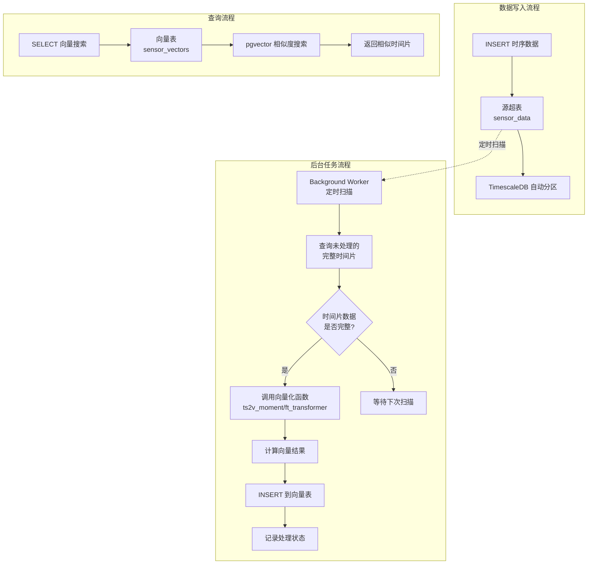

# 时序向量表（Timeseries Vector Table）设计文档

## 1. 概述

### 1.1 功能简介

时序向量表功能用于在 TimescaleDB 超表（hypertable）基础上，自动按固定时间间隔（时间片）对时序数据进行向量化计算，并将向量结果连同时间片信息和相关属性存储到新的向量表中。

该功能结合了 TimescaleDB 的时序数据管理能力和 pgvector 的向量相似度搜索能力，适用于时序数据的异常检测、模式识别、相似度搜索等 AI 应用场景。

### 1.2 设计目标

- 基于现有超表自动创建向量表，无需手动维护
- 支持按固定时间间隔（time bucket）自动切分时序数据
- 当时间片数据完整后，自动调用向量化函数计算该时间片的向量
- 向量表记录时间片元数据（开始时间、结束时间）和源表属性列
- 利用 TimescaleDB 的后台任务调度机制实现定时扫描和计算
- 支持向量相似度查询，快速检索相似的时间片段

### 1.3 典型应用场景

- **工业 IoT 异常检测**：将传感器时序数据按分钟/小时分片向量化，通过向量相似度搜索找到异常时间段
- **金融行情模式识别**：将股票行情按时间窗口向量化，识别相似走势模式
- **系统监控告警**：将服务器指标按时间片向量化，通过相似度匹配历史故障模式
- **能耗分析**：将能耗数据按小时向量化，比较不同时间段的用能模式

### 1.4 术语定义

| 术语 | 说明 |
|------|------|
| 源表（Source Table） | 原始的 TimescaleDB 超表，存储时序数据 |
| 向量表（Vector Table） | 新创建的表，存储时间片的向量数据和元信息 |
| 时间片（Time Slice） | 固定时间间隔的数据窗口，如 1 小时、1 天 |
| 向量化函数 | 将时序数据转换为向量的函数，如 `ts2v_moment`、`ft_transformer_embedding` |

## 2. 语法设计

### 2.1 创建时序向量表

创建向量表**不再引入自定义 DDL 语法**，而是复用 PostgreSQL 标准的 `CREATE TABLE ... WITH (...)` 语法。当 `WITH` 子句中指定了 `timeseries.source` 时，内核在建表前**自动注入**所有系统必需列（`slice_start`、`slice_end`、携带列、向量列、质量元数据列等），用户**只需声明额外的自定义列**（也可以不声明任何列）。

```sql
CREATE TABLE vector_table_name (
    <自定义列...>                             -- 可选：用户自定义列，可省略
) WITH (
    timeseries.source = 'source_table_name',  -- 必需：关联原始时序表（触发自动注入）
    timeseries.bucket_interval = 3600,      -- 必需：时间片间隔（秒）
    timeseries.vector_len = 384,             -- 向量维度（默认 384）
    timeseries.vectorize_function = 'fn',     -- 向量化函数（默认 ts2v_moment）
    timeseries.vector_column = 'col',         -- 向量列名（默认 embedding）
    timeseries.carry_columns = 'c1,c2,...',   -- 携带列名（逗号分隔，类型从源表自动推断）
    timeseries.enabled = true,                -- 后台任务开关
    timeseries.scan_interval = 300,           -- 扫描间隔（秒）
    timeseries.completion_delay = 0           -- 完成延迟（秒）
    /* 其余数据质量参数见 4.3 节 */
);
```

#### 自动注入的列

当 `timeseries.source` 存在于 `WITH` 子句时，内核在 `DefineRelation()` 执行前自动向 `tableElts` 注入以下列（若用户已手动声明同名列则跳以免重复）：

| 列名 | 类型 | 来源 | 说明 |
|------|------|------|------|
| `slice_start` | TIMESTAMPTZ NOT NULL | 固定 | 时间片开始时间（主键之一） |
| `slice_end` | TIMESTAMPTZ NOT NULL | 固定 | 时间片结束时间 |
| `{carry_columns}` | 源表对应类型 NOT NULL | 从源表 `pg_attribute` 推断 | 携带列，用于 GROUP BY 与主键 |
| `{vector_column}` | vector(vector_len) | 由 `timeseries.vector_len` 决定维度 | 向量数据列（列名默认 `embedding`） |
| `_processed` | BOOLEAN DEFAULT true | 固定 | 处理状态 |
| `_data_watermark` | TIMESTAMPTZ | 固定 | 迟到数据水位线 |
| `_coverage` | FLOAT | 固定 | 覆盖率 |
| `_row_count` | INT | 固定 | 采样点数 |
| `_gap_count` | INT | 固定 | 间隙数 |
| `_created_at` | TIMESTAMPTZ DEFAULT now() | 固定 | 记录创建时间 |
| PRIMARY KEY | — | `(slice_start, {carry_columns})` 自动生成 | 保证幂等性 |

注入完成后，内核还自动创建 HNSW 向量索引：`CREATE INDEX ... USING hnsw ({vector_column} vector_cosine_ops)`。

#### 用户只需关注的列

| 列类型 | 说明 |
|------|------|
| 自定义列 | 用户在 `CREATE TABLE` 中显式声明的额外列，后台任务不写入，其值由用户自行维护 |

> 即使用户不声明任何列（`CREATE TABLE foo () WITH (...)`），系统也会自动注入上述全部必需列，建出一张完整的向量表。

#### 表选项（reloptions）说明

下表列出与源表关联和向量化相关的表选项，全部保存在表的 reloptions 中。

| 选项 | 类型 | 必需 | 默认值 | 说明 |
|------|------|------|--------|------|
| `timeseries.source` | text | ✅ | — | 关联的原始时序表（源表）名称。存在即触发系统列自动注入 |
| `timeseries.bucket_interval` | int | ✅ | — | 时间片间隔（秒），如 `3600`（1 小时） |
| `timeseries.vector_len` | int | — | `384` | 向量维度，决定向量列 `vector(N)` 的 N |
| `timeseries.vectorize_function` | text | — | `ts2v_moment` | 向量化函数名 |
| `timeseries.vector_column` | text | — | `embedding` | 向量列名 |
| `timeseries.carry_columns` | text | — | 空 | 携带列名（逗号分隔），类型从源表自动推断 |
| `timeseries.enabled` | bool | — | `true` | 是否启用后台任务 |
| `timeseries.scan_interval` | int | — | `300` | 后台任务扫描间隔（秒） |
| `timeseries.completion_delay` | int | — | `0` | 时间片完成后的延迟等待（秒） |
| `timeseries.sample_interval` | int | — | NULL | 期望采样间隔（秒），用于推断期望采样点数 |
| `timeseries.min_coverage` | float | — | `0.5` | 覆盖率阈值 |
| `timeseries.max_gap` | int | — | NULL | 最大数据间隙（秒） |
| `timeseries.completion_timeout` | int | — | NULL | 补全缺失数据超时（秒） |
| `timeseries.strict` | bool | — | `false` | 超时后是否跳过不完整时间片 |
| `timeseries.recompute_on_late_data` | bool | — | `false` | 迟到数据是否触发重算 |

> `timeseries.source` 与 `timeseries.bucket_interval` 为必需项，其余选项均带默认值。结构性与可调参数统一保存在 reloptions 中，均可通过 `ALTER TABLE ... SET/RESET` 维护（见 2.4 节）。

### 2.2 语法示例

```sql
-- 基本示例：只写 WITH 子句，系统列全部自动注入
CREATE TABLE sensor_vectors () WITH (
    timeseries.source = 'sensor_data',
    timeseries.bucket_interval = 3600,
    timeseries.carry_columns = 'sensor_id,location',
    timeseries.vector_len = 384,
    timeseries.scan_interval = 300,
    timeseries.completion_delay = 300
);
-- 系统自动注入：slice_start, slice_end, sensor_id(TEXT), location(TEXT),
--               embedding vector(384), _processed, _data_watermark, _coverage,
--               _row_count, _gap_count, _created_at, PRIMARY KEY(slice_start, sensor_id, location)
-- 系统自动创建：HNSW 索引 on embedding

-- 携带自定义列：用户只声明额外需要的列
CREATE TABLE sensor_vectors_ext (
    anomaly_score FLOAT,          -- 自定义列（后台任务不写入）
    notes         TEXT            -- 自定义列
) WITH (
    timeseries.source = 'sensor_data',
    timeseries.bucket_interval = 1800,
    timeseries.carry_columns = 'sensor_id',
    timeseries.vector_len = 128
);
-- 系统自动注入：slice_start, slice_end, sensor_id(TEXT), embedding vector(128),
--               _processed, _data_watermark, _coverage, _row_count, _gap_count,
--               _created_at, PRIMARY KEY(slice_start, sensor_id)
-- 系统自动创建：HNSW 索引 on embedding
-- 用户自定义列 anomaly_score、notes 保留在表中，由用户自行维护
```

### 2.3 删除时序向量表

向量表就是普通表，直接使用标准 `DROP TABLE` 即可，无需专用语法：

```sql
DROP TABLE vector_table_name;
```

后台任务通过 reloptions 识别向量表，表被删除后对应的后台任务/扫描逻辑自动失效，无需额外清理。

### 2.4 管理后台任务

向量表的所有配置（含可调参数与结构性配置）都保存在表的 reloptions 中，因此直接使用 PostgreSQL 标准的 `ALTER TABLE ... SET/RESET` 语法即可管理，无需额外的管理函数。

```sql
-- 查看所有时序向量表配置
SELECT * FROM timeseries_vector_info;

-- 手动触发一次向量计算
SELECT timeseries_vector_run('vector_table_name');

-- 修改扫描间隔（后台任务下次扫描时动态读取，立即生效）
ALTER TABLE vector_table_name SET (timeseries.scan_interval = 600);

-- 修改时间片完成延迟
ALTER TABLE vector_table_name SET (timeseries.completion_delay = 300);

-- 恢复为默认值
ALTER TABLE vector_table_name RESET (timeseries.scan_interval);

-- 停用 / 启用后台任务
ALTER TABLE vector_table_name SET (timeseries.enabled = false);
ALTER TABLE vector_table_name SET (timeseries.enabled = true);

-- 关联到新的源表 / 调整时间片间隔（结构性配置同样通过 reloptions 修改）
ALTER TABLE vector_table_name SET (timeseries.source = 'new_source_table');
ALTER TABLE vector_table_name SET (timeseries.bucket_interval = 1800);
```

说明：

- 表选项（reloptions）是 PostgreSQL 表自带的存储机制，`ALTER TABLE ... SET/RESET` 由内核自动处理，无需自定义语法解析。
- 后台任务每次扫描时动态读取 reloptions，因此修改后无需重建任务。
- 所有配置统一保存在 reloptions 中，不再维护独立的元数据表（见 3.3 节）。

## 3. 架构设计

### 3.1 系统架构图



### 3.2 核心组件

#### 3.2.1 向量表结构

向量表由用户通过标准 `CREATE TABLE ... WITH (timeseries.source = ...)` 创建。当 `timeseries.source` 存在时，内核自动注入以下列（用户无需手动声明），用户声明的自定义列会追加在系统列之后：

| 列名 | 类型 | 注入方式 | 说明 |
|------|------|---------|------|
| `slice_start` | TIMESTAMPTZ NOT NULL | 自动注入 | 时间片开始时间（主键之一） |
| `slice_end` | TIMESTAMPTZ NOT NULL | 自动注入 | 时间片结束时间 |
| `{carry_columns}` | 源表对应类型 NOT NULL | 自动注入（类型从源表推断） | 携带列，用于 GROUP BY 与主键 |
| `{vector_column}` | vector(vector_len) | 自动注入 | 向量数据列（列名默认 `embedding`，维度由 `timeseries.vector_len` 决定） |
| `_processed` | BOOLEAN DEFAULT true | 自动注入 | 处理状态 |
| `_data_watermark` | TIMESTAMPTZ | 自动注入 | 迟到数据水位线 |
| `_coverage` | FLOAT | 自动注入 | 覆盖率 = 实际采样点 / 期望采样点（0~1） |
| `_row_count` | INT | 自动注入 | 本时间片实际采样点数 |
| `_gap_count` | INT | 自动注入 | 检测到的数据间隙数量 |
| `_created_at` | TIMESTAMPTZ DEFAULT now() | 自动注入 | 记录创建时间 |
| PRIMARY KEY | — | 自动注入 | `(slice_start, {carry_columns})` |
| HNSW 索引 | — | 自动创建 | `ON {vector_column} USING hnsw (... vector_cosine_ops)` |
| `{用户自定义列}` | 任意 | 用户声明 | 用户在 `CREATE TABLE` 中显式声明的列，后台任务不写入 |

> 系统列若与用户声明的列同名则跳过注入（以免重复），用户可在 `CREATE TABLE` 中覆盖系统列定义（如改默认值或加约束）。

#### 3.2.2 时间片完整性判断与数据质量处理

时序数据的采集存在两类典型问题：**数据延迟**（数据未及时写入）和**数据缺失**（采集失败导致时间片内出现空洞）。后台任务不能简单地把"时间已过 `slice_end`"等同于"数据完整"，需要分别处理。

##### 1. 数据延迟（迟到数据）

数据延迟指某段数据在其所属时间片结束后才写入源表。处理策略：

1. **延迟缓冲（`completion_delay`）**：时间片结束后额外等待一段时间再计算，缓解正常传输延迟导致的数据不完整。
2. **水位线追踪（watermark）**：为每个向量表记录已处理到的源数据最高时间 `_data_watermark`，后台任务从水位线之后扫描，避免重复读取。
3. **迟到数据重算（`recompute_on_late_data`）**：当检测到水位线之前出现新增数据（迟到数据），将受影响的时间片标记为"待重算"，下次扫描时重新计算向量。默认关闭，按需通过表属性开启。
   - 检测方式：源表新增数据行时（可借助源表触发器记录 `_updated_at`，或通过 INSERT 语义识别），若其 `time` 早于当前水位线，判定为迟到数据。

##### 2. 数据缺失（采集失败）

数据缺失指某个时间片内预期的采样点没有全部到达（如传感器离线、丢包）。处理策略：

1. **覆盖率阈值（`min_coverage`）**：`实际采样点数 / 期望采样点数`，低于阈值的时间片不计算向量，避免产生误导性向量。
2. **最大间隙检测（`max_gap`）**：时间片内相邻采样点的时间间隔若超过阈值，判定中间存在缺失段。
3. **等待补齐超时（`completion_timeout`）**：覆盖率不足的时间片继续等待回补数据，超时后按模式处理：
   - `strict` 模式：跳过该时间片，不写入向量（等待后续重算）；
   - 非 `strict` 模式：仍计算向量，但记录低覆盖率标记，供查询时过滤。
4. **质量元数据**：在向量表中记录质量元数据列，供查询时过滤低质量向量（见 3.2.1）。

期望采样点数由 `sample_interval` 表属性推断（= 时间片长度 / 采样间隔秒数）；未指定时仅依据 `_row_count` 与 `_gap_count` 判断。

##### 3. 综合判定流程

```
1. 找出候选时间片（slice_end + completion_delay < NOW()，且在水位线之后）
2. 对每个候选时间片：
   a. 统计覆盖率、最大间隙、行数
   b. 若 coverage >= min_coverage 且 max_gap 在阈值内 → 计算向量，标记 complete
   c. 若 coverage < min_coverage 或存在超限间隙：
      - 未到 completion_timeout → 跳过，继续等待回补数据
      - 已超时 → 按 strict 模式决定「跳过」或「带质量标记计算」
3. 检测迟到数据（time < watermark 的新增行）→ 标记受影响时间片为待重算
4. 重算受影响的时间片
```

```sql
-- 候选时间片 + 数据质量统计（示意）
WITH candidates AS (
    SELECT
        time_bucket('1 hour', time) AS slice_start,
        time_bucket('1 hour', time) + interval '1 hour' AS slice_end,
        sensor_id, location,
        count(*) AS row_count,
        count(*)::float / (3600.0 / 60.0) AS coverage,  -- 期望采样点 = 片长 / 采样间隔(60s)
        MAX(time) AS max_time_in_slice
    FROM sensor_data
    WHERE time < NOW() - make_interval(secs => ${completion_delay})  -- completion_delay（秒）
      AND time > ${watermark}                            -- 水位线之后
    GROUP BY 1, 2, 3, 4
)
SELECT c.*
FROM candidates c
LEFT JOIN sensor_vectors sv
    ON sv.slice_start = c.slice_start AND sv.sensor_id = c.sensor_id
WHERE sv.slice_start IS NULL
  AND c.coverage >= 0.5;                                 -- min_coverage
```

#### 3.2.3 向量化函数接口

向量化函数接收一个时间片内的所有时序数据，返回一个向量。函数签名约定：

```sql
-- 向量化函数模板
CREATE FUNCTION ts2v_moment(
    data_rows REFCURSOR,  -- 或使用 SET RETURNING 函数
    vector_len INT DEFAULT 384
) RETURNS vector;
```

实际实现中，向量化函数在后台任务内部通过 SPI 执行，接收时间片内的聚合数据作为输入。

#### 3.2.4 后台任务机制

定时扫描可用 TimescaleDB 的 `add_job` API 注册。由于配置已保存在向量表的 reloptions 中，job 只需一个通用入口，扫描时动态发现并读取各向量表配置，无需在 job config 中重复维护：

```sql
-- 注册一个通用扫描任务（配置来自各向量表的 reloptions）
SELECT timescaledb_internal.add_job(
    proc => 'timeseries_vector_scan'::regproc,
    schedule_interval => '5 min'::interval,
    job_name => 'timeseries_vector_scan'
);
```

后台任务的执行逻辑：

```
1. 扫描 pg_class，找出含 timeseries.source reloption 的向量表
2. 读取每个向量表的 reloptions，获取源表、时间片、向量化等配置
3. 查询源表，找出未处理且已完整的时间片（依据 completion_delay 等质量参数）
4. 对每个完整时间片：
   a. 查询该时间片内的时序数据
   b. 调用向量化函数计算向量
   c. INSERT 到向量表（slice_start, slice_end, carry_columns, vector_column）
5. 记录处理日志
```

### 3.3 元数据管理

#### 3.3.1 配置存储

向量表**不再维护独立的元数据表**。所有配置（源表关联、时间片间隔、向量化函数、携带列，以及可调参数）统一保存在向量表自身的 reloptions 中，即在 `pg_class.reloptions` 中以 `timeseries.*` 前缀的键值存储。

- **识别依据**：`pg_class.reloptions` 中存在 `timeseries.source` 选项的普通表即视为时序向量表。
- **动态读取**：后台任务通过内核函数（`get_reloptions` / 解析 reloptions 数组）读取配置，因此任何 `ALTER TABLE ... SET/RESET` 均立即生效，无需重建任务。
- **统一存储**：结构性配置（`timeseries.source`、`timeseries.bucket_interval`、`timeseries.vectorize_function`、`timeseries.vector_column`、`timeseries.carry_columns`）与可调参数（`timeseries.scan_interval`、`timeseries.completion_delay`、`timeseries.enabled` 等）不再拆分。

为使 `CREATE TABLE ... WITH (...)` 与 `ALTER TABLE ... SET/RESET` 能解析这些键，采用 **reloption 命名空间（namespace）** 机制，而非逐个注册 reloption。具体做法：

1. 在 `src/include/access/reloptions.h` 的 `HEAP_RELOPT_NAMESPACES` 中加入 `"timeseries"`：
   ```c
   #define HEAP_RELOPT_NAMESPACES { "toast", "timeseries", NULL }
   ```
   这样 parser 在解析 `WITH (timeseries.source = '...')` 时，会将 `timeseries` 识别为合法命名空间，`DefElem->defnamespace = "timeseries"`、`DefElem->defname = "source"`。

2. 由于 `transformRelOptions(..., NULL, ...)` 仅处理空命名空间选项，且 `heap_reloptions` 不识别 `timeseries.*` 键，内核在 `DefineRelation()` 与 `ATExecSetRelOptions()` 中对 `timeseries.*` 选项做**旁路处理**：
   - 验证阶段：过滤掉 `timeseries.*` 条目后再交给 `heap_reloptions` 校验；
   - 存储阶段：手动将 `timeseries.*` 选项以 `timeseries.<name>=<value>` 格式拼入 `pg_class.reloptions` 文本数组（保留命名空间前缀，便于 `timeseries_vector_run` 通过 `regexp_match` 定位）。

> 这种方式无需为每个 `timeseries.*` 键调用 `add_*_reloption`，新增选项时也不必改 reloptions.c，只需在 `tsvectorcmds.c` 的 `tsrelopt_get_string` / `tsrelopt_get_int` 中读取即可。

#### 3.3.2 信息视图

后台任务与信息视图通过解析 `pg_class.reloptions` 识别并展示向量表配置：

```sql
CREATE VIEW timeseries_vector_info AS
SELECT
    c.oid::regclass::text AS vector_table_name,
    reloptions_text(c.reloptions, 'timeseries.source') AS source_table_name,
    reloptions_int(c.reloptions, 'timeseries.bucket_interval') AS bucket_interval,
    reloptions_text(c.reloptions, 'timeseries.vectorize_function') AS vectorize_function,
    reloptions_text(c.reloptions, 'timeseries.vector_column') AS vector_column,
    reloptions_text(c.reloptions, 'timeseries.carry_columns') AS carry_columns,
    reloptions_bool(c.reloptions, 'timeseries.enabled') AS enabled,
    reloptions_int(c.reloptions, 'timeseries.scan_interval') AS scan_interval,
    reloptions_int(c.reloptions, 'timeseries.completion_delay') AS completion_delay
FROM pg_class c
WHERE reloptions_text(c.reloptions, 'timeseries.source') IS NOT NULL;
```

> `reloptions_text` / `reloptions_bool` 为示意函数，实际实现中从 `c.reloptions`（`text[]`）解析对应的 `timeseries.*` 键值。若后续接入 TimescaleDB 后台任务，`job_id` 与任务状态通过扩展自身元数据维护，不写入向量表 reloptions。

## 4. 数据模型设计

### 4.1 源表示例

```sql
-- 源表：传感器时序数据
CREATE TABLE sensor_data (
    time        TIMESTAMPTZ NOT NULL,
    sensor_id   TEXT NOT NULL,
    location    TEXT NOT NULL,
    temperature DOUBLE PRECISION,
    humidity    DOUBLE PRECISION,
    pressure    DOUBLE PRECISION
);

SELECT create_hypertable('sensor_data', 'time');
```

### 4.2 向量表结构

用户只需写 `WITH` 子句和自定义列，系统列由内核自动注入：

```sql
-- 用户只声明自定义列（也可以不声明任何列）
CREATE TABLE sensor_vectors (
    anomaly_score FLOAT               -- 自定义列（可选，后台任务不写入）
) WITH (
    timeseries.source = 'sensor_data',
    timeseries.bucket_interval = 3600,
    timeseries.carry_columns = 'sensor_id,location',
    timeseries.vector_len = 384
);

-- 内核自动注入后的等效表结构：
-- CREATE TABLE sensor_vectors (
--     slice_start   TIMESTAMPTZ NOT NULL,
--     slice_end     TIMESTAMPTZ NOT NULL,
--     sensor_id     TEXT NOT NULL,         -- 类型从 sensor_data.sensor_id 推断
--     location      TEXT NOT NULL,         -- 类型从 sensor_data.location 推断
--     embedding     vector(384),
--     _processed    BOOLEAN DEFAULT true,
--     _data_watermark TIMESTAMPTZ,
--     _coverage     FLOAT,
--     _row_count    INT,
--     _gap_count    INT,
--     _created_at   TIMESTAMPTZ DEFAULT now(),
--     anomaly_score FLOAT,                  -- 用户自定义列
--     PRIMARY KEY (slice_start, sensor_id, location)
-- );
-- CREATE INDEX ... ON sensor_vectors USING hnsw (embedding vector_cosine_ops);
```

### 4.3 WITH 选项

下表中的选项均通过 `CREATE TABLE ... WITH (...)` 设置，并保存在表的 reloptions 中，可后续用 `ALTER TABLE ... SET/RESET` 修改。向量维度由 `timeseries.vector_len` 决定（默认 384），系统据此自动创建 `vector(N)` 类型的列。

| 选项 | 类型 | 默认值 | 说明 |
|------|------|--------|------|
| `timeseries.source` | text | —（必需） | 关联的原始时序表名称。存在即触发系统列自动注入 |
| `timeseries.bucket_interval` | int | —（必需） | 时间片间隔（秒），如 `3600`（1 小时） |
| `timeseries.vector_len` | int | 384 | 向量维度，决定自动注入的向量列类型 `vector(N)` |
| `timeseries.vectorize_function` | text | ts2v_moment | 向量化函数名 |
| `timeseries.vector_column` | text | embedding | 向量列名 |
| `timeseries.carry_columns` | text | 空 | 携带列名（逗号分隔），类型从源表自动推断 |
| `timeseries.enabled` | bool | true | 是否启用后台任务 |
| `timeseries.scan_interval` | int | 300 | 后台任务扫描间隔（秒） |
| `timeseries.completion_delay` | int | 0 | 时间片完成后的延迟等待（秒，缓解迟到数据） |
| `timeseries.sample_interval` | int | NULL | 期望采样间隔（秒），用于推断期望采样点数（NULL 则自动推断） |
| `timeseries.min_coverage` | float | 0.5 | 覆盖率阈值，低于此值不计算向量 |
| `timeseries.max_gap` | int | NULL | 最大数据间隙（秒），超过则判定数据不连续（NULL 表示不检测） |
| `timeseries.completion_timeout` | int | NULL | 等待补齐缺失数据的超时时间（秒，NULL 表示一直等待） |
| `timeseries.strict` | bool | false | 超时后是否跳过不完整时间片（true 跳过 / false 带质量标记计算） |
| `timeseries.recompute_on_late_data` | bool | false | 检测到迟到数据时是否重算受影响的时间片 |

> 向量索引（HNSW）由系统在建表后自动创建，无需用户手动执行。

## 5. 后台任务设计

### 5.1 任务执行流程

```
┌─────────────────────────────────────────────────────┐
│              timeseries_vector_scan()                │
├─────────────────────────────────────────────────────┤
│                                                      │
│  1. 读取 job config                                   │
│     ├── source_table, vector_table                   │
│     ├── bucket_interval, carry_columns               │
│     └── completion_delay, vectorize_function         │
│                                                      │
│  2. 查询未处理的完整时间片                              │
│     ├── 使用 time_bucket 计算时间片                    │
│     ├── WHERE slice_end < NOW() - completion_delay   │
│     └── LEFT JOIN 向量表排除已处理的时间片              │
│                                                      │
│  3. 遍历每个时间片                                     │
│     ├── 查询该时间片内的时序数据                        │
│     ├── 调用向量化函数                                 │
│     │   ├── ts2v_moment: 时序特征提取                        │
│     │   └── ft_transformer_embedding: 多列向量化      │
│     └── INSERT 结果到向量表                           │
│                                                      │
│  4. 异常处理                                          │
│     ├── 单个时间片失败不影响其他时间片                  │
│     └── 记录错误日志                                   │
│                                                      │
└─────────────────────────────────────────────────────┘
```

### 5.2 完整性判断逻辑

```sql
-- 找出所有未处理的完整时间片
WITH complete_slices AS (
    SELECT
        time_bucket($1, time) AS slice_start,
        time_bucket($1, time) + $1 AS slice_end,
        sensor_id, location,  -- CARRY 列
        count(*) AS row_count,
        avg(temperature) AS avg_temp,
        avg(humidity) AS avg_humidity,
        avg(pressure) AS avg_pressure,
        min(temperature) AS min_temp,
        max(temperature) AS max_temp,
        stddev(temperature) AS std_temp
    FROM sensor_data
    WHERE time < NOW() - make_interval(secs => $2)  -- completion_delay（秒）
    GROUP BY slice_start, sensor_id, location
)
SELECT c.* FROM complete_slices c
LEFT JOIN sensor_vectors v
    ON c.slice_start = v.slice_start
    AND c.sensor_id = v.sensor_id
    AND c.location = v.location
WHERE v.slice_start IS NULL;  -- 未处理的时间片
```

### 5.3 向量化计算

向量化函数接收时间片内的数据，返回向量。两种支持模式：

#### 模式一：聚合特征向量化（ts2v_moment）

```sql
-- ts2v_moment 函数：将时间片的统计特征转为向量
-- 输入：时间片内的聚合数据（均值、标准差、最小值、最大值等）
-- 输出：固定维度的向量
SELECT ts2v_moment(
    avg_temp, avg_humidity, avg_pressure,
    min_temp, max_temp, std_temp,
    row_count
);
```

#### 模式二：多列直接向量化（ft_transformer_embedding）

```sql
-- ft_transformer_embedding 函数：将多列数值转为向量
SELECT ft_transformer_embedding(
    avg_temp, avg_humidity, avg_pressure
);
```

### 5.4 并发控制

- 后台任务使用 TimescaleDB 的 job 机制，同一 job 不会并发执行
- 向量表的 INSERT 使用 `ON CONFLICT DO NOTHING` 防止重复插入
- 支持多任务并行处理不同的源表

## 6. 使用示例

### 6.1 完整示例

```sql
-- 1. 创建源超表
CREATE TABLE sensor_data (
    time        TIMESTAMPTZ NOT NULL,
    sensor_id   TEXT NOT NULL,
    location    TEXT NOT NULL,
    temperature DOUBLE PRECISION,
    humidity    DOUBLE PRECISION,
    pressure    DOUBLE PRECISION
);

SELECT create_hypertable('sensor_data', 'time');

-- 2. 插入测试数据
INSERT INTO sensor_data VALUES
    ('2026-01-01 00:00:00+00', 'S001', 'Room-A', 22.5, 45.0, 1013.0),
    ('2026-01-01 00:30:00+00', 'S001', 'Room-A', 22.8, 45.5, 1013.2),
    ('2026-01-01 01:00:00+00', 'S001', 'Room-A', 23.0, 46.0, 1013.1),
    ('2026-01-01 01:30:00+00', 'S001', 'Room-A', 23.2, 46.2, 1013.0);

-- 3. 创建时序向量表（只需 WITH 子句，系统列自动注入）
CREATE TABLE sensor_vectors (
    anomaly_score FLOAT               -- 自定义列（可选）
) WITH (
    timeseries.source = 'sensor_data',
    timeseries.bucket_interval = 3600,
    timeseries.carry_columns = 'sensor_id,location',
    timeseries.vector_len = 384,
    timeseries.scan_interval = 60,
    timeseries.completion_delay = 300
);
-- 系统自动注入 slice_start, slice_end, sensor_id, location, embedding,
-- _processed, _data_watermark, _coverage, _row_count, _gap_count, _created_at
-- 系统自动创建 PRIMARY KEY 和 HNSW 索引

-- 4. 手动触发一次计算（不等后台任务）
SELECT timeseries_vector_run('sensor_vectors');

-- 5. 查看结果
SELECT slice_start, slice_end, sensor_id, location,
       embedding::text
FROM sensor_vectors
ORDER BY slice_start;

-- 6. 向量相似度搜索：找最相似的时间片
SELECT slice_start, slice_end, sensor_id, location,
       embedding <=> target_embedding AS distance
FROM sensor_vectors
ORDER BY embedding <=> target_embedding
LIMIT 5;

-- 7. 查看任务状态
SELECT * FROM timeseries_vector_info;
```

### 6.2 删除示例

```sql
-- 删除时序向量表（直接使用标准 DROP TABLE）
DROP TABLE sensor_vectors;
```

## 7. 实现方案

### 7.1 实现层次

```
src/include/access/reloptions.h        # HEAP_RELOPT_NAMESPACES 增加 "timeseries"
src/backend/parser/parse_utilcmd.c     # transformCreateStmt() 开头调用 InjectTimeseriesColumns()
src/backend/commands/tablecmds.c       # DefineRelation()/ATExecSetRelOptions() 旁路存储 timeseries.* reloptions
src/backend/commands/tsvectorcmds.c    # 列注入核心实现（InjectTimeseriesColumns）
src/include/commands/tsvectorcmds.h    # 头文件声明
contrib/tsvector_funcs/                # 向量化函数与手动触发（ts2v_moment、timeseries_vector_run）
```

> 由于不再引入自定义 DDL 语法，无需修改语法解析器（`gram.y` / `kwlist.h` / `parsenodes.h`），也无需新增命令标签。实现收敛为：
> 1) 在 `reloptions.h` 注册 `timeseries` 命名空间；
> 2) 在 `transformCreateStmt()` 中拦截 `CREATE TABLE`，检测 `timeseries.source`，自动注入系统列与主键（必须在 `transformCreateStmt` 而非 `DefineRelation` 中注入，因为主键约束需经约束转换逻辑处理）；
> 3) 在 `DefineRelation()` / `ATExecSetRelOptions()` 中旁路存储 `timeseries.*` reloptions；
> 4) `timeseries_vector_run` 从 reloptions 读取配置。

### 7.2 列自动注入与建表流程

```
用户执行 CREATE TABLE ... WITH (timeseries.source = ..., ...)
    │
    ├── 1. Parser 解析为 CreateStmt（tableElts + options）
    │
    ├── 2. DefineRelation() 前拦截：检测 options 中的 timeseries.source
    │      ├── 解析 timeseries.* reloptions（source, bucket_interval, carry_columns, vector_len, ...）
    │      ├── 打开源表 relation，读取 carry 列的 attnum 和 atttypid
    │      ├── 构造 ColumnDef 节点：
    │      │   ├── slice_start (TIMESTAMPTZ NOT NULL)
    │      │   ├── slice_end   (TIMESTAMPTZ NOT NULL)
    │      │   ├── {carry 列}  (源表对应类型 NOT NULL)
    │      │   ├── {vector 列}  (vector(vector_len)，typmod = vector_len)
    │      │   ├── _processed, _data_watermark, _coverage, _row_count, _gap_count, _created_at
    │      │   └── PRIMARY KEY (slice_start, {carry 列})
    │      └── 将构造的 ColumnDef / Constraint 追加到 stmt->tableElts
    │         （与用户已声明的列去重：同名列跳过注入）
    │
    ├── 3. 正常执行 DefineRelation()（建表 + 持久化 reloptions 到 pg_class）
    │
    └── 4. 建表后：自动创建 HNSW 向量索引
           └── CREATE INDEX ... ON {vec_table} USING hnsw ({vector_col} vector_cosine_ops)
```

列注入核心代码示意：

```c
/* 在 DefineRelation() 中，解析完 reloptions 后调用 */
if (tsv_source != NULL)
{
    Relation source_rel = relation_openrv(makeRangeVar(NULL, tsv_source, -1),
                                         AccessShareLock);
    TupleDesc tupdesc = RelationGetDescr(source_rel);

    /* 注入 slice_start, slice_end */
    inject_column(stmt, "slice_start", TIMESTAMPTZOID, -1, true);
    inject_column(stmt, "slice_end",   TIMESTAMPTZOID, -1, true);

    /* 注入 carry 列（类型从源表推断） */
    foreach(lc, carry_names)
    {
        char *colname = strVal(lfirst(lc));
        AttrNumber attnum = get_attnum(source_rel->rd_id, colname);
        Form_pg_attribute attr = TupleDescAttr(tupdesc, attnum - 1);
        inject_column(stmt, colname, attr->atttypid, attr->atttypmod, true);
    }

    /* 注入向量列 */
    inject_vector_column(stmt, vector_column, vector_len);

    /* 注入质量元数据列 */
    inject_column(stmt, "_processed",      BOOLOID,    -1, false);
    inject_column(stmt, "_data_watermark",  TIMESTAMPTZOID, -1, false);
    inject_column(stmt, "_coverage",        FLOAT4OID, -1, false);
    inject_column(stmt, "_row_count",       INT4OID,   -1, false);
    inject_column(stmt, "_gap_count",       INT4OID,   -1, false);
    inject_column(stmt, "_created_at",      TIMESTAMPTZOID, -1, false);

    /* 注入主键 */
    inject_primary_key(stmt, "slice_start", carry_names);

    relation_close(source_rel, AccessShareLock);
}
```

### 7.3 后台任务实现

```c
/*
 * timeseries_vector_scan - 后台任务主函数
 * 由 TimescaleDB job scheduler 调用
 */
Datum
timeseries_vector_scan(PG_FUNCTION_ARGS)
{
    Jsonb       *config;
    Oid          source_table;
    Oid          vector_table;
    int          bucket_interval;  /* 秒 */
    char       **carry_columns;
    int          num_carry;
    char        *vector_column;
    Oid          vectorize_func;
    int          completion_delay;   /* 秒 */

    /* 1. 从 job config 读取参数 */
    config = PG_GETARG_JSONB_P(0);
    parse_vector_scan_config(config, &source_table, &vector_table,
                             &bucket_interval, &carry_columns, &num_carry,
                             &vector_column, &vectorize_func,
                             &completion_delay);

    /* 2. 查询未处理的完整时间片 */
    find_complete_unprocessed_slices(source_table, vector_table,
                                     bucket_interval, carry_columns, num_carry,
                                     completion_delay);

    /* 3. 对每个时间片计算向量并插入 */
    while (has_next_slice())
    {
        SliceInfo  *slice = get_next_slice();

        /* 查询时间片内的数据 */
        char *query = build_slice_query(source_table, bucket_interval,
                                        carry_columns, num_carry, slice);

        /* 执行查询获取聚合数据 */
        SPI_execute(query, true, 0);

        /* 调用向量化函数 */
        Datum vector_result = call_vectorize_function(vectorize_func,
                                                       SPI_tuptable);

        /* INSERT 到向量表 */
        insert_vector_row(vector_table, slice, carry_columns,
                          num_carry, vector_column, vector_result);
    }

    SPI_finish();
    PG_RETURN_VOID();
}
```

### 7.4 向量化函数 ts2v_moment 设计

`ts2v_moment` 是一个内置的时序数据向量化函数，将时间片内的时序数据转换为固定维度的向量。当前实现采用 **moment 算法**（统计矩特征提取）：计算均值、标准差、偏度、峰度及 5~8 阶标准化矩，经 soft-sign 有界归一化后循环填充到目标维度（详见 13.5 节）。

```c
/*
 * ts2v_moment - 将时序数据转为向量
 *
 * 接收时间片内的数据行，提取统计特征，
 * 通过线性映射或学习模型转换为固定维度向量。
 *
 * 参数：
 *   - 多个数值参数（来自聚合查询的统计值）
 * 返回：
 *   - vector(vector_len)
 */
Datum
ts2v_moment(PG_FUNCTION_ARGS)
{
    int         nargs = PG_NARGS();
    int         vector_len = 384;  /* 默认维度 */
    Vector     *result;
    float      *features;
    int         nfeatures = 0;

    /* 收集所有数值参数作为特征 */
    features = (float *) palloc(nargs * sizeof(float));
    for (int i = 0; i < nargs; i++)
    {
        Oid argtype = get_fn_expr_argtype(fcinfo->flinfo, i);
        features[i] = extract_float_value(fcinfo, i, argtype);
        nfeatures++;
    }

    /* 特征扩展：将 nfeatures 个特征扩展到 vector_len 维度 */
    result = expand_features_to_vector(features, nfeatures, vector_len);

    pfree(features);
    PG_RETURN_POINTER(result);
}
```

特征扩展策略（当前实现采用 moment 算法，即第 1、4 条的组合）：
1. **直接填充**：将特征值重复填充到目标维度 — 当前实现将 8 个 moment 特征循环填充
2. **统计变换**：对每个特征计算多种统计量（平方、对数、平方根等）扩展维度
3. **位置编码**：添加时间位置信息
4. **归一化**：确保向量各维度在合理范围内 — 当前实现使用 soft-sign 有界归一化到 (-1, 1)

## 8. 异常处理与可靠性

### 8.1 错误处理

| 场景 | 处理方式 |
|------|---------|
| 向量化函数执行失败 | 跳过该时间片，记录日志，下次扫描重试 |
| 源表被删除 | 后台任务自动停止，发送通知 |
| 向量表插入冲突 | `ON CONFLICT DO NOTHING`，视为已处理 |
| 后台任务超时 | TimescaleDB job 机制自动重试 |
| 数据库重启 | job 机制自动恢复任务 |

### 8.2 数据一致性

- 使用事务确保每个时间片的处理是原子的
- 通过主键 `(slice_start, carry_columns)` 保证幂等性
- 支持手动重新计算指定时间片：
  ```sql
  SELECT timeseries_vector_recompute('sensor_vectors',
    '2026-01-01 00:00:00+00', '2026-01-01 02:00:00+00');
  ```

## 9. 性能设计

### 9.1 索引策略

- 向量表主键：`(slice_start, carry_columns)` — 用于快速查找已处理时间片
- 向量索引：HNSW 或 IVFFlat — 用于向量相似度搜索
- 源表时间索引：TimescaleDB 自动分区索引

### 9.2 批处理优化

- 每次扫描批量处理多个时间片，减少查询次数
- 支持配置单次扫描的最大时间片数量
- 向量化计算使用批量数据获取，减少 SPI 调用开销

### 9.3 内存控制

- 向量化函数在内存中处理数据，限制单个时间片的最大数据量
- 对于大数据量时间片，支持采样或分批处理

## 10. 兼容性设计

### 10.1 依赖关系

| 依赖 | 说明 |
|------|------|
| TimescaleDB | 提供超表、time_bucket、后台任务调度 |
| pgvector | 提供向量类型和相似度搜索 |
| jolix_embedding | 提供 st_embedding、ft_transformer_embedding 函数 |

### 10.2 版本兼容

- 向量表本身也可以是普通表（非超表），但在数据量大时可选择转换为超表
- 支持通过 `WITH (hypertable = true)` 选项自动将向量表转为超表

## 11. 后续扩展方向

1. **连续聚合集成**：与 TimescaleDB 连续聚合（Continuous Aggregates）集成，先聚合再向量化
2. **增量更新**：当源表时间片内有新数据写入时，自动重新计算该时间片的向量
3. **多向量列支持**：一个向量表支持多个向量列，使用不同的向量化函数
4. **向量过期策略**：自动删除过期的向量数据，类似 TimescaleDB 的 retention policy
5. **自定义完整性判断**：允许用户提供自定义函数判断时间片是否完整
6. **向量质量评估**：记录每个向量的计算质量指标（如数据覆盖率、置信度）

## 12. 测试计划

### 12.1 功能测试

| 测试项 | 说明 |
|--------|------|
| 创建向量表 | 验证标准 `CREATE TABLE ... WITH (timeseries.*)` 正确解析并持久化 reloptions |
| 关联源表校验 | 验证 `timeseries.source` 指向的源表存在且可访问 |
| 自定义列 | 验证除必需列外，用户可自由新增自定义列且不参与向量计算 |
| 手动触发计算 | 验证 `timeseries_vector_run` 正确读取 reloptions 并计算向量 |
| 自动后台计算 | 验证后台任务动态发现向量表并处理完整时间片 |
| 向量相似度搜索 | 验证向量索引和相似度查询正常工作 |
| 删除向量表 | 验证标准 `DROP TABLE` 删除后后台任务不再扫描该表 |
| carry 列处理 | 验证多列 GROUP BY 和主键正确 |
| 时间片完整性判断 | 验证 completion_delay 机制 |

### 12.2 边界测试

| 测试项 | 说明 |
|--------|------|
| 空时间片 | 源表无数据时，后台任务不报错 |
| 单行时间片 | 时间片内只有一行数据时正确计算 |
| 源表删除 | 源表删除后后台任务优雅停止 |
| 大数据量 | 单时间片大量数据时内存控制 |
| 并发写入 | 源表并发写入时后台任务正常执行 |

## 13. 实现状态

### 13.1 设计变更说明（2026-09-10）

原有基于自定义 `CREATE TIMESERIES VECTOR TABLE` 语法的实现方案已废弃，本设计已改为**复用标准 `CREATE TABLE ... WITH (...)` + reloptions** 方案（见第 2 章）。原方案中已实现的、依赖自定义 DDL 的建表逻辑不再适用，仅以下与语法无关的实现得以保留：

| 功能 | 状态 | 说明 |
|------|------|------|
| ts2v_moment 向量化函数 | ✅ 已完成 | `contrib/tsvector_funcs` 共享库，moment 统计矩特征提取 + soft-sign 归一化 + 循环填充 |
| 手动触发函数 | ✅ 已完成 | `timeseries_vector_run(text)` 已改为从 `pg_class.reloptions` 读取 `timeseries.*` 配置 |

### 13.2 待实现 / 待重构功能

| 功能 | 状态 | 说明 |
|------|------|------|
| reloption 注册 | ✅ 已完成 | 在 `reloptions.h` 的 `HEAP_RELOPT_NAMESPACES` 中加入 `timeseries` 命名空间 |
| 列自动注入 | ✅ 已完成 | `transformCreateStmt()` 中检测 `timeseries.source`，调用 `InjectTimeseriesColumns()` 注入系统列、carry 列、向量列、主键 |
| HNSW 索引自动创建 | ✅ 已完成 | 建表后在向量列上自动创建 `USING hnsw (... vector_cosine_ops)` 索引 |
| timeseries_vector_run 改造 | ✅ 已完成 | 已从 `pg_class.reloptions` 读取源表、bucket、vectorize、carry 等配置 |
| 后台扫描任务 | 🔲 待实现 | 定时扫描并计算向量 |
| 时间片完整性判断 | 🔲 待实现 | 基于 completion_delay 等质量参数判断时间片完整性 |
| TimescaleDB 后台任务集成 | 🔲 待实现 | TimescaleDB 可用时通过 add_job 注册定时任务 |

### 13.3 涉及源码文件（新方案）

| 文件 | 修改内容 |
|------|----------|
| `src/backend/commands/tablecmds.c` | 修改 `DefineRelation()`：检测 `timeseries.source` 后调用列注入逻辑 |
| `src/backend/commands/tsvectorcmds.c` | 注册 `timeseries.*` reloption、列注入逻辑、HNSW 索引自动创建 |
| `src/include/commands/tsvectorcmds.h` | 头文件声明 |
| `contrib/tsvector_funcs/tsvector_funcs.c` | ts2v_moment + timeseries_vector_run（改为从 reloptions 读取配置） |

> 新方案不再修改 parser / nodes / cmdtag 等语法相关文件；原方案对 `kwlist.h`、`gram.y`、`parsenodes.h`、`cmdtaglist.h`、`utility.c`、`gen_node_support.pl` 的改动一并移除。

### 13.4 测试验证结果

> 说明：以下 1~6 项基于**旧自定义 DDL 方案**，已随设计变更作废；7~10 项与语法无关、依然有效。新方案（标准 `CREATE TABLE` + reloptions）的建表与 reloption 解析已于 2026-09-11 重新验证通过（见下方「13.4.1 新方案验证」）。

在编译的 PostgreSQL 18.3 (端口 5433) 上验证通过：

1. ~~**DDL 解析**: `CREATE TIMESERIES VECTOR TABLE` 语法正确解析~~（旧方案，已作废）
2. ~~**表创建**: 向量表包含 6 列~~（旧方案，已作废）
3. ~~**索引创建**: 主键索引 + HNSW 向量索引均成功创建~~（旧方案，已作废）
4. ~~**元数据注册**: 元数据表正确记录配置信息~~（旧方案，已作废）
5. ~~**IF NOT EXISTS**: 幂等创建正常工作~~（旧方案，已作废）
6. ~~**多 CARRY 列**: 支持多个携带列~~（旧方案，已作废）
7. **pgvector 兼容**: 需使用对应 PG18 编译的 pgvector 扩展
8. **ts2v_moment 函数**: moment 特征提取(均值/标准差/偏度/峰度/高阶矩 + soft-sign 归一化)、循环填充、默认维度384、空数组/NULL错误处理均通过
9. **timeseries_vector_run**: 正确计算时间片的向量，幂等执行(ON CONFLICT DO NOTHING)，不存在的表返回错误，配置从 `pg_class.reloptions` 读取
10. **向量内容验证**: moment 特征经 soft-sign 归一化后落在 [-1,1]，如 `[0.6666667, 0.44948974, 0, 0.6]`

#### 13.4.1 新方案验证（2026-09-11）

`CREATE TABLE ... WITH (timeseries.*)` + reloptions 方案在 PostgreSQL 18.3 上验证通过（需重新 initdb 以匹配节点序列化格式）：

1. **列自动注入**: 自动注入 `slice_start`、`slice_end`、carry 列（类型从源表推断）、`{vector_column}` vector(N)、`_processed`（BOOLEAN DEFAULT true）、`_data_watermark`、`_coverage`、`_row_count`、`_gap_count`、`_created_at`（DEFAULT now()），用户已声明的同名列跳过
2. **主键**: 自动生成 `PRIMARY KEY (slice_start, {carry_columns})`
3. **HNSW 索引**: 自动创建 `CREATE INDEX ... USING hnsw ({vector_column} vector_cosine_ops)`
4. **reloptions 持久化**: `timeseries.*` 选项以 `timeseries.<name>=<value>` 形式存储到 `pg_class.reloptions`，`ALTER TABLE ... SET/RESET (timeseries.*)` 正常工作
5. **自定义列**: 用户自定义列保留在系统列之后，后台任务不写入
6. **错误处理**: 缺失 `timeseries.bucket_interval` 报错 `timeseries.bucket_interval is required`；`timeseries.source` 指向不存在的表报错
7. **端到端**: `timeseries_vector_run` 读取 reloptions 成功计算向量并写入向量表，幂等执行

### 13.5 ts2v_moment 函数技术细节

- **实现位置**: `contrib/tsvector_funcs/tsvector_funcs.c`（共享库，非内置函数）
- **原因**: `vector` 返回类型来自 pgvector 扩展，bootstrap 时不可用，无法通过 `pg_proc.dat` 注册为 `LANGUAGE internal`
- **算法**（moment 特征提取）:
  1. 计算 1 阶原点矩（均值 mean）与 2 阶中心矩（方差 variance，标准差 stddev）
  2. 计算 3~8 阶标准化矩（偏度 skewness、峰度 kurtosis 及更高阶矩），标准化矩具有平移/尺度不变性
  3. 对每个特征应用 soft-sign 有界归一化 `f(v) = v / (1 + |v|)`，映射到 (-1, 1)
  4. 将 8 个有界特征（mean, stddev, 3~8 阶标准化矩）循环填充到目标维度
  - 常量序列（std=0）时，高阶矩全部置 0，仅保留均值特征
- **签名**: `ts2v_moment(float8[], int DEFAULT 384) RETURNS vector`
- **属性**: IMMUTABLE, PARALLEL SAFE

### 13.6 timeseries_vector_run 函数技术细节

- **实现位置**: `contrib/tsvector_funcs/tsvector_funcs.c`
- **签名**: `timeseries_vector_run(text) RETURNS text`（参数为向量表名）
- **属性**: VOLATILE
- **执行流程**:
  1. 读取向量表 `pg_class.reloptions` 中的 `timeseries.*` 配置（源表、bucket、vectorize、carry 等；当前实现暂读元数据表，待重构为 reloptions）
  2. 构建源表和向量表的限定标识符
  3. 查找源表的时间列（第一个 TIMESTAMPTZ 列）
  4. 查找数值列（排除时间列和 carry 列）
  5. 构建 INSERT...SELECT，使用 epoch 时间分桶和 GROUP BY
  6. 通过 SPI 执行，ON CONFLICT DO NOTHING 保证幂等
  7. 返回处理的时间片数量
- **内存管理**: 在 `SPI_connect()` 前保存 `CurrentMemoryContext`，在 `SPI_finish()` 前切换回原上下文分配结果文本
