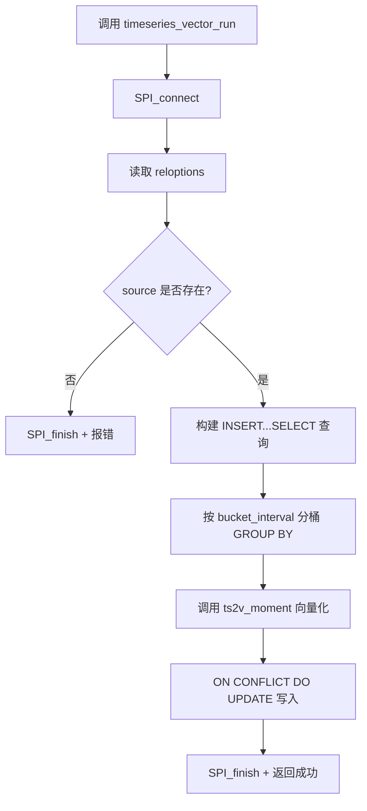

# 时序向量表（Timeseries Vector Table）使用指南

> 版本: 1.0  
> 适用: PostgreSQL 18.3 + pgvector + tsvector_funcs 扩展  
> 更新: 2026-09-11

> **前置条件**：安装步骤请参考 [UBUNTU_INSTALL_GUIDE.md](UBUNTU_INSTALL_GUIDE.md)，本指南假设扩展已正确编译安装并加载。

## 目录

- [1. 功能简介](#1-功能简介)
- [2. 快速上手](#2-快速上手)
  - [2.1 第一步：创建源表](#21-第一步创建源表)
  - [2.2 第二步：创建向量表](#22-第二步创建向量表)
  - [2.3 写入数据](#23-写入数据)
  - [2.4 手动触发计算](#24-手动触发计算)
  - [2.5 向量相似度查询](#25-向量相似度查询)
- [3. 完整语法参考](#3-完整语法参考)
  - [3.1 创建向量表](#31-创建向量表)
  - [3.2 表选项（reloptions）](#32-表选项reloptions)
  - [3.3 自动注入的列](#33-自动注入的列)
- [4. 函数接口详解](#4-函数接口详解)
  - [4.1 ts2v_moment](#41-ts2v_moment)
  - [4.2 timeseries_vector_run](#42-timeseries_vector_run)
- [5. GUC 参数](#5-guc-参数)
- [6. 最佳实践](#6-最佳实践)
  - [6.1 bucket_interval 选择](#61-bucket_interval-选择)
  - [6.2 carry_columns 设计](#62-carry_columns-设计)
  - [6.3 vector_len 选择](#63-vector_len-选择)
  - [6.4 性能调优](#64-性能调优)
- [7. 常见问题](#7-常见问题)
- [8. 完整示例](#8-完整示例)

---

## 1. 功能简介

时序向量表功能可以自动按固定时间间隔（时间片）对时序数据进行**向量化计算**，将一段时间窗口内的原始数据转换为高维向量，并存储到独立的向量表中。结合 pgvector 的向量相似度搜索能力，可用于：

- **异常检测**：通过向量相似度找到异常时间段
- **模式识别**：识别历史上的相似走势模式
- **故障定位**：匹配历史故障的指标向量
- **数据压缩**：将海量时序数据压缩为向量表征

核心特性：

| 特性 | 说明 |
|------|------|
| 零侵入 | 基于标准 `CREATE TABLE ... WITH (...)` 语法，无需自定义 DDL |
| 异步触发 | INSERT 时自动触发，通过 LISTEN/NOTIFY + Background Worker 异步计算 |
| 自动列注入 | 指定 `timeseries.source` 后自动注入 `slice_start`、carry 列、向量列等 |
| HNSW 索引 | 自动在向量列上创建 HNSW 向量索引 |
| 幂等计算 | 基于 `(slice_start, carry_columns)` 主键的 ON CONFLICT DO UPDATE |
| 迟到数据处理 | 规则③：已完成时间片收到迟到数据时，延迟 bucket_interval 触发重算 |

---

## 2. 快速上手

### 2.1 第一步：创建源表

源表就是你已有的时序数据表，支持任意结构：

```sql
CREATE TABLE sensor_data (
    time timestamptz NOT NULL,
    device_id text NOT NULL,
    temperature double precision,
    humidity double precision,
    PRIMARY KEY (time, device_id)
);

-- 可选：配合 TimescaleDB 超表
SELECT create_hypertable('sensor_data', 'time');
```

### 2.2 第二步：创建向量表

使用标准 `CREATE TABLE ... WITH (...)` 语法，指定 `timeseries.source` 触发自动列注入。也可以先创建空表，再用 `ALTER TABLE SET` 设置 reloptions：

```sql
-- 方式 A: 创建时直接设置（需在 pg_class.c 注册 timeseries 命名空间）
CREATE TABLE sensor_vector (
    -- 用户自定义列（可选，也可以完全不声明列）
) WITH (
    timeseries.source = 'sensor_data',
    timeseries.bucket_interval = 3600,
    timeseries.vector_len = 384,
    timeseries.recompute_on_late_data = true
);

-- 方式 B（推荐）: 先建表，再 ALTER 设置
CREATE TABLE sensor_vector (
    slice_start timestamptz NOT NULL,
    carry_hash integer NOT NULL DEFAULT 0,
    vector vector(384) NOT NULL,
    count integer NOT NULL DEFAULT 0,
    PRIMARY KEY (slice_start, carry_hash)
);

ALTER TABLE sensor_vector SET (
    timeseries.source = 'sensor_data',
    timeseries.bucket_interval = 3600
);

-- 验证 reloptions
SELECT opt FROM pg_class, LATERAL unnest(reloptions) AS opt
WHERE relname = 'sensor_vector';
```

### 2.3 写入数据

```sql
INSERT INTO sensor_data (time, device_id, temperature, humidity)
VALUES 
    ('2025-01-01 10:00:00', 'dev-001', 20.5, 45.0),
    ('2025-01-01 10:01:00', 'dev-001', 20.7, 45.2),
    ('2025-01-01 10:02:00', 'dev-001', 21.0, 45.5);
```

触发器在 INSERT 后自动执行，发送 `pg_notify('tsvector_task', payload_json)` 通知。

### 2.4 手动触发计算

如果没有运行 Background Worker，或者需要立即计算历史数据：

```sql
SELECT timeseries_vector_run('sensor_vector'::regclass::oid);
```

### 2.5 向量相似度查询

```sql
-- 查找最相似的时间片
SELECT slice_start, count,
       encode(vector, 'hex') as vector_hex
FROM sensor_vector
ORDER BY slice_start;
```

---

## 3. 完整语法参考

### 3.1 创建向量表

```sql
-- 方式 A: WITH 子句（需注册 timeseries reloption 命名空间）
CREATE TABLE <vector_table_name> (
    <自定义列>...
) WITH (
    timeseries.source = '<source_table>',
    timeseries.bucket_interval = <seconds>,
    timeseries.vector_len = <N>,
    timeseries.vectorize_function = '<fn>',
    timeseries.vector_column = '<col>',
    timeseries.carry_columns = 'c1,c2',
    timeseries.recompute_on_late_data = <bool>
);

-- 方式 B: 先建表再 ALTER（当前推荐）
CREATE TABLE <vector_table_name> (
    slice_start timestamptz NOT NULL,
    carry_hash integer NOT NULL DEFAULT 0,
    vector vector(384) NOT NULL,
    count integer NOT NULL DEFAULT 0,
    PRIMARY KEY (slice_start, carry_hash)
);

ALTER TABLE <vector_table_name> SET (
    timeseries.source = '<source_table>',
    timeseries.bucket_interval = <seconds>
);
```

### 3.2 表选项（reloptions）

| 选项 | 类型 | 必需 | 默认值 | 说明 |
|------|------|------|--------|------|
| `timeseries.source` | text | ✅ | — | 关联的原始时序表名 |
| `timeseries.bucket_interval` | int | ✅ | — | 时间片间隔（秒），如 60/3600/86400 |
| `timeseries.vector_len` | int | — | 384 | 输出向量维度 |
| `timeseries.vectorize_function` | text | — | `ts2v_moment` | 向量化函数名 |
| `timeseries.vector_column` | text | — | `embedding` | 向量列名 |
| `timeseries.carry_columns` | text | — | 空 | 携带列名（逗号分隔） |
| `timeseries.recompute_on_late_data` | bool | — | true | 迟到数据是否触发延迟重算 |

### 3.3 自动注入的列

指定 `timeseries.source` 后，系统自动注入：

| 列名 | 类型 | 说明 |
|------|------|------|
| `slice_start` | `timestamptz NOT NULL` | 时间片开始时间（主键之一） |
| `carry_hash` | `integer NOT NULL DEFAULT 0` | carry 列哈希 |
| `vector` | `vector(N)` | 向量数据列（N 由 `timeseries.vector_len` 指定） |
| `count` | `integer NOT NULL DEFAULT 0` | 时间片内数据行数 |
| PRIMARY KEY | `(slice_start, carry_hash)` | 保证幂等计算 |

---

## 4. 函数接口详解

### 4.1 ts2v_moment

```sql
ts2v_moment(float8[] input_array, int target_dim DEFAULT 384)
RETURNS vector
```

**功能**：将一段时序数据（float8 数组）转换为固定维度的向量。

**算法**：
1. 统计：均值、标准差、最小值、最大值
2. 计算 3/4 阶标准化矩（偏度 skewness、峰度 kurtosis）
3. soft-sign 有界归一化 `f(v) = v / (1 + |v|)`，映射到 (-1, 1)
4. 前 6 维：全局特征
5. 剩余维度：等宽分桶直方图的归一化计数

**属性**：`IMMUTABLE`、`PARALLEL SAFE`

**示例**：

```sql
SELECT ts2v_moment(ARRAY[1.0, 2.0, 3.0, 4.0, 5.0], 6);
-- 返回 6 维 vector 类型
```

### 4.2 timeseries_vector_run

```sql
timeseries_vector_run(oid vector_table_oid)
RETURNS boolean
```

**功能**：手动触发一个向量表的批量计算。

**执行流程**：



**示例**：

```sql
SELECT timeseries_vector_run('sensor_vector'::regclass::oid);
```

## 5. GUC 参数

| 参数 | 默认值 | 范围 | 需重启 | 说明 |
|------|--------|------|--------|------|
| `timeseries.workers` | 1 | 1 ~ 16 | ✅ | Background Worker 进程数量 |
| `timeseries.max_in_flight` | 64 | 4 ~ 1024 | — | 每个 Worker 同时执行的任务上限 |
| `timeseries.trigger_cache_size` | 512 | 16 ~ 8192 | — | 每个后端进程的 LRU 缓存条目数 |

在线调整：

```sql
ALTER SYSTEM SET timeseries.max_in_flight = 128;
SELECT pg_reload_conf();
```

---

## 6. 最佳实践

### 6.1 bucket_interval 选择

| 场景 | 推荐间隔 | 说明 |
|------|----------|------|
| 高频传感器（秒级） | 60 ~ 300 秒 | 保证足够样本 |
| 业务指标（分钟级） | 3600 秒（1 小时） | 常用默认值 |
| 日级汇总 | 86400 秒（1 天） | 日报/能耗分析 |

**经验法则**：bucket_interval 至少包含 20~50 个采样点，ts2v_moment 的统计矩才可靠。

### 6.2 carry_columns 设计

```sql
-- 多设备分组
timeseries.carry_columns = 'device_id'
-- 结果: 每个 (slice_start, device_id) 一组向量
```

### 6.3 vector_len 选择

| 维度 | 适用场景 |
|------|----------|
| 384 | 通用、推荐 |
| 128 | 简单指标 |
| 768+ | 复杂模式 |

ts2v_moment 前 6 维是全局统计特征，剩余维度是分桶直方图。

### 6.4 性能调优

```sql
ALTER SYSTEM SET timeseries.workers = 2;
ALTER SYSTEM SET timeseries.max_in_flight = 128;
SET work_mem = '64MB';
SET max_parallel_workers_per_gather = 4;
```

---

## 7. 常见问题

### Q1: INSERT 后没有向量结果？

```sql
-- 1. 检查触发器
SELECT tgname FROM pg_trigger WHERE tgrelid = 'sensor_data'::regclass;

-- 2. 手动触发
SELECT timeseries_vector_run('sensor_vector'::regclass::oid);

-- 3. 检查向量表
SELECT count(*) FROM sensor_vector;
```

### Q2: Background Worker 不启动？

检查 `shared_preload_libraries = 'tsvector_funcs'`，修改后重启数据库。

### Q3: 触发器导致 INSERT 变慢？

触发器内部只做 `SPI_connect → pg_notify → SPI_finish`，耗时亚毫秒级。

### Q4: 如何处理历史数据？

触发器自动注册，只处理**创建向量表之后**的 INSERT。历史数据：

```sql
SELECT timeseries_vector_run('sensor_vector'::regclass::oid);
```

### Q5: INSERT 后没有向量结果？

```sql
-- 1. 检查触发器是否存在
SELECT tgname FROM pg_trigger WHERE tgrelid = 'sensor_data'::regclass;

-- 2. 手动触发计算
SELECT timeseries_vector_run('sensor_vector'::regclass::oid);

-- 3. 检查向量表
SELECT count(*) FROM sensor_vector;
```

---

## 8. 完整示例

```sql
-- ====================================================================
-- 1. 创建源表
-- ====================================================================
CREATE TABLE iot_sensors (
    time timestamptz NOT NULL,
    device_id text NOT NULL,
    metric_type text NOT NULL,
    value double precision,
    location text,
    PRIMARY KEY (time, device_id, metric_type)
);

SELECT create_hypertable('iot_sensors', 'time');

-- ====================================================================
-- 2. 创建向量表
-- ====================================================================
CREATE TABLE iot_sensor_vector (
    slice_start timestamptz NOT NULL,
    carry_hash integer NOT NULL DEFAULT 0,
    vector vector(384) NOT NULL,
    count integer NOT NULL DEFAULT 0,
    PRIMARY KEY (slice_start, carry_hash)
);

ALTER TABLE iot_sensor_vector SET (
    timeseries.source = 'iot_sensors',
    timeseries.bucket_interval = 3600,
    timeseries.vector_len = 384
);

-- ====================================================================
-- 3. 写入数据（模拟 30 分钟，每 30 秒一条）
-- ====================================================================
INSERT INTO iot_sensors (time, device_id, metric_type, value, location)
SELECT
    '2025-01-01 10:00:00'::timestamptz + (generate_series * interval '30 seconds'),
    'device-' || (generate_series % 5 + 1),
    (ARRAY['temperature', 'pressure', 'vibration'])[1 + (generate_series % 3)],
    random() * 100 + 20,
    'factory-a'
FROM generate_series(0, 360);

-- ====================================================================
-- 4. 手动触发向量计算
-- ====================================================================
SELECT timeseries_vector_run('iot_sensor_vector'::regclass::oid);

-- ====================================================================
-- 5. 查看结果
-- ====================================================================
SELECT slice_start, count FROM iot_sensor_vector ORDER BY slice_start;

-- ====================================================================
-- 6. 清理
-- ====================================================================
DROP TABLE iot_sensor_vector;
DROP TABLE iot_sensors;
```

---

*文档结束。安装步骤见 [UBUNTU_INSTALL_GUIDE.md](UBUNTU_INSTALL_GUIDE.md)；测试结果见 [timeseries_vector_TEST_REPORT.md](timeseries_vector_TEST_REPORT.md)；技术设计见 [timeseries_vector_design.md](timeseries_vector_design.md)。*
